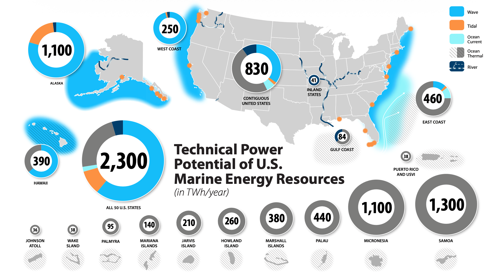
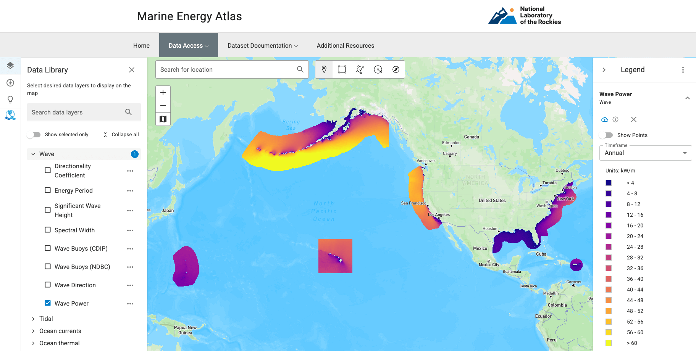
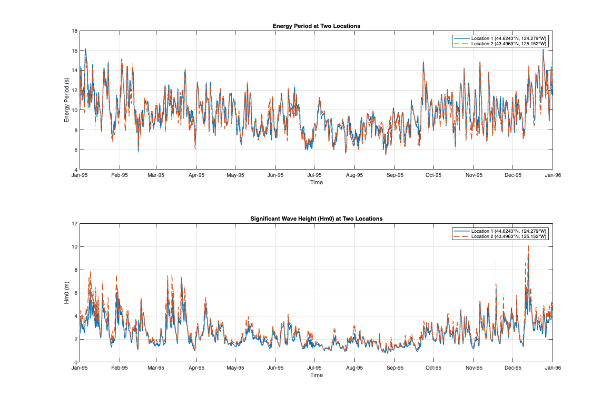
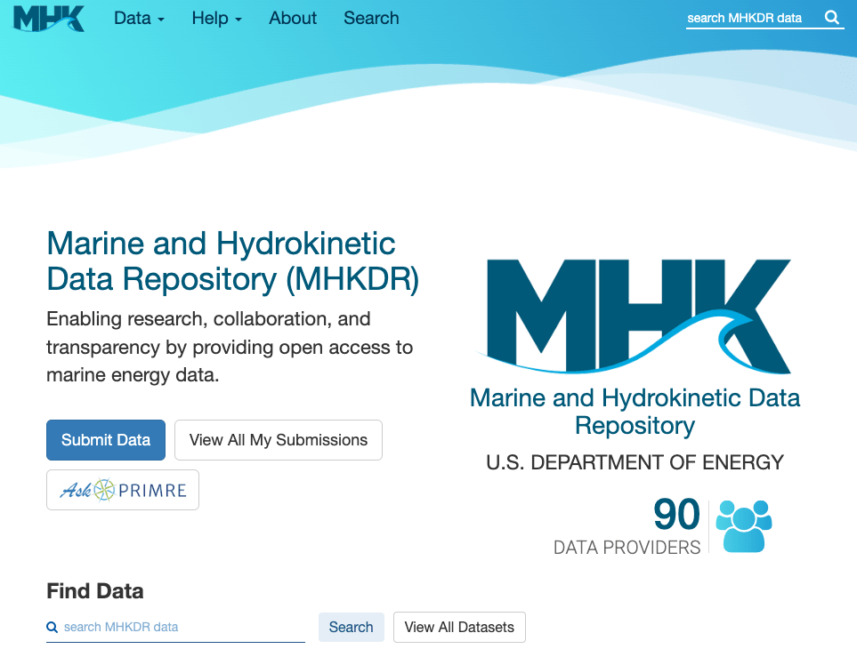

# U.S. Marine Energy Resource

<figure markdown="span">
  { width="100%" }
  <figcaption>Map of estimated technical power potential of U.S. marine energy resources [TWh/yr] by region and technlogy type. Source: Kilcher et al. [@general_kilcher2021_marine]</figcaption>
</figure>

## Overview of U.S. Marine Energy Resources

Marine energy resources in the United States and its territories are distributed across offshore waters, coastlines, and rivers. They occur in several forms, including ocean waves, tidal currents, ocean currents, ocean thermal gradients, and river currents, and can be converted into usable electricity through technologies such as wave energy converters and tidal energy converters. Although marine energy development is at an early stage, the available technical resource is large and geographically widespread, with most of it still untapped. Understanding where these resources are located, how much energy they contain, and how they vary over time is therefore a foundational step for evaluating their future contribution to U.S. and territorial energy production [@general_kilcher2021_marine]. <a href="https://maps-dev.nrel.gov/marine-energy-atlas/data-viewer/data-library/layers?vL=68c955d8b12e9eb9d3c3fc55&b=%5B%5B-327.304699%2C-15.464884%5D%2C%5B6.484744%2C78.729566%5D%5D" target="_blank" class="md-button md-button--inline">View Wave Resource on the Marine Energy Atlas</a>

<figure markdown="span">
  { width="100%" }
  <figcaption>Technical marine energy resource power potential estimates for all U.S. states. Source: Kilcher et al. [@general_kilcher2021_marine]</figcaption>
</figure>

- **Wave energy** resources are especially strong along the Pacific coastlines of California, Oregon, Washington, Alaska, and Hawaii [@general_kilcher2021_marine].
- **Tidal energy** resources could contribute substantially to electricity generation in Alaska, with additional significant potential in Washington and several Atlantic states [@general_kilcher2021_marine].
- **Ocean thermal energy** resources present major opportunities across Hawaii and U.S. Pacific and Caribbean territories, as well as portions of the Atlantic and Gulf coasts. U.S. Pacific and Caribbean territories and freely associated states contain an estimated additional **4,100 TWh/yr** of technical ocean thermal energy resource potential [@general_kilcher2021_marine].
- **Ocean current energy** resources are concentrated primarily in the Gulf Stream system and could provide relatively steady power generation for portions of North Carolina, South Carolina, Georgia, and Florida [@general_kilcher2021_marine].
- **River current energy** resources can be harnessed without dams or river diversion structures and may provide distributed power generation opportunities throughout the United States [@general_kilcher2021_marine]. <a href="us-marine-energy-potential-by-region/" class="md-button md-button--inline">Explore Marine Energy Power Potential Estimates by Region</a>

Even partial use of the available technical resource could contribute meaningfully to the national energy supply. Capturing one-tenth of the technically available marine energy resource across the 50 states would correspond to approximately **5.7% of current U.S. electricity generation**, enough to power approximately **22 million homes**, and would represent between **40 GW and 90 GW** of installed generating capacity [@general_kilcher2021_marine]. <a href="types-of-marine-energy-conversion/" class="md-button md-button--inline">Learn About Marine Energy Conversion Technology</a>

<!--
# U.S. Marine Energy Resources

Marine energy resources in the United States and its territories are distributed throughout offshore waters, coastlines, and rivers. These resources take several forms, including ocean waves, tidal currents, ocean currents, ocean thermal gradients, and river currents. Technologies such as wave energy converters and tidal energy converters are being developed to capture these resources. Development of marine energy remains at an early stage, and most of the available technical resource potential remains untapped. Characterizing where these resources occur, how energetic they are, and how they vary over time is an essential first step toward their utilization [@general_kilcher2021_marine].

<figure markdown="span">
  { width="100%" }
  <figcaption>Estimated technical energy production potential of U.S. marine energy resources [TWh/yr] by region, adapted from Kilcher et al. [@general_kilcher2021_marine]</figcaption>
</figure>

A national assessment estimated the **total technical marine energy resource across the 50 U.S. states at approximately 2,300 TWh/yr**, equivalent to approximately **57% of the electricity generated by those states in 2019**, or enough to power approximately 220 million homes [@general_kilcher2021_marine]. These resources are distributed broadly, though unevenly, across the country:

- **Wave energy** resources are especially energetic along the Pacific coastlines of California, Oregon, Washington, Alaska, and Hawaii.
- **Tidal energy** resources could contribute substantially to electricity generation in Alaska, with additional significant potential in Washington and several Atlantic states.
- **Ocean current energy** resources are concentrated primarily within the Gulf Stream system and could provide relatively steady and predictable power generation for portions of North Carolina, South Carolina, Georgia, and Florida.
- **Ocean thermal energy** resources present significant opportunities across Hawaii and U.S. Pacific and Caribbean territories, as well as portions of the Atlantic and Gulf coasts. U.S. territories alone contain an estimated additional **4,100 TWh/yr** of technical ocean thermal energy resource potential.
- **River current energy** resources can be harnessed without dams or river diversion structures and may provide distributed, reliable power generation opportunities throughout the United States [@general_kilcher2021_marine].

Even partial utilization of the available technical resource could contribute substantially to the national energy supply. Capturing one-tenth of the technically available marine energy resource across the 50 states would correspond to approximately 5.7% of 2019 U.S. electricity generation, enough to power approximately 22 million homes, and would represent between 40 GW and 90 GW of installed generating capacity [@general_kilcher2021_marine].

# U.S. Marine Energy Resource

The United States is home to significant marine energy resources distributed across its coastlines, rivers, and offshore waters. These resources take several forms, including ocean waves, tidal currents, ocean currents, ocean thermal gradients, and river currents, and technologies such as wave energy converters and tidal energy converters are being developed to capture each of them. Development of these resources remains at an early stage and most of this potential is still untapped; characterizing where these resources occur, how energetic they are, and how they vary over time is the essential first step toward harnessing them [@general_kilcher2021_marine].

<figure markdown="span">
  { width="100%" }
  <figcaption>Estimated Technical Energy Production Potential of U.S. Marine Energy Resources [TWh/yr] per Kilcher et al. [@general_kilcher2021_marine]</figcaption>
</figure>

A national assessment of these resources estimated the **total technical marine energy resource across all 50 U.S. states at 2,300 TWh/yr**, equivalent to **57% of the electricity generated by those states in 2019**, or enough to power 220 million homes [@general_kilcher2021_marine]. These resources are distributed broadly but unevenly across the country:

- **Wave energy** is particularly energetic along the Pacific shorelines of California, Oregon, Washington, Alaska, and Hawaii.
- **Tidal energy** could play a major role in Alaska's electricity generation, with sizable contributions also possible in Washington and several Atlantic states.
- **Ocean current energy** is concentrated in the Gulf Stream and could provide steady, reliable power to North Carolina, South Carolina, Georgia, and Florida.
- **Ocean thermal energy** presents significant opportunity across U.S. Pacific and Caribbean territories, Hawaii, the Atlantic coast, and the Gulf Coast; the territories alone hold an additional **4,100 TWh/yr** of ocean thermal resource.
- **River current energy** can be harnessed without dams or river diversion to provide reliable power throughout the country [@general_kilcher2021_marine].

Even if only a small portion of the technical resource potential is captured, the contribution to the nation's energy supply would be significant: one-tenth of the technically available resource across the 50 states would equal 5.7% of 2019 U.S. electricity generation, enough to power 22 million homes, corresponding to between 40 GW and 90 GW of installed capacity [@general_kilcher2021_marine].

-->

## Marine Energy Resource Data Products & Access

Marine energy resource data supports a wide range of applications spanning initial resource screening, site characterization, and multi-site optimization. The tools and datasets described here are designed for different user needs and technical backgrounds. Select the pathway below that best matches your use case.

<a class="access-pathways__row" href="#reconnaissance">
Where are the marine energy resources?
Reconnaissance Level Data Products ›
</a>
<a class="access-pathways__row" href="#site-feasibility">
What's at my site?
Site Feasibility Data Products ›
</a>
<a class="access-pathways__row" href="#spatiotemporal-analysis">
Optimizing across sites?
Spatiotemporal Analysis Data Products ›
</a>

<!-- Card 1: Reconnaissance -->

Reconnaissance Level Data Products

Investors | Policymakers | Regional Energy Planners | General Public

Reconnaissance level data products help users understand where marine energy resources are located within the United States and its territories .The <a href="https://maps.nlr.gov/marine-energy-atlas">Marine Energy Atlas</a> maps the spatial distribution of wave, tidal, and other marine energy resources across U.S. waters. What you see are time-averaged summaries, wave layers averaged from 42 years of hindcast data, tidal layers from depth-averaged annual conditions. This reconnaissance-level view reveals where resources exist and their relative magnitude, providing a foundation for regional planning, policy conversations, and early investment screening. It is a starting point: site-specific development requires progressively detailed assessment beyond what these summaries capture.

<a href="https://maps.nlr.gov/marine-energy-atlas" class="md-button md-button--site">Visit the Marine Energy Atlas</a>

<!-- Card 2: Site Feasibility -->

Site Feasibility Data Products

Marine Energy Developers | Marine Communities | Academic Research

What's at my site? Site Feasibility data products support answering this question by providing programmatic access to the underlying hindcast models at your coordinates of interest. Start with the Atlas to screen and refine your site, then pull time-series data through the pathways below.

<a href="https://maps.nrel.gov/marine-energy-atlas" class="md-button md-button--site">Explore the Atlas</a>

Wave Energy

Access multi-decade WPTO Hindcast data using MHKiT, available for both Python and MATLAB. These tools enable resource characterization, sea state analysis, and preliminary energy calculations for your selected coordinates.

<a href="data-access/#wave-hindcast" class="md-button md-button--site">Wave Data Access</a>
<a href="https://mhkit-software.github.io/MHKiT/WPTO_hindcast_example.html" class="md-button md-button--site">MHKiT WPTO Hindcast (Python)</a>
<a href="https://mhkit-software.github.io/MHKiT/mhkit-matlab/WPTO_hindcast_example.html" class="md-button md-button--site">MHKiT WPTO Hindcast (MATLAB)</a>

Tidal Energy

Download high-resolution tidal hindcast data using the <code>us-marine-energy-resource</code> Python library, then perform resource analysis with the MHKiT Tidal module. This workflow supports current velocity statistics, harmonic analysis, and power density calculations.

<a href="data-access/#tidal-hindcast" class="md-button md-button--site">Tidal Data Access</a>
<a href="https://github.com/US-Marine-Energy-Resource/us-marine-energy-resource-python" class="md-button md-button--site">us-marine-energy-resource Python Library</a>

<!-- Card 3: Spatiotemporal Analysis -->

Spatiotemporal Analysis Data Products

Large Scale Site Development | Optimization Studies | Machine Learning and AI

Optimizing across sites? Spatiotemporal Analysis data products support this by providing full temporal and spatial coverage of the hindcast datasets for rigorous technical analysis, covering device design, validation studies, and multi-site comparison. Both wave and tidal datasets are publicly available at no cost via OpenEI-hosted AWS S3 buckets. The MHKDR records serve as the authoritative data citations, linking to the datasets with formal versioning and provenance. Datasets are structured to support IEC 62600-101 [@iec_62600_101] and IEC 62600-201 [@iec_62600_201] requirements.

Wave Energy

The complete WPTO wave hindcast (~113.5 TB across 6 regions) is freely available via the OpenEI AWS S3 bucket (<code>s3://wpto-pds-us-wave</code>, no credentials required). Variable definitions and dataset documentation are maintained in this site. Use the MHKDR record as the authoritative citation when referencing this dataset.

<a href="wave/" class="md-button md-button--site">Wave Energy Resource</a>
<a href="https://mhkdr.openei.org/submissions/326" class="md-button md-button--site">Wave Dataset on MHKDR</a>

Tidal Energy

The full high-resolution tidal hindcast (46.6 TB) is freely available via the <a href="https://data.openei.org/s3_viewer?bucket=marine-energy-data&prefix=us-tidal%2F">OpenEI AWS S3 data lake</a> (<code>aws s3 ls --no-sign-request s3://marine-energy-data/us-tidal/</code>). Variable definitions and dataset documentation are maintained in this site. Use the MHKDR record as the authoritative citation when referencing this dataset.

<a href="tidal/high_resolution_hindcast/data-access/" class="md-button md-button--site">Tidal Data Access</a>
<a href="tidal/high_resolution_hindcast/variables/" class="md-button md-button--site">Tidal Variables</a>
<a href="https://mhkdr.openei.org/submissions/632" class="md-button md-button--site">Tidal Dataset on MHKDR</a>

## References

--8<-- "docs/_general_cite_widget.md"
