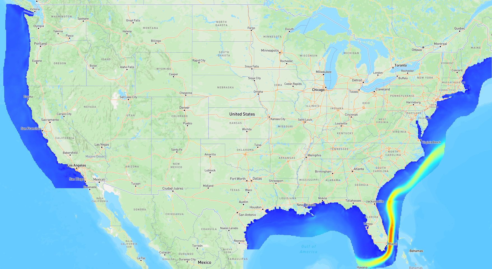

# Ocean Current Energy

[{ width="1757" height="962" }][atlas-ocean-current]

Ocean currents are large-scale, persistent flows of seawater driven by wind, density gradients, and the rotation of the Earth rather than by the tides [@iec_62600_1]. In U.S. waters the resource is dominated by the Gulf Stream, the western boundary current of the North Atlantic that flows along the East Coast of the United States [@haas2013_ocean_current_assessment], from the Straits of Florida to Cape Hatteras, where it departs from the continental margin [@park2025_gulf_stream_30yr]. The U.S. ocean current technical resource is estimated at **49 TWh/yr**, nearly all of it in the Gulf Stream, with a theoretical resource of 160 TWh/yr [@general_kilcher2021_marine]. Other non-tidal currents in U.S. waters are comparatively weak, with speeds of roughly 0.2 m/s or less [@general_kilcher2021_marine]. Because the Gulf Stream flows continuously, national resource assessments assume a capacity factor of 70 percent for ocean current converters, compared with 30 percent for wave and tidal devices [@general_kilcher2021_marine].

## How the Resource Is Characterized

Ocean current energy is a kinetic resource. Like tidal and river currents, it is characterized by the kinetic power density of the flow (see [Resource Characterization](../resource-characterization.md)):

$$
\frac{P}{A} = \frac{1}{2} \rho v^3
$$

Where:

- $P$ is the kinetic power of the flow passing through a cross-sectional area [W]
- $A$ is the cross-sectional area of the flow perpendicular to the current [m²]
- $P/A$ is the kinetic power density [W/m²]
- $\rho$ is the density of seawater [kg/m³]
- $v$ is the current speed [m/s]

Because power scales with the cube of speed, a small change in current speed produces a large change in available power. The IEC terminology specification groups tidal, ocean current, and river energy together as in-stream generation, the capture and conversion of the energy of flowing water [@iec_62600_1].

The metrics used in U.S. ocean current assessments are:

- **Mean current speed**: the time-averaged speed at the surface and at depth [@haas2013_ocean_current_assessment]
- **Kinetic power density**: the undisturbed kinetic power per unit area of flow, in W/m², computed from the speed at each grid point [@haas2013_ocean_current_assessment]
- **Kinetic energy flux**: the total kinetic power crossing a transect of the current, in GW [@haas2013_ocean_current_assessment; @park2025_gulf_stream_30yr]
- **Variability**: the standard deviation of current speed and the meandering of the current path, which govern how steady the resource is at a fixed location [@haas2013_ocean_current_assessment; @park2025_gulf_stream_30yr]
- **Vertical structure**: the decrease in power density with depth, which determines how much resource is available at practical turbine hub depths [@park2025_gulf_stream_30yr]

Turbine arrays add drag that slows the current, and at some level of extraction the Gulf Stream would likely shift its course around them, so the extractable resource cannot be estimated from the undisturbed flow alone [@general_kilcher2021_marine; @yang2014_gulf_stream_extraction].

## Resource Assessment Standards

No part of the IEC 62600 marine energy series is dedicated to open-ocean current resource assessment. IEC TS 62600-201 defines resource assessment and characterization for tidal currents and is the closest available guidance [@iec_62600_201]. IEC TS 62600-2 sets design requirements for marine energy systems, including ocean current converters [@iec_62600_2].

## U.S. Resource

The Gulf Stream is strongest and closest to shore where it squeezes between the Florida coast and the Bahamas as the Florida Current, then broadens and meanders as it moves north past Georgia and the Carolinas before leaving the coast at Cape Hatteras [@general_kilcher2021_marine; @park2025_gulf_stream_30yr]. The national technical resource of 49 TWh/yr was computed for the Gulf Stream from Florida to North Carolina within the U.S. Exclusive Economic Zone, assuming 30 percent device efficiency, and applies to the Atlantic Southeast states of Florida, Georgia, South Carolina, and North Carolina [@general_kilcher2021_marine]. Ocean current resource was reported as zero or not assessed for all other U.S. regions [@general_kilcher2021_marine].

| Region | Theoretical (TWh/yr) | Technical (TWh/yr) | Source |
|:---|---:|---:|:---|
| Atlantic Southeast (Gulf Stream) | 160 | 49 | [@general_kilcher2021_marine] |
| All other U.S. regions | 0 or not assessed | 0 or not assessed | [@general_kilcher2021_marine] |

Published theoretical estimates for the Gulf Stream span from about 1 GW to more than 200 GW, reflecting the difficulty of modeling how the current responds to large-scale extraction [@general_kilcher2021_marine]. See [U.S. Marine Energy Potential by Region](../us-marine-energy-potential-by-region.md) for the full regional tables.

## Datasets

### National Ocean Current Assessment

The ocean current layers on the [Marine Energy Atlas][atlas-ocean-current] come from the DOE-funded assessment led by Georgia Institute of Technology with Sandia National Laboratories [@haas2013_ocean_current_assessment]. The assessment used multi-year output from regional ocean circulation models (HYCOM and NCOM) to map monthly mean current speed, the standard deviation of surface speed, modeled water depth, and annual mean kinetic power density along the U.S. coastline [@haas2013_ocean_current_assessment]. A simplified ocean circulation model was then used to estimate the theoretical and technical resource of the Gulf Stream by finding the turbine drag that maximizes extracted power [@general_kilcher2021_marine; @yang2013_gulf_stream_theoretical; @yang2014_gulf_stream_extraction]. The gridded results were published as a national geodatabase with a web-based GIS tool [@yang2015_national_geodatabase].

#### Atlas Layers

The Atlas ocean current group contains two vector layers on the same grid. Both can be queried by clicking a grid cell and downloaded as shapefiles from the layer menu.

| Layer | What it shows | Legend | Point query returns |
|:---|:---|:---|:---|
| **Mean Current Speed** | Mean surface current speed in m/s, selectable as the annual mean or any of the twelve monthly means [@haas2013_ocean_current_assessment] | 0 to 2.0 m/s in 0.1 m/s steps | Mean current speed for the selected month or annual period |
| **Mean Annual Power Density** | Annual mean undisturbed kinetic power density in W/m², computed from the speed at each grid point as one half the water density times the cube of the velocity magnitude [@haas2013_ocean_current_assessment] | 0 to 3,000 W/m² in 100 W/m² steps | Mean annual kinetic power density |

### 30-Year Gulf Stream Hindcast

Pacific Northwest National Laboratory, Georgia Institute of Technology, and East Carolina University have produced a 30-year hindcast of the Gulf Stream using an unstructured-grid ocean model with horizontal resolution as fine as 400 m at two locations identified as the most viable for energy extraction, the Florida Straits and Cape Hatteras [@park2025_gulf_stream_30yr]. The 30-year mean kinetic energy flux is 27.50 GW at Cape Hatteras and 19.74 GW in the Florida Straits; the larger Cape Hatteras value reflects the wider cross-section of the current there, while its variability is also higher because the Gulf Stream meanders and shifts its path more at that latitude [@park2025_gulf_stream_30yr]. Kinetic energy density at existing acoustic Doppler current profiler sites reaches up to 2,908 W/m² in the Florida Straits and 1,512 W/m² at Cape Hatteras at 20 m depth, and decreases by up to 44 percent between 20 m and 100 m [@park2025_gulf_stream_30yr]. High-energy zones lie close to shore in the Florida Straits but farther offshore at Cape Hatteras [@park2025_gulf_stream_30yr].

| Use Case   | Data Product | Reference |
|:---|:---|:---|
| Explore ocean current layers spatially | [Marine Energy Atlas][atlas-ocean-current] | [Atlas guide](../getting-started/marine-energy-atlas.md) |
| Read the national assessment methodology | Haas et al. [@haas2013_ocean_current_assessment] final report | [@haas2013_ocean_current_assessment] |
| Read the 30-year hindcast study | Park et al. [@park2025_gulf_stream_30yr] journal article | [@park2025_gulf_stream_30yr] |

## Next Steps

- **Explore the resource**: open the ocean current layers on the [Marine Energy Atlas][atlas-ocean-current].
- **Read the references**: see [References](references.md) for the assessment reports, standards, and studies behind this page.
- **Compare with tidal currents**: see the [Tidal Current Energy](../tidal/index.md) section for the IEC 62600-201 workflow applied to reversing tidal flows.

--8<-- "docs/ocean-current/_cite-widget.md"
--8<-- "docs/includes/links.md"
