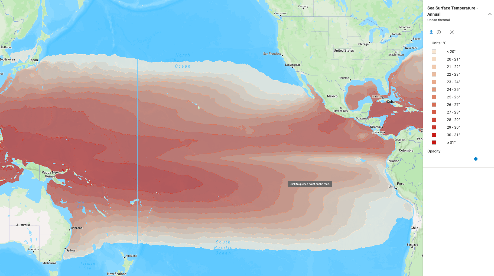

# Ocean Thermal Energy Conversion (OTEC)

[{ width="1824" height="1021" }][atlas-otec]

Ocean thermal energy conversion (OTEC) generates electricity from the temperature difference between warm tropical surface water and cold deep ocean water. Because the thermal gradient persists day and night in all seasons, OTEC is expected to operate as baseload power rather than as an intermittent resource [@general_kilcher2021_marine; @copping2025_ewtec_multi_use]. The U.S. ocean thermal technical resource is estimated at **540 TWh/yr** across the 50 states, with an additional **4,100 TWh/yr** in U.S. Pacific territories and freely associated states [@general_kilcher2021_marine].

## How the Resource Is Characterized

An OTEC plant pumps warm surface water through an evaporator to vaporize a working fluid and cold deep water through a condenser to condense it again, driving a turbine in between [@ascari2012_oteev]. The resource is therefore described by the temperature difference, $\Delta T$, between the two water sources, and by how far the plant must reach to get cold water. The maximum theoretical conversion efficiency is set by the Carnot limit, which is proportional to the temperature difference and is low for the roughly 20 °C differences available in the ocean, so OTEC plants move relatively large volumes of water to produce useful power [@general_nrc2013_evaluation] (see [Resource Characterization](../resource-characterization.md) for the calculation). OTEC plants operate at thermal efficiencies of about 4.7 to 6.7 percent [@copping2025_ewtec_multi_use].

The national assessment by Ascari et al. [@ascari2012_oteev] defines the warm water source as the temperature at 20 m depth, the approximate depth of a warm water intake, and defines the cold water source at each location by searching downward for the depth that gives the most favorable net power, limited to about 1,000 m [@ascari2012_oteev]. The key resource metrics used in that study and in later work are:

- **Temperature difference** ($\Delta T$): the difference between the warm and cold water sources, reported as annual, summer, and winter averages [@ascari2012_oteev]
- **Cold water depth**: the depth of the cold water intake that maximizes net power at a location [@ascari2012_oteev]
- **Net power**: the electrical output of a reference plant after subtracting the pumping losses for the warm water, cold water, and working fluid systems [@ascari2012_oteev]
- **Plant spacing**: the minimum distance between plants such that cold water withdrawal does not deplete the local deep water resource, derived from modeled deep water velocities and a global limit on OTEC extraction [@ascari2012_oteev]
- **Seawater cooling depth**: the depth at which 8 °C, 14 °C, or 20 °C water is available for direct cooling applications, mapped alongside the power resource [@ascari2012_oteev]

Sites where deep water lies close to shore, such as volcanic islands with steep bathymetry, are the most practical because they shorten the cold water pipe [@copping2025_ewtec_multi_use].

## Resource Assessment Standards

A power performance assessment standard for OTEC is in development but not yet released. The new work item proposal "Electricity producing ocean thermal energy converters - Power performance assessment" was adopted by IEC TC 114 in 2024 as project PT 62600-21, covering test equipment, test procedures and methods, output performance calculation, and reporting, with completion planned for 2026 [@kriso2024_iec_62600_21]. No IEC technical specification is dedicated to OTEC resource assessment. In the IEC 62600 marine energy series, the published OTEC-specific document is IEC TS 62600-20, which gives general guidance for the design and analysis of an OTEC plant [@iec_62600_20]. IEC TS 62600-2 sets design requirements for marine energy systems [@iec_62600_2].

## U.S. Resource

The ocean thermal resource is limited to tropical and subtropical waters where surface temperatures are high and the seafloor drops quickly to cold water. Within the 50 states the resource is concentrated on the Atlantic Southeast coast, the Gulf Coast, and Hawaii [@general_kilcher2021_marine]. The ocean thermal resource of the U.S. Pacific territories and freely associated states alone is nearly double the entire 50-state technical resource across all marine energy technologies [@general_kilcher2021_marine].

| Region | Technical resource (TWh/yr) | Source |
|:---|---:|:---|
| East Coast | 340 | [@general_kilcher2021_marine] |
| Gulf Coast | 53 | [@general_kilcher2021_marine] |
| Hawaii | 140 | [@general_kilcher2021_marine] |
| Puerto Rico and U.S. Virgin Islands | 38 | [@general_kilcher2021_marine] |
| Pacific territories and freely associated states | 4,100 | [@general_kilcher2021_marine] |

These values are drawn directly from the national assessment by Ascari et al. [@ascari2012_oteev] and apply a single reference plant design and a two-year ocean model simulation [@general_kilcher2021_marine; @ascari2012_oteev]. See [U.S. Marine Energy Potential by Region](../us-marine-energy-potential-by-region.md) and [Types of Marine Energy Conversion](../types-of-marine-energy-conversion.md) for the full regional tables.

## Datasets

### Ocean Thermal Extractable Energy Visualization

The OTEC layers on the [Marine Energy Atlas][atlas-otec] come from the DOE-funded Ocean Thermal Extractable Energy Visualization project led by Lockheed Martin with the National Laboratory of the Rockies [@ascari2012_oteev]. The study used the HYbrid Coordinate Ocean Model (HYCOM) with Navy Coupled Ocean Data Assimilation over a two-year period from March 2009 through February 2011 to map ocean temperature and currents at roughly 0.08 degree resolution across the global ocean between 78 °S and 47 °N [@ascari2012_oteev]. Atlas layers include sea surface temperature, temperature difference, cold water depth, net power, plant spacing, and seawater cooling depths as annual, summer, and winter averages [@ascari2012_oteev]. The underlying shapefiles are archived on the Marine and Hydrokinetic Data Repository [@mhkdr_otec_datasets].

#### Atlas Layers

The Atlas ocean thermal group contains 19 layers from the same assessment: sea surface temperature, temperature difference, and net power as annual, summer, and winter averages; seawater cooling depth layers for 8 °C, 14 °C, and 20 °C water; and the OTEC and seawater cooling grid points. The layer described here is the starting point for exploring the resource; the others follow the same conventions and are documented in the assessment report [@ascari2012_oteev].

| Layer | What it shows | Legend | Point query returns |
|:---|:---|:---|:---|
| **Sea Surface Temperature - Annual** | Annual mean temperature of the warm water source for an OTEC plant, defined at 20 m depth, the approximate depth of a warm water intake pipe, from model data spanning March 2009 through February 2011 [@ascari2012_oteev] | Below 20 °C through 31 °C and higher, in 1 °C classes | Sea surface temperature class in °C |

| Use Case   | Data Product | Reference |
|:---|:---|:---|
| Explore OTEC layers spatially | [Marine Energy Atlas][atlas-otec] | [Atlas guide](../getting-started/marine-energy-atlas.md) |
| Download the source GIS layers | Marine and Hydrokinetic Data Repository | [@mhkdr_otec_datasets] |
| Read the assessment methodology | Ascari et al. [@ascari2012_oteev] final report | [@ascari2012_oteev] |

## Next Steps

- **Explore the resource**: open the OTEC layers on the [Marine Energy Atlas][atlas-otec].
- **Read the references**: see [References](references.md) for the assessment reports, standards, and recent studies behind this page.
- **Compare technologies**: see [Types of Marine Energy Conversion](../types-of-marine-energy-conversion.md).

--8<-- "docs/otec/_cite-widget.md"
--8<-- "docs/includes/links.md"
