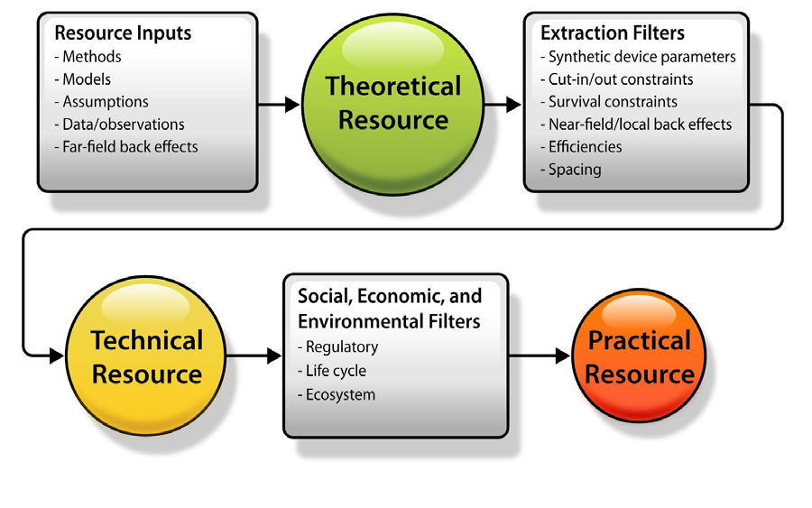

# Resource Characterization

Resource characterization is the process of quantifying how much energy is present in a marine resource and how much of it can realistically be converted to electricity. The IEC framework defines three nested levels [@general_kilcher2021_marine]:

- **Theoretical resource**: the total energy available in the resource, as determined by the physics of the system.
- **Technical resource**: the portion of the theoretical resource that can be captured using existing technology, without regard to external constraints.
- **Practical resource**: the portion of the technical resource that remains available after accounting for economic, environmental, regulatory, and competing-use constraints.

<figure markdown="span">
  { width="100%" }
  <figcaption>Classification of marine energy resource assessment [@general_kilcher2021_marine]</figcaption>
</figure>

The datasets documented here support assessment of the theoretical and technical resource. The practical resource depends on site-specific factors that fall outside the scope of a national-scale dataset.

## Energy Flux

Each marine resource type is characterized by a different physical quantity that describes how energy moves through the environment.

**Kinetic resources (tidal, ocean current, river current)** are characterized by **power density**, the kinetic energy flux per unit cross-sectional area of the flow:

$$P/A = \frac{1}{2} \rho v^3$$

where $\rho$ is water density (~1,025 kg/m³ for seawater) and $v$ is current speed. Because power scales with the cube of velocity, small changes in current speed produce large changes in power density: a location with 2 m/s currents has 8 times the power density of a 1 m/s location. This nonlinearity makes accurate, high-resolution current speed data critical for resource assessment.

**Wave energy** is characterized by **wave energy flux**, the rate of energy transport per unit width of wave front (W/m). In deep water, wave energy flux is approximated by:

$$J \approx \frac{\rho g^2}{64\pi} H_s^2 T_e$$

where $H_s$ is significant wave height and $T_e$ is energy period. Wave energy flux depends on both wave height and period, so regions with long-period swell can carry substantial energy even when wave heights are moderate.

**Ocean thermal energy** is characterized by the temperature differential between the warm surface layer and cold deep water. A larger differential means a higher thermodynamic efficiency ceiling. The Carnot limit sets the maximum theoretical conversion efficiency: $\eta_\text{max} = 1 - T_\text{cold}/T_\text{warm}$ (temperatures in Kelvin). For a typical 20°C differential, $\eta_\text{max} \approx 7\%$, so practical OTEC systems capture a small fraction of the available thermal energy, but the absolute resource volume is large because the temperature differential is sustained over vast ocean areas.

## From Available Energy to Usable Work

A marine energy device placed in a flow does not and cannot extract all the available energy. For kinetic turbines in an open flow, there is a theoretical upper bound on the fraction of the stream's kinetic energy that can be extracted, analogous to the Betz limit in wind energy (59.3%). In practice, turbine arrays in tidal channels face an additional constraint: extracting energy adds drag to the channel, which slows the flow and reduces the total power available. Garrett and Cummins (2005) showed that for a channel connecting two basins, there is a maximum extractable power that depends on the tidal head difference and the natural flow rate; beyond that point, adding more turbines reduces total output.

For wave energy converters, arrays of devices progressively reduce the wave energy flux as it propagates through the array. The technical resource is calculated by assuming extraction continues until the residual wave energy flux falls to 8 kW/m, below which additional rows of devices are not considered economically justified [@general_kilcher2021_marine].

The result of applying these physical and technological limits to the theoretical resource is the **technical resource**: the portion of the available energy that existing devices can realistically convert to electricity.

## References

--8<-- "docs/_general_cite_widget.md"
