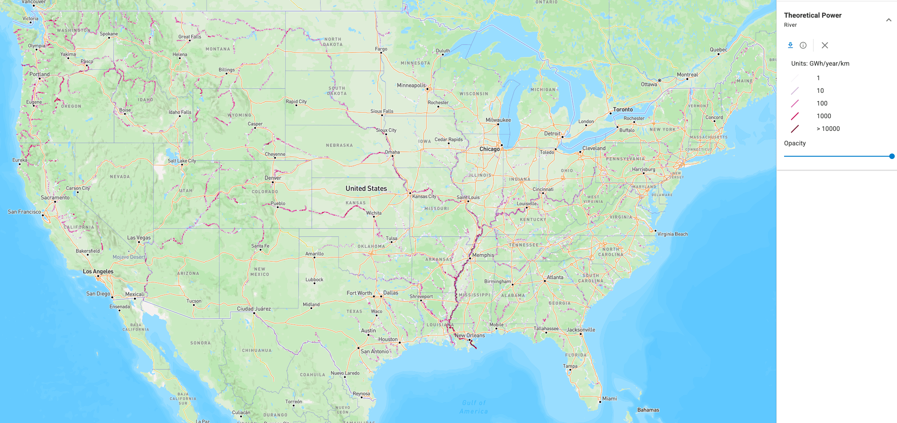

# River Current Energy

[{ width="1978" height="934" }][atlas-river]

River current, or riverine hydrokinetic, energy is generated by turbines placed directly in the flow of a river, without the dams or river diversion that conventional hydropower requires [@general_kilcher2021_marine]. The U.S. river current technical resource is estimated at **99 TWh/yr**, with a theoretical resource of 1,300 TWh/yr, distributed across more than 71,000 assessed river segments throughout the country [@general_kilcher2021_marine]. Because many remote communities, particularly in Alaska, are located along rivers and depend on diesel generation, river current energy is a distinctive opportunity for local power supply [@general_kilcher2021_marine].

## How the Resource Is Characterized

River current energy is a kinetic resource characterized by the kinetic power density of the flow (see [Resource Characterization](../resource-characterization.md)):

$$
\frac{P}{A} = \frac{1}{2} \rho v^3
$$

Where:

- $P$ is the kinetic power of the flow passing through a cross-sectional area [W]
- $A$ is the cross-sectional area of the flow perpendicular to the current [m²]
- $P/A$ is the kinetic power density [W/m²]
- $\rho$ is the density of fresh water [kg/m³]
- $v$ is the current speed [m/s]

At the scale of a river reach[^reach], the theoretical power available is bounded by the hydraulic power of the reach [@jacobson2012_epri_riverine]:

$$
P = \gamma \, Q \, H
$$

Where:

- $P$ is the theoretical hydraulic power of the reach [W]
- $\gamma$ is the specific weight of water [N/m³]
- $Q$ is the volume discharge of the reach [m³/s]
- $H$ is the elevation drop along the reach [m]

The assessment computed this quantity for every reach[^reach] in the contiguous United States from discharge and channel slope data in the NHDPlus hydrography database, and for Alaska from a combination of the Idaho National Laboratory Virtual Hydropower Prospector, Google Earth, and U.S. Geological Survey stream gages [@general_kilcher2021_marine; @jacobson2012_epri_riverine]. Segments with discharge below 1,000 cubic feet per second, and segments with existing hydroelectric plants or non-powered dams, were excluded [@general_kilcher2021_marine]. A recovery factor that depends on water velocity and depth at low flow, device packing density, device efficiency, flow statistics, channel slope, and the feedback between turbines and hydraulic head converts the theoretical power of each segment to a technically recoverable value [@general_kilcher2021_marine; @jacobson2012_epri_riverine].

At the site scale, the metrics that govern device siting and performance are:

- **Discharge and flow duration**: the seasonal and interannual distribution of river flow, which sets how often usable velocities occur [@jacobson2012_epri_riverine]
- **Mean velocity and power density**: the depth-averaged speed and resulting kinetic power density at the turbine location [@jacobson2012_epri_riverine; @neary2013_turbulent_inflow]
- **Turbulence intensity and velocity profile**: the vertical shear and unsteadiness of the inflow that drive turbine loads and performance [@neary2013_turbulent_inflow; @neary2013_near_far_field]
- **Site conditions**: the factors affecting site selection, deployment, and operation of devices at a specific reach, such as those characterized for the Tanana River at Nenana, Alaska [@toniolo2010_tanana; @johnson2013_tanana]

## Resource Assessment Standards

IEC TS 62600-301 defines the methodology for river energy resource assessment [@iec_62600_301], and IEC TS 62600-300 covers power performance assessment of river energy converters [@iec_62600_300]. IEC TS 62600-2 sets design requirements for marine energy systems, including river current converters [@iec_62600_2]. The national assessment described below predates these specifications and does not follow the IEC methodology, which requires detailed river bathymetry that does not exist at the necessary resolution nationwide [@general_kilcher2021_marine].

## U.S. Resource

The river current resource is broadly distributed but concentrated in a few large river systems. The national technical resource of 99 TWh/yr is split among the inland states, the Gulf Coast, Alaska, and the West Coast [@general_kilcher2021_marine]. Within the inland states, most of the resource is along the lower Mississippi and Ohio river basins [@general_kilcher2021_marine].

| Region | Technical resource (TWh/yr) | Source |
|:---|---:|:---|
| Inland U.S. | 41 | [@general_kilcher2021_marine] |
| Gulf Coast | 31 | [@general_kilcher2021_marine] |
| Alaska | 21 | [@general_kilcher2021_marine] |
| West Coast | 6.7 | [@general_kilcher2021_marine] |
| U.S. total | 99 | [@general_kilcher2021_marine] |

The riverine resource overlaps with the theoretical potential of conventional hydropower. The energy in a given reach could be extracted either by a dam or by hydrokinetic turbines, but not by both [@general_kilcher2021_marine]. A 2024 reassessment of the contiguous United States using higher-resolution hydrography found a comparable national technical resource of about 100 TWh/yr but significant regional differences from the 2012 estimate; Alaska was not included [@jang2024_us_river_technical]. See [U.S. Marine Energy Potential by Region](../us-marine-energy-potential-by-region.md) for the full regional tables, including state-by-state rankings.

## Datasets

### Assessment and Mapping of the Riverine Hydrokinetic Resource

The river layers on the [Marine Energy Atlas][atlas-river] come from the DOE-funded assessment by the Electric Power Research Institute (EPRI) with the University of Alaska and the National Laboratory of the Rockies [@jacobson2012_epri_riverine]. The assessment covers more than 71,000 river segments derived from the NHDPlus database in the contiguous United States, plus major rivers in Alaska assessed with separate data sources [@general_kilcher2021_marine]. Three layers are provided: the annual average theoretical power of each river reach in GWh/yr, the technically recoverable resource of each reach after applying the recovery factor, and the hydrologic watershed basins from the U.S. Geological Survey Watershed Boundary Dataset that organize the results [@jacobson2012_epri_riverine]. The National Laboratory of the Rockies later regrouped the segments by state, dividing the power of any segment within 5 km of a state border equally between the adjoining states [@general_kilcher2021_marine].

#### Atlas Layers

The Atlas river group contains three layers. Each is a vector layer that can be queried by clicking a river reach or basin, and each can be downloaded as a shapefile from the layer menu.

| Layer | What it shows | Legend | Point query returns |
|:---|:---|:---|:---|
| **Theoretical Power** | Annual average theoretical power of each river reach, computed from discharge and elevation drop along the segment, displayed per kilometer of reach [@jacobson2012_epri_riverine] | 1 to more than 10,000 GWh/yr/km, classed by standard deviations from the median | Reach name, hydrologic basin, reach length, mean discharge, power in W and GWh/yr, recovery factor, slope, and elevation change |
| **Technically Recoverable Resource** | Annual average reach power after applying the recovery factor, which accounts for minimum velocity and depth at low flow, device packing density, device efficiency, flow statistics, and the feedback of turbines on head and velocity, evaluated with the HEC-RAS hydraulic model [@jacobson2012_epri_riverine] | Less than 13, 13 to 37, and more than 37 GWh/yr | Same fields as Theoretical Power |
| **Hydrologic Watershed Basins** | The 18 two-digit hydrologic unit regions of the contiguous United States from the U.S. Geological Survey Watershed Boundary Dataset, used to organize the reach results | One color per region, from the Arkansas-White-Red Region to the Upper Mississippi Region | Hydrologic unit name and code |

The reach data come from the NHDPlus hydrography database and are limited to the contiguous 48 states in these layers [@jacobson2012_epri_riverine].

| Use Case   | Data Product | Reference |
|:---|:---|:---|
| Explore river reach power spatially | [Marine Energy Atlas][atlas-river] | [Atlas guide](../getting-started/marine-energy-atlas.md) |
| Download reach shapefiles | Atlas layer download menu | [Atlas guide](../getting-started/marine-energy-atlas.md) |
| Read the assessment methodology | EPRI final report | [@jacobson2012_epri_riverine] |
| Find state-level totals | Kilcher et al. [@general_kilcher2021_marine] overview | [@general_kilcher2021_marine] |
| Browse the original OpenEI atlas | River Hydrokinetic Resource Atlas | [@openei_river_atlas] |

## Next Steps

- **Explore the resource**: open the river layers on the [Marine Energy Atlas][atlas-river].
- **Read the references**: see [References](references.md) for the assessment reports, standards, and studies behind this page.
- **Compare with tidal currents**: see the [Tidal Current Energy](../tidal/index.md) section for the related in-stream resource characterization workflow.

--8<-- "docs/river/_cite-widget.md"
--8<-- "docs/includes/links.md"

[^reach]: A reach is a length of river treated as a single segment in the analysis. In the national assessment each reach is an NHDPlus flowline, which carries its own average discharge, velocity, and slope [@jacobson2012_epri_riverine].
