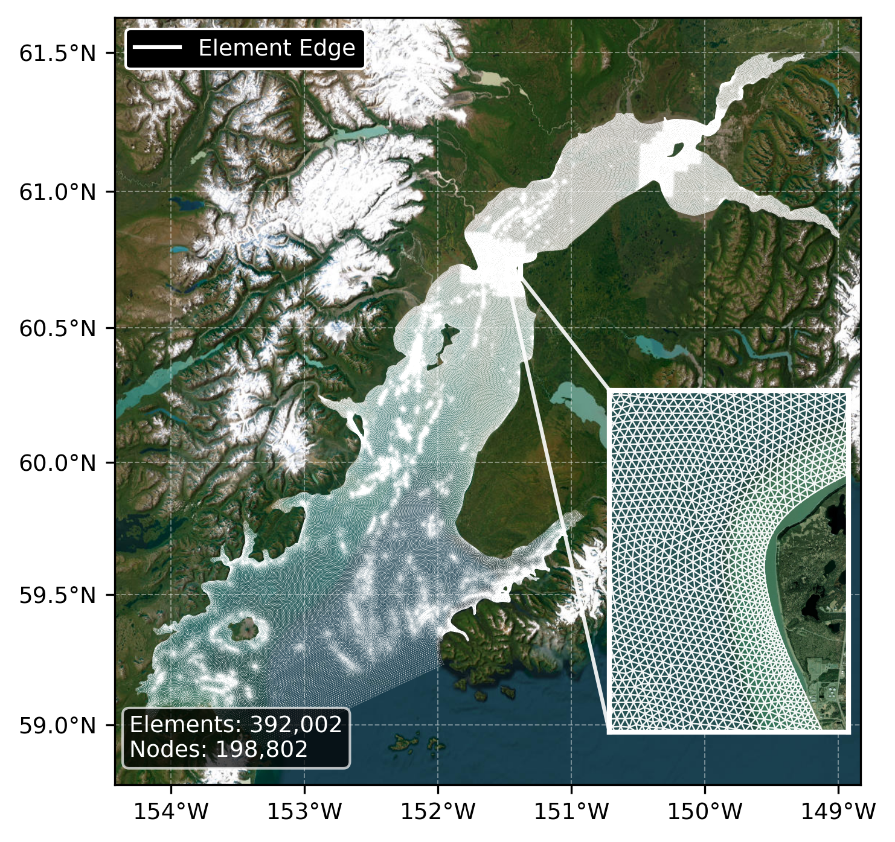

# Unstructured Grid

## What Is an Unstructured Grid?

An unstructured grid is a computational mesh composed of irregularly-shaped elements (triangles in FVCOM) that can vary in size across the domain. This allows higher resolution in areas of interest (narrow channels, complex coastlines) and coarser resolution in open water, providing computational efficiency while maintaining accuracy where needed. For the duration of the model run, the horizontal coordinates (lat/lon) of the grid remain fixed in space.

## Grid Structure

The FVCOM model uses an unstructured triangular mesh where each element (cell) is defined by three nodes. Model variables are computed at element centers, while the mesh geometry is defined by node positions. The flexibility of triangular elements allows the mesh to conform to complex coastlines and bathymetric features without requiring uniform grid spacing.

<figure markdown="span">
  { width="100%" }
  <figcaption>Wide angle and detailed view of the underlying FVCOM unstructured triangular mesh used for the High Resolution Tidal Hindcast in Cook Inlet, Alaska. The main panel shows the full model domain with 392,002 triangular elements conforming to the complex coastline geometry. The inset shows a detailed view of the mesh structure, illustrating how element size varies with higher resolution near coastlines and in channels where accurate representation of tidal dynamics requires finer spatial detail.</figcaption>
</figure>

## Spatial Resolution

Grid resolution varies across the domain based on local requirements:

- **In narrow channels and near coastlines** where currents are strongest and bathymetry changes rapidly, triangles are smaller (higher resolution)
- **In open water regions** where conditions vary more gradually, triangles are larger (coarser resolution), reducing computational cost without sacrificing accuracy

The [grid resolution variable](variables/grid-resolution.md) in the dataset reports the average edge length of each triangular element.

### IEC Resolution Requirements

Per IEC 62600-201 tidal energy resource assessment standards:

| Assessment Stage         | Required Resolution |
| ------------------------ | ------------------- |
| Stage 1 (reconnaissance) | < 500 m             |
| Stage 2 (layout design)  | < 50 m              |

All locations in this dataset meet Stage 1 requirements, with many areas meeting Stage 2 requirements in regions of highest tidal energy potential.

## Free-Stream Velocity

All velocity and power density values in this dataset represent **free-stream (undisturbed) conditions** and should not be used directly for turbine array yield estimation. Actual flow through turbine arrays will be modified by:

1. **Blockage effects** that can reduce channel flow
2. **Wake interactions** where downstream turbines experience velocity differences
3. **Device-induced turbulence** that affects fatigue loading

Array yield calculations require site-specific wake modeling and cannot be derived directly from free-stream resource data.

--8<-- "docs/tidal/high_resolution_hindcast/\_cite-widget.md"
