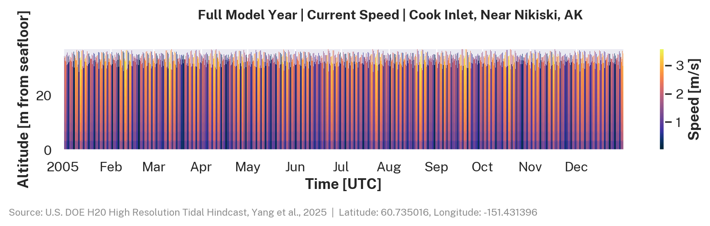
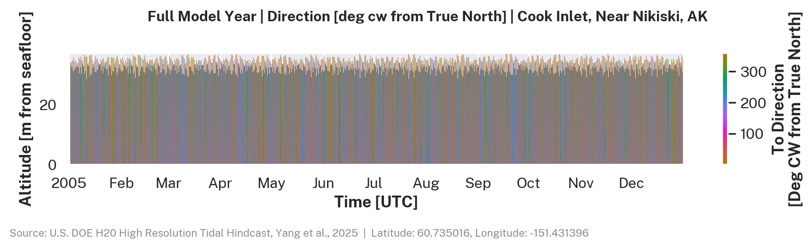
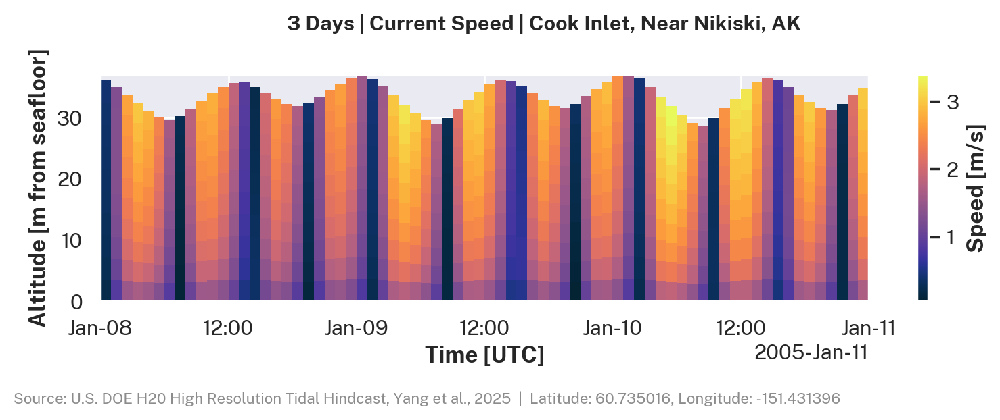
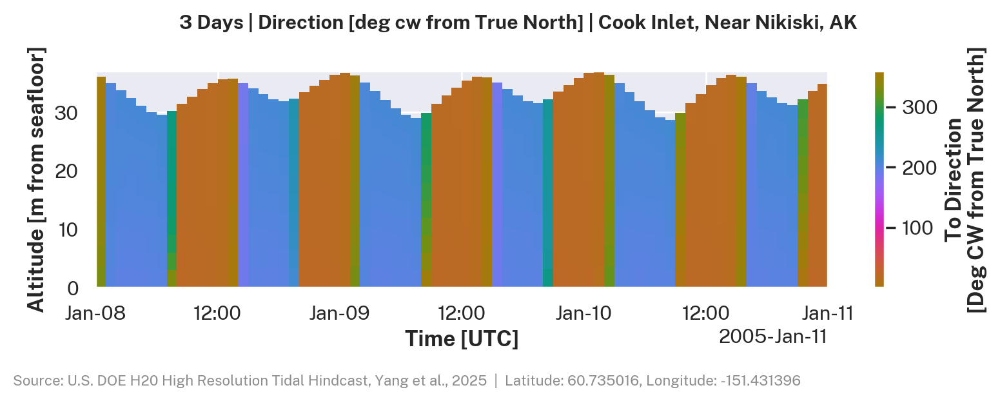
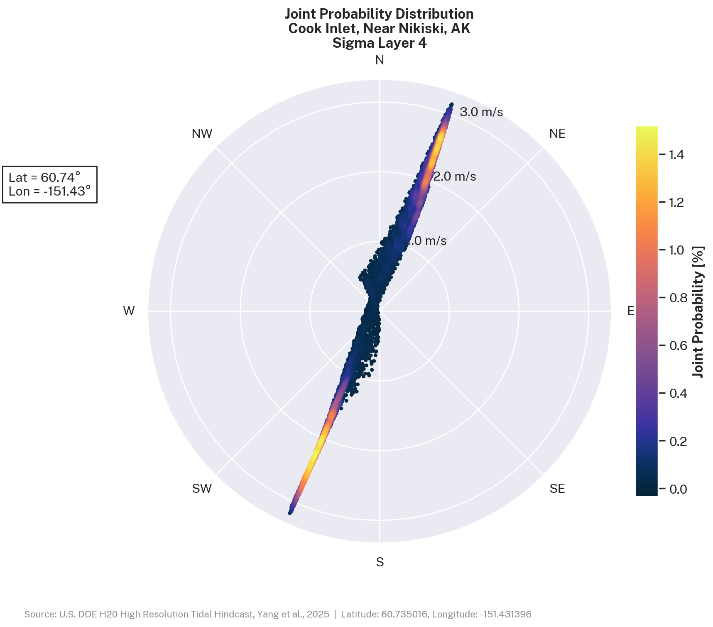
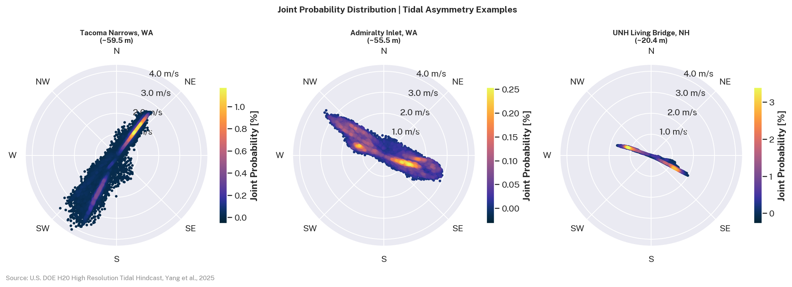
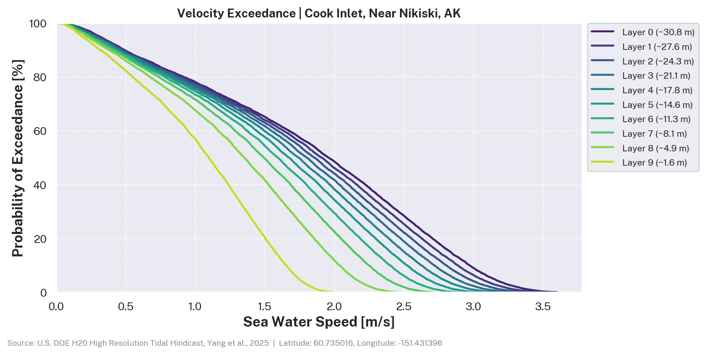

# Tidal Current Energy

Tidal currents are the large-scale movement of water through coastal channels driven by the rise and fall of tides. In constricted passages, this movement can produce strong, sustained flows that can be captured by underwater turbines to generate electricity.

The Moon and Sun exert a gravitational pull on the ocean. As the Earth rotates beneath them, the alignment between any fixed coastal location and that pull changes on a predictable schedule, driving the tidal cycle [@noc_tidal_modeling]. The two primary drivers are Earth's rotation (~24 hours), which produces the roughly twice-daily flood and ebb, and the Moon's orbit (~29.5 days), which produces the spring-neap cycle. While the underlying drivers are predictable, the actual current speed and direction at any coastal location is shaped by local geography in ways that are difficult to estimate without detailed numerical simulation.

To better understand tidal energy potential in the United States, the U.S. Department of Energy's H2O program and national laboratories created detailed computer models of tidal currents using high-performance computing. The open-source datasets include current speed, direction, and water movement at different depths for five major U.S. coastal sites, helping researchers and developers evaluate locations and design tidal energy projects.

## Resource Characterization Workflow

IEC TS 62600-201 defines two stages for tidal resource assessment: a feasibility study (Stage 1) covering the broader estuary or channel, and a layout design study (Stage 2) focused on a specific development site.

### Site Screening

The [Marine Energy Atlas][marine-energy-atlas] displays time- and depth-averaged current speed and power density across all five hindcast domains. Grid cells are color-coded by magnitude. The point-query tool returns summary statistics for a selected location.

### Feasibility Study (IEC 62600-201 Stage 1)

A Stage 1 feasibility study investigates the scale and attributes of the energy resource within a study area. The hindcast provides current speed and direction at 10 depth layers over the full model duration, from which the following can be derived:

- **Mean current speed**: time-averaged speed at each depth layer
- **95th-percentile current speed**: upper bound on current speed for a given location
- **Mean power density**: time-averaged kinetic energy flux per unit rotor area (W/m²)
- **Velocity exceedance curve**: the fraction of time current speed exceeds a given threshold
- **Joint probability distribution**: the joint distribution of current speed and direction

The [Marine Energy Atlas][marine-energy-atlas] provides a point-and-click interface for summary statistics at any model grid point. The [`us-marine-energy-resource` Python library][python-library] (which includes the `us-tidal` command line tool) can query tidal hindcast data by point, transect, or area, with built-in tools to visualize and analyze the results:

```python
import us_marine_energy_resource.tidal_hindcast as tidal

# Fetch the full hindcast time series for the nearest grid point.
# Data is downloaded from S3 and cached locally on first call.
df = tidal.get_data_at_point(lat=60.73, lon=-151.43)

# Plot velocity exceedance curves across all depth layers.
fig, stats = tidal.plot_velocity_exceedance(df)

# Plot the joint probability distribution at a single depth layer.
fig = tidal.generate_tidal_joint_probability(df, sigma_layer=4)
```

```bash
# Query from the command line, no Python required.
# See Data Access for the full CLI reference.
us-tidal 60.73,-151.43 --info
```

!!! tip "Prerequisites"
    See [Getting Started](../getting-started/index.md) for installation and setup instructions. Full `us-tidal` CLI reference is in [Data Access](high_resolution_hindcast/data-access.md#us-tidal-cli).

### Layout Design (IEC 62600-201 Stage 2)

A Stage 2 layout design study focuses on a specific development site to determine annual energy production (AEP) and support array layout decisions. The full depth-resolved time series can be queried by point, transect, or area using the [`us-marine-energy-resource` Python library][python-library], which includes the `us-tidal` CLI. Raw data is also available for bulk access via [HSDS](../getting-started/hsds-setup.md) or [AWS S3](../getting-started/aws-s3.md).

### Power Performance Assessment and Engineering Design Inputs

For power performance assessment, IEC 62600-200 [@iec_62600_200] provides more specific guidance. The hindcast provides current speed, direction, and water depth at 10 depth layers over the full model year, queryable by point, transect, or area via the [`us-marine-energy-resource` Python library][python-library], which includes the `us-tidal` CLI.

---

## Data Access

| Use case                                                                        | Interface                                                    | Reference                                                                               |
| ------------------------------------------------------------------------------- | ------------------------------------------------------------ | --------------------------------------------------------------------------------------- |
| Spatial resource exploration and point statistics                               | [Marine Energy Atlas][marine-energy-atlas]                   | [Atlas guide](../getting-started/marine-energy-atlas.md)                                |
| Query tidal hindcast data by point, transect, or area, with built-in tools to visualize and analyze the results | [`us-marine-energy-resource` Python library][python-library] (includes `us-tidal` CLI) | [Data Access](high_resolution_hindcast/data-access.md) |
| Bulk and raw data access                                                        | HSDS or AWS S3                                               | [HSDS Setup](../getting-started/hsds-setup.md) · [AWS S3](../getting-started/aws-s3.md) |
| Variable definitions and units                                                  | Variable documentation                                       | [Tidal Variables](high_resolution_hindcast/variables/index.md)                          |

## Example Site

The visualizations below use data from a single grid point in Upper Cook Inlet, Alaska (60.74°N, 151.43°W), near Nikiski. Cook Inlet has some of the strongest tidal currents in the U.S. The map shows the model domain boundary and the example point. See [Regional Coverage](high_resolution_hindcast/coverage-maps.md) for all five dataset extents.

<link rel="stylesheet" href="https://unpkg.com/leaflet@1.9.4/dist/leaflet.css" />
<script src="https://unpkg.com/leaflet@1.9.4/dist/leaflet.js"></script>

<div id="site-context-map" style="height: 300px; width: 100%; border-radius: 6px; border: 1px solid #e0e0e0; margin: 1em 0;"></div>

<script>
(function () {
  var map = L.map("site-context-map", { zoomControl: true, scrollWheelZoom: false, center: [60.74, -151.43], zoom: 7 });

  L.tileLayer("https://{s}.basemaps.cartocdn.com/light_all/{z}/{x}/{y}{r}.png", {
    attribution: '&copy; <a href="https://www.openstreetmap.org/copyright">OpenStreetMap</a> &copy; <a href="https://carto.com/attributions">CARTO</a>',
    subdomains: "abcd",
    maxZoom: 19
  }).addTo(map);

  var color = "#4C72B0";
  var assetBase = window.location.origin + "/assets/tidal/";

  fetch(assetBase + "AK_cook_inlet_boundary.geojson")
    .then(function (r) { return r.json(); })
    .then(function (data) {
      var boundary = L.geoJSON(data, {
        style: { color: color, weight: 1.5, opacity: 0.9, fillColor: color, fillOpacity: 0.12 },
        smoothFactor: 2
      }).addTo(map);

      // Example point marker
      var siteLatLon = [60.735016, -151.431396];
      L.circleMarker(siteLatLon, {
        radius: 7,
        fillColor: "#C44E52",
        color: "#fff",
        weight: 2,
        opacity: 1,
        fillOpacity: 0.95
      })
        .bindTooltip("Near Nikiski, AK (example site)", { permanent: true, direction: "right", offset: [10, 0] })
        .addTo(map);

      map.fitBounds(boundary.getBounds().pad(0.05));
      // Ensure tiles fill the container after layout is finalized
      setTimeout(function () { map.invalidateSize(); }, 100);
    })
    .catch(function (err) {
      console.warn("Could not load Cook Inlet boundary", err);
      map.setView([60.5, -152], 7);
    });
})();
</script>

## Vertical Current Structure

FVCOM resolves the water column with 10 sigma (terrain-following) layers. Current speed decreases toward the seafloor due to bottom friction.

The depth-time plot below shows current speed across all 10 sigma layers for the full hindcast year at Upper Cook Inlet, AK. Each band represents one sigma layer, covering an equal fraction of the water column from surface to seafloor.

<figure markdown="span">
  { width="100%" }
  <figcaption>Current speed across all 10 sigma layers at Cook Inlet, AK (60.74°N, 151.43°W), full hindcast year. Each horizontal band is one sigma layer, from Layer 9 (surface, ~1.6 m) at the top to Layer 0 (bottom, ~30.8 m) at the base. The repeating ~14.8-day amplitude variation is the spring-neap cycle. Peak speeds exceed 3 m/s during spring tides.</figcaption>
</figure>

The direction plot shows the flood-ebb reversal and any rotational signal in the water column.

<figure markdown="span">
  { width="100%" }
  <figcaption>Current direction across all 10 sigma layers at Cook Inlet, AK, full hindcast year. Direction is in degrees clockwise from True North. Alternations between ~$030^\circ$ (flood, NE) and ~$210^\circ$ (ebb, SW) reflect the channel orientation. Color is nearly uniform with depth, indicating that directional turning with depth is small at this site.</figcaption>
</figure>

A 3-day window shows individual tidal cycles and the vertical shear between the surface and bottom layers.

<figure markdown="span">
  { width="100%" }
  <figcaption>Three-day window of current speed across all 10 sigma layers. Each semidiurnal cycle is approximately 12.4 hours ($M_2$). The speed difference between Layer 9 (surface, ~1.6 m) and Layer 0 (bottom, ~30.8 m) is visible during peak flows, reflecting vertical shear from bottom friction.</figcaption>
</figure>

<figure markdown="span">
  { width="100%" }
  <figcaption>Three-day window of current direction across all 10 sigma layers. Reversals between flood (~$030^\circ$) and ebb (~$210^\circ$) are sharp. Direction is nearly uniform with depth, confirming the current is rectilinear with little rotational component.</figcaption>
</figure>

For background on sigma coordinates see [Sigma Layers](high_resolution_hindcast/sigma-layers.md).

## Joint Probability Distribution

A joint probability distribution (JPD) is a polar histogram of current speed and direction at a single depth layer. It shows the dominant flow direction, flood-ebb asymmetry, and the speed distribution across the tidal cycle.

The plot below uses sigma layer 4 (mid-column) at Cook Inlet, AK. The reversing tidal current reflects the flood-ebb cycle in the inlet.

<figure markdown="span">
  { width="80%" }
  <figcaption>Speed and direction at sigma layer 4 (~17.8 m depth), Cook Inlet, AK, full hindcast year. Each point is one hourly observation; color encodes joint probability [%]. The bidirectional pattern along ~$030^\circ$/$210^\circ$ reflects a rectilinear, reversing current with little rotational component. The distribution is nearly symmetric about the flood-ebb axis, with peak speeds near 3 m/s and the highest probability density at 1-2 m/s.</figcaption>
</figure>

Tidal asymmetry - where the flood and ebb half-cycles differ in speed or duration - can have a significant effect on energy estimates. The comparison below shows the bottom sigma layer JPD for Tacoma Narrows, Admiralty Inlet, and the Piscataqua River.

<figure markdown="span">
  { width="100%" }
  <figcaption>Joint probability distribution at the bottom sigma layer for three high-resource sites: Tacoma Narrows, WA; Admiralty Inlet, WA; and UNH Living Bridge, NH (Piscataqua River). Asymmetry between the flood and ebb lobes indicates that one half-cycle is faster or more energetic than the other.</figcaption>
</figure>

## Velocity Exceedance

An exceedance curve shows what fraction of the year the current exceeds a given speed. Because power scales with the cube of speed (see [Spring-Neap Cycle](#the-spring-neap-cycle)), the exceedance curve directly characterizes the annual energy available at a given sigma layer.

!!! note
Sigma layers follow the shape of the seafloor and water surface, so the depth each layer represents varies across the model domain. See [Sigma Layers](high_resolution_hindcast/sigma-layers.md).

Exceedance curves are a standard output for IEC 62600-201 Stage 1 feasibility studies [@iec_62600_201]:

<figure markdown="span">
  { width="100%" }
  <figcaption>Velocity exceedance curves for all 10 sigma layers, Cook Inlet, AK, full hindcast year. Each curve shows the fraction of the year that current speed exceeds a given value, from Layer 9 (surface, ~1.6 m) to Layer 0 (deepest, ~30.8 m). The spread between layers increases at higher speeds, reflecting the vertical shear profile.</figcaption>
</figure>

## How FVCOM Models Tidal Currents

The datasets are produced with the Finite Volume Community Ocean Model (FVCOM) [@fvcom], a 3D coastal ocean model designed for complex coastlines [@noc_tidal_modeling].

**Governing equations.** FVCOM solves the 3D Reynolds-averaged Navier-Stokes equations for horizontal velocities $u$, $v$ and sea surface elevation $\eta$ on a triangular mesh. Tidal forcing is applied at open boundaries from a global ocean tidal atlas.

**Unstructured grid.** FVCOM uses a triangular mesh that can be refined around complex coastlines and narrow passages. Grid resolution at the five U.S. sites ranges from ~10 m in narrow channels to ~500 m offshore. See [Unstructured Grid](high_resolution_hindcast/unstructured-grid.md).

**Sigma coordinates.** The water column is divided into vertical layers that scale with local depth, so the seafloor and surface are resolved at any water depth. The dataset provides 10 sigma layers per grid point. See [Sigma Layers](high_resolution_hindcast/sigma-layers.md).

**Boundary conditions.** Tidal constituents from a global ocean tidal atlas are applied at the open boundaries of each regional domain. The model runs for a full hindcast year. See [Model Configuration](high_resolution_hindcast/model-configuration.md).

**Validation.** Model output is compared against tide gauge observations and, where available, ADCP current measurements using standard skill metrics (RMSE, bias, $R^2$). See [Validation](high_resolution_hindcast/validation.md).

## Datasets

The [H2O High Resolution Tidal Hindcast](high_resolution_hindcast/index.md) provides 3D tidal current data at five U.S. coastal locations. Each dataset includes depth-resolved current speed, direction, power density, water depth, and tidal range derived from FVCOM simulations.

| Location                                                  | Period    | Sampling    | Grid Points |
| --------------------------------------------------------- | --------- | ----------- | ----------- |
| [Aleutian Islands, AK](high_resolution_hindcast/index.md) | 2010-2011 | Hourly      | 797,978     |
| [Cook Inlet, AK](high_resolution_hindcast/index.md)       | 2005      | Hourly      | 392,002     |
| [Piscataqua River, NH](high_resolution_hindcast/index.md) | 2007      | Half-hourly | 292,927     |
| [Salish Sea, WA](high_resolution_hindcast/index.md)       | 2015      | Half-hourly | 1,734,765   |
| [Western Passage, ME](high_resolution_hindcast/index.md)  | 2017      | Half-hourly | 231,208     |

Click a location to view documentation including model configuration, variable descriptions, and data access.

## Next Steps

- **Browse the datasets** - click a location in the table above to view model configuration, variable descriptions, and data access.
- **Access the data** - see [Data Access](high_resolution_hindcast/data-access.md) for installation, Python library usage, CLI reference, and bulk download options.
- **Read the technical background** - see [Sigma Layers](high_resolution_hindcast/sigma-layers.md), [Unstructured Grid](high_resolution_hindcast/unstructured-grid.md), and [Model Configuration](high_resolution_hindcast/model-configuration.md) for model details.

--8<-- "docs/tidal/index-cite.md"
--8<-- "docs/includes/links.md"
