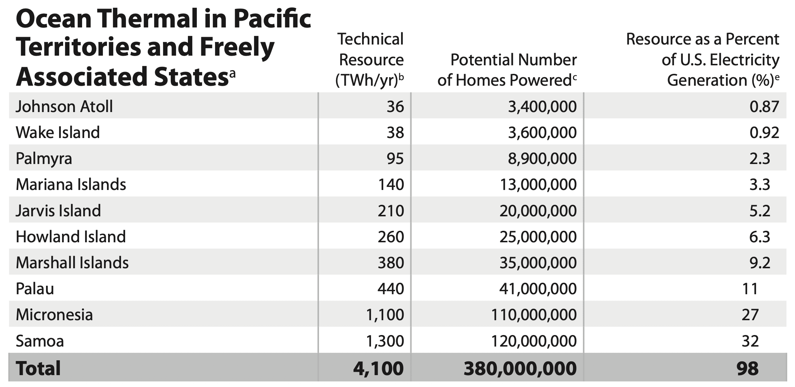

# Types of Marine Energy Conversion

Within the United States Exclusive Economic Zone there are multiple distinct types of marine energy originating from different physical phenomenon and offering specific generation characteristics, geographic distributions, and development pathways. Together they represent a **total technical resource of 2,300 TWh/yr** across all 50 states [@general_kilcher2021_marine].

## Wave Energy

Wave energy is generated by wind acting on the ocean surface. The energy accumulates over large open-water fetches and propagates as surface waves toward coastlines. Wave energy is the largest single U.S. marine energy resource, with a technical potential of **1,400 TWh/yr** across all 50 states (measured at the Exclusive Economic Zone boundary) [@general_kilcher2021_marine]. The resource is strongest along Pacific coastlines, including Alaska, Hawaii, Washington, Oregon, and California, with additional resources along the Atlantic coast [@general_kilcher2021_marine].

## Tidal Current Energy

Tidal currents are driven by the gravitational interaction of the Earth, Moon, and Sun. Because these forces follow a predictable astronomical schedule, tidal energy is among the most predictable of all renewable resources. Where tides flow through narrow channels, current speeds can be sufficient to drive submerged turbines. The U.S. tidal technical potential is **220 TWh/yr** across all 50 states, dominated by Alaska, particularly Cook Inlet and Chatham Strait, with additional resources in Washington state and several Atlantic states [@general_kilcher2021_marine].

## Ocean Current Energy

Ocean currents are large-scale, persistent flows driven by wind patterns, temperature, and salinity differences. The **Gulf Stream**, flowing northward along the southeastern U.S. coast, accounts for the vast majority of the U.S. ocean current resource, with a technical potential of **49 TWh/yr** [@general_kilcher2021_marine]. Because the Gulf Stream flows continuously, it represents a reliable generation resource primarily for North Carolina, South Carolina, Georgia, and Florida [@general_kilcher2021_marine].

## Ocean Thermal Energy Conversion (OTEC)

In tropical and subtropical waters, a temperature differential exists between the warm surface layer and cold deep water. OTEC technology uses this differential to run a thermodynamic cycle and generate electricity. The U.S. OTEC technical potential is **540 TWh/yr** across the 50 states, concentrated in Hawaii and the Gulf Coast [@general_kilcher2021_marine]. U.S. Pacific territories and freely associated states hold an additional **4,100 TWh/yr** of ocean thermal resource [@general_kilcher2021_marine].

<figure markdown="span">
  { width="100%" }
  <figcaption>Theoretical and technical ocean thermal energy conversion (OTEC) resources [@general_kilcher2021_marine]</figcaption>
</figure>

## River Current Energy

River current (hydrokinetic) turbines extract energy from the natural flow of rivers without dams or flow diversion. The U.S. river current technical potential is **99 TWh/yr**, distributed across thousands of river segments throughout the country [@general_kilcher2021_marine].

## References

--8<-- "docs/_general_cite_widget.md"
