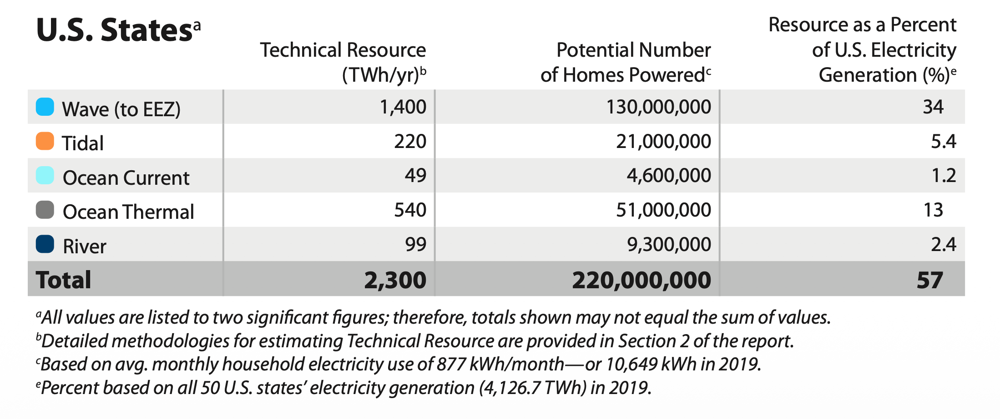
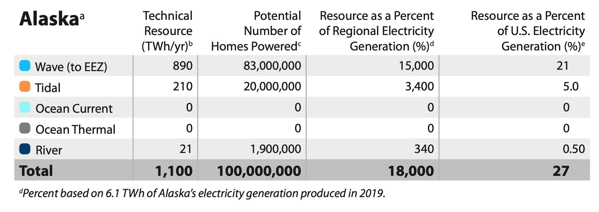
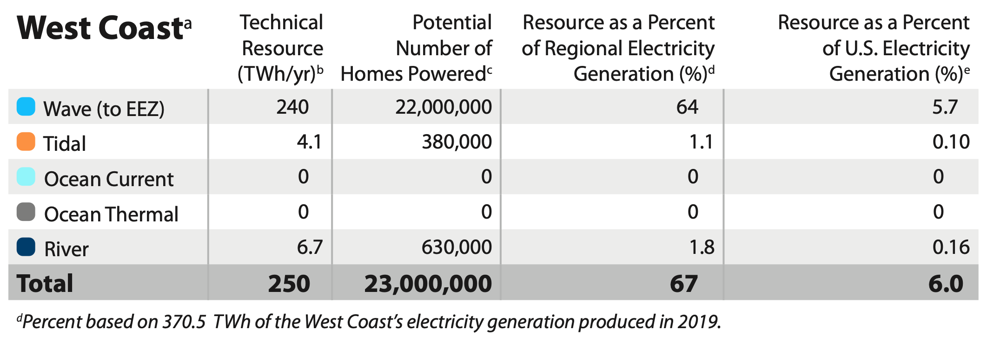
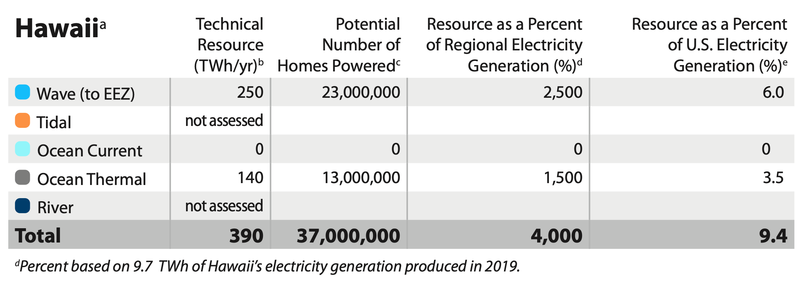
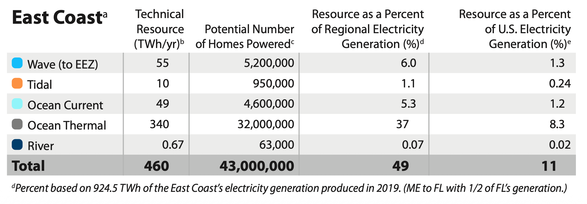
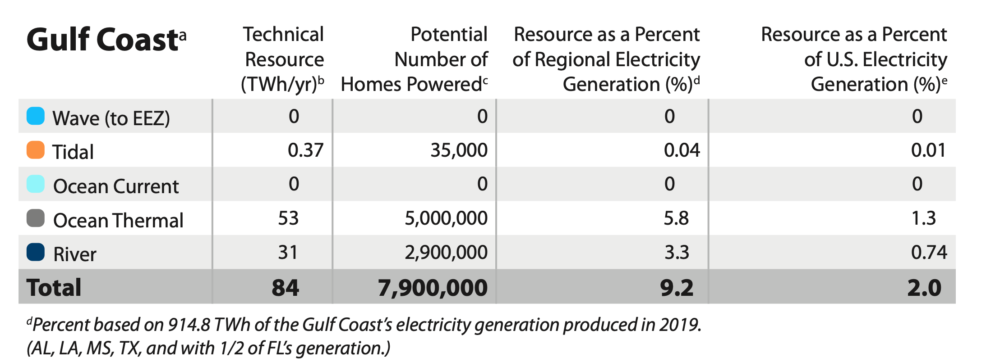
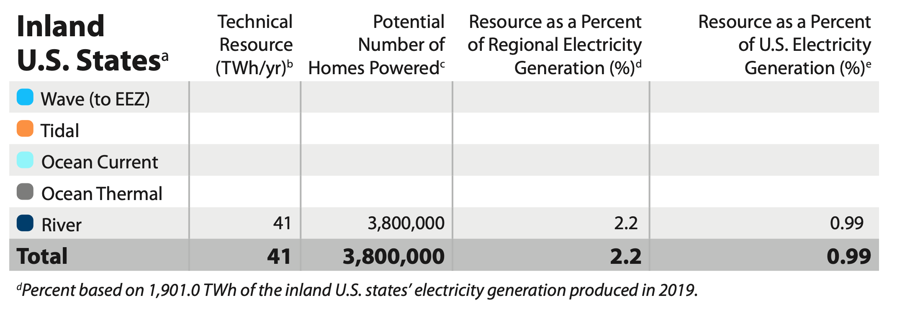
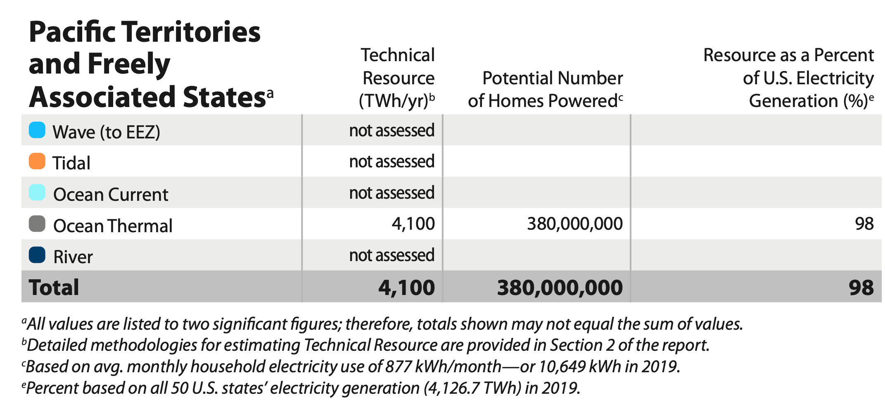
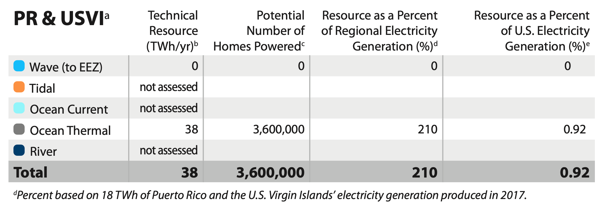

# U.S. Marine Energy Potential By Region

Marine energy resources are distributed throughout the United States and provide unique opportunities to different states and regions. The tables below present the theoretical and technical resource potential for each region, drawn from the national assessment by Kilcher et al. [@general_kilcher2021_marine].

## All U.S. States

<figure markdown="span">
  { width="100%" }
  <figcaption>Theoretical and technical marine energy resources for all U.S. states [@general_kilcher2021_marine]</figcaption>
</figure>

## Alaska

Alaska holds the largest share of the U.S. tidal resource, driven by powerful currents in Cook Inlet and Chatham Strait, and also benefits from substantial wave energy along its extensive coastline.

<figure markdown="span">
  { width="100%" }
  <figcaption>Theoretical and technical marine energy resources for Alaska [@general_kilcher2021_marine]</figcaption>
</figure>

## West Coast

California, Oregon, and Washington sit in the path of some of the most energetic open-ocean wave conditions in the world, giving the West Coast the highest wave energy resource of any contiguous U.S. region.

<figure markdown="span">
  { width="100%" }
  <figcaption>Theoretical and technical marine energy resources for the West Coast [@general_kilcher2021_marine]</figcaption>
</figure>

## Hawaii

Hawaii's offshore location in the central Pacific provides strong and consistent wave energy, as well as one of the most favorable ocean thermal gradients in U.S. territory, making it a prime candidate for both wave and OTEC development.

<figure markdown="span">
  { width="100%" }
  <figcaption>Theoretical and technical marine energy resources for Hawaii [@general_kilcher2021_marine]</figcaption>
</figure>

## East Coast

The Atlantic coast hosts tidal resources in several states, particularly in the Gulf of Maine and along the mid-Atlantic, and the Gulf Stream's proximity to the Florida coastline makes ocean current energy a distinct opportunity for the southeastern states.

<figure markdown="span">
  { width="100%" }
  <figcaption>Theoretical and technical marine energy resources for the East Coast [@general_kilcher2021_marine]</figcaption>
</figure>

## Gulf Coast

The Gulf Coast benefits primarily from ocean thermal gradients in the warm waters of the Gulf of Mexico, alongside river current resources from the Mississippi River system.

<figure markdown="span">
  { width="100%" }
  <figcaption>Theoretical and technical marine energy resources for the Gulf Coast [@general_kilcher2021_marine]</figcaption>
</figure>

## Inland U.S.

River current energy can be extracted from free-flowing rivers without dams or flow diversion. The inland United States contains thousands of viable river segments, providing broadly distributed generation potential throughout the country.

<figure markdown="span">
  { width="100%" }
  <figcaption>Theoretical and technical marine energy resources for Inland U.S. [@general_kilcher2021_marine]</figcaption>
</figure>

## Pacific Territories

U.S. Pacific territories and freely associated states, including the Marshall Islands, Micronesia, Palmyra, and others, sit in tropical waters with exceptional ocean thermal gradients, holding **4,100 TWh/yr** of ocean thermal resource, nearly double the entire 50-state total marine energy resource [@general_kilcher2021_marine].

<figure markdown="span">
  { width="100%" }
  <figcaption>Theoretical and technical marine energy resources for U.S. Pacific Territories [@general_kilcher2021_marine]</figcaption>
</figure>

## Puerto Rico & U.S. Virgin Islands

Puerto Rico and the U.S. Virgin Islands benefit from wave energy arriving from the open Atlantic and Caribbean, as well as ocean thermal resources in the warm waters of the Caribbean Sea.

<figure markdown="span">
  { width="100%" }
  <figcaption>Theoretical and technical marine energy resources for Puerto Rico and U.S. Virgin Islands [@general_kilcher2021_marine]</figcaption>
</figure>

## References

--8<-- "docs/_general_cite_widget.md"
