# Wave Energy

[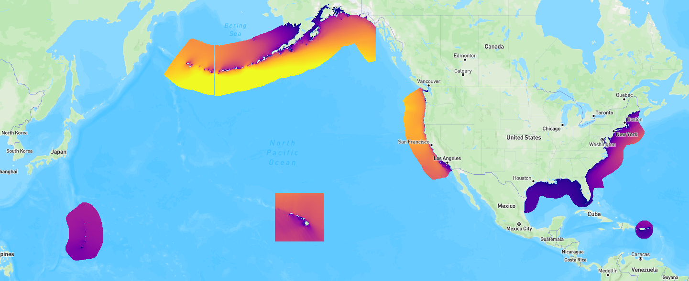][atlas-wave-all-datasets]

Ocean waves have an estimated **1,400 TWh/yr** of technical energy potential across the U.S. EEZ, equivalent to 34% of U.S. electricity generation [@general_kilcher2021_marine]. The [U.S. Department of Energy's Hydropower and Hydrokinetic Office (H2O)][h2o-office] produced a 42-year, high-resolution hindcast covering all U.S. coastal and offshore waters to map that resource in detail. The data are freely accessible through the [Marine Energy Atlas][atlas-wave-all-datasets], a Python API, and raw HDF5 files on AWS S3.

--8<-- "docs/includes/hindcast-definition.md"

## Regional Datasets

<div class="region-card" markdown="1">
<div class="region-card__top" markdown="1">
[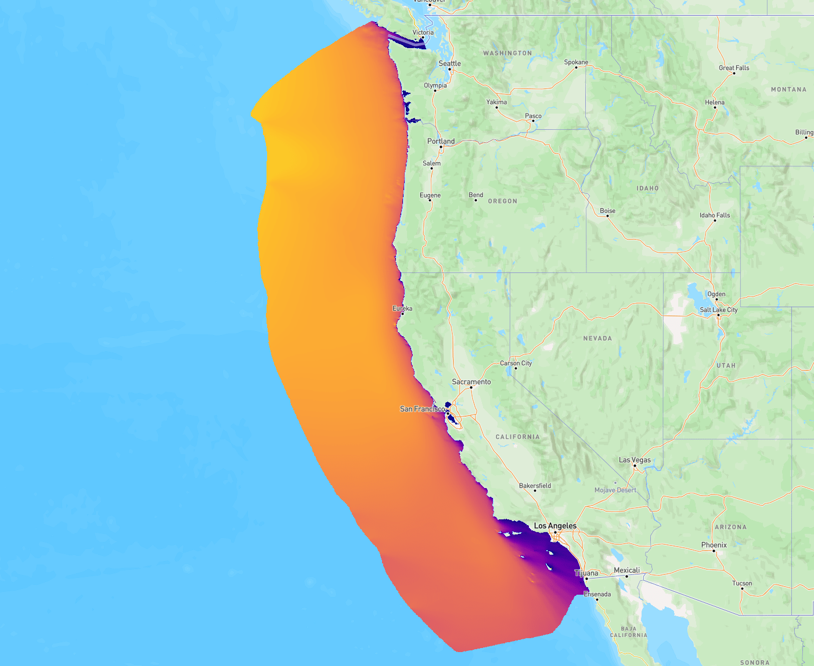{.region-card__img}][atlas-wave-west-coast]{target=_blank}
<div class="region-card__header" markdown="1">

### West Coast

[chicago@wu2020_west_coast]

</div>
</div>
<div class="region-card__body" markdown="1">

--8<-- "docs/includes/wave/region-stats-west-coast.md"

[View West Coast on the Marine Energy Atlas][atlas-wave-west-coast]{.md-button .md-button--inline}

</div>
</div>

<div class="region-card" markdown="1">
<div class="region-card__top" markdown="1">
[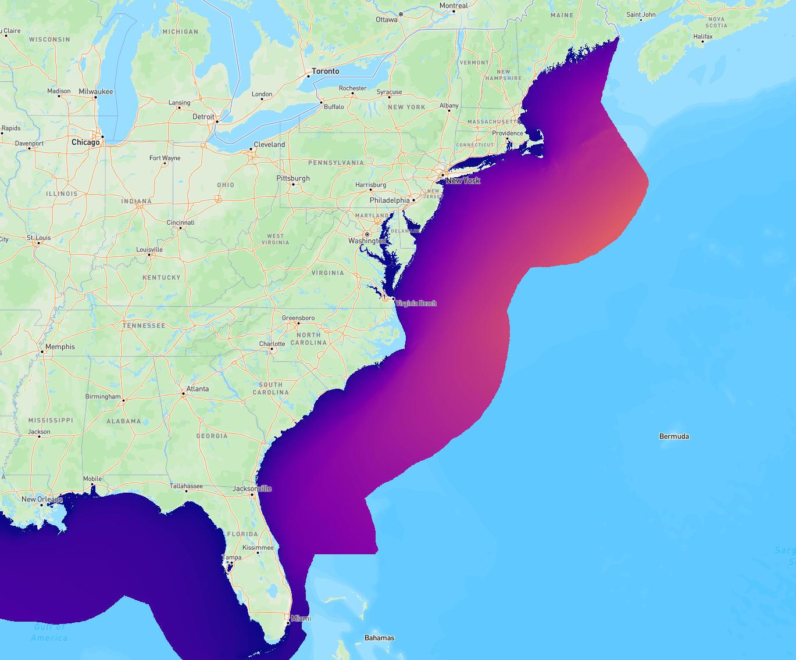{.region-card__img}][atlas-wave-atlantic]{target=_blank}
<div class="region-card__header" markdown="1">

### East Coast

[chicago@ahn2021_east_coast]

</div>
</div>
<div class="region-card__body" markdown="1">

--8<-- "docs/includes/wave/region-stats-atlantic.md"

[View Atlantic on the Marine Energy Atlas][atlas-wave-atlantic]{.md-button .md-button--inline}

</div>
</div>

<div class="region-card" markdown="1">
<div class="region-card__top" markdown="1">
[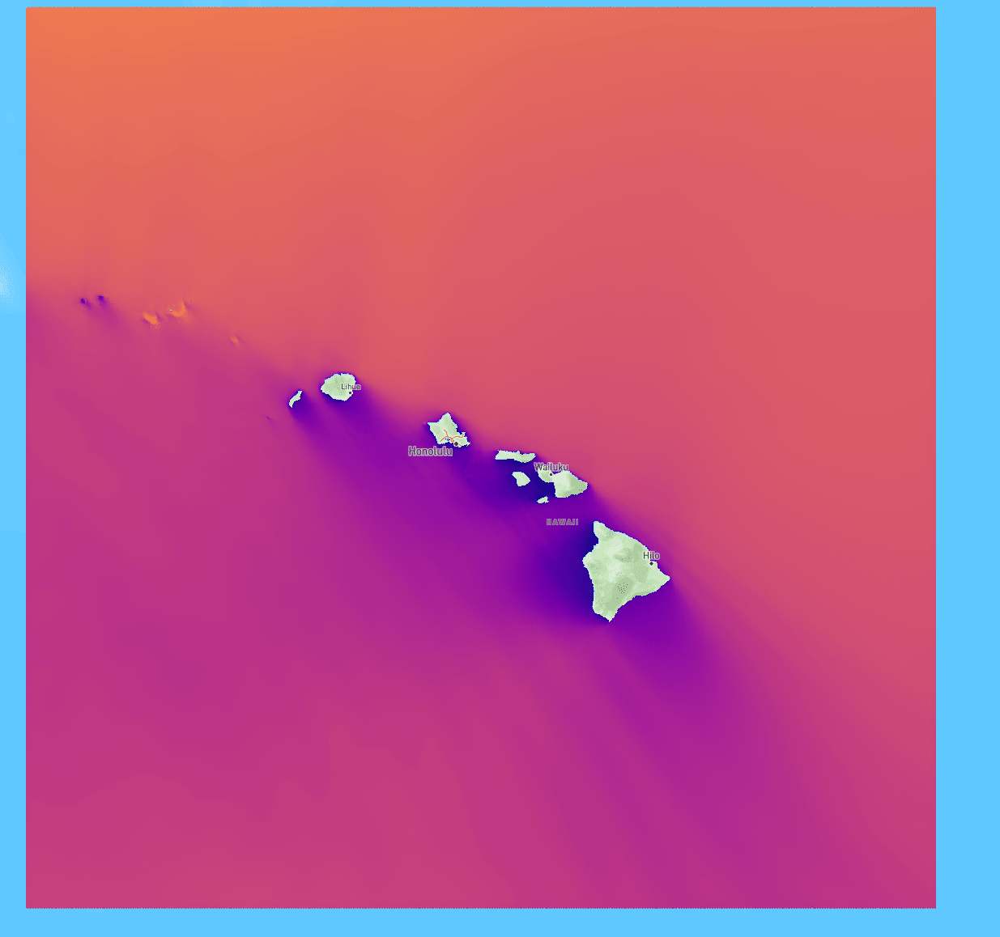{.region-card__img}][atlas-wave-hawaii]{target=_blank}
<div class="region-card__header" markdown="1">

### Hawaii

[chicago@li2021_hawaii]

</div>
</div>
<div class="region-card__body" markdown="1">

--8<-- "docs/includes/wave/region-stats-hawaii.md"

[View Hawaii on the Marine Energy Atlas][atlas-wave-hawaii]{.md-button .md-button--inline}

</div>
</div>

<div class="region-card" markdown="1">
<div class="region-card__top" markdown="1">
[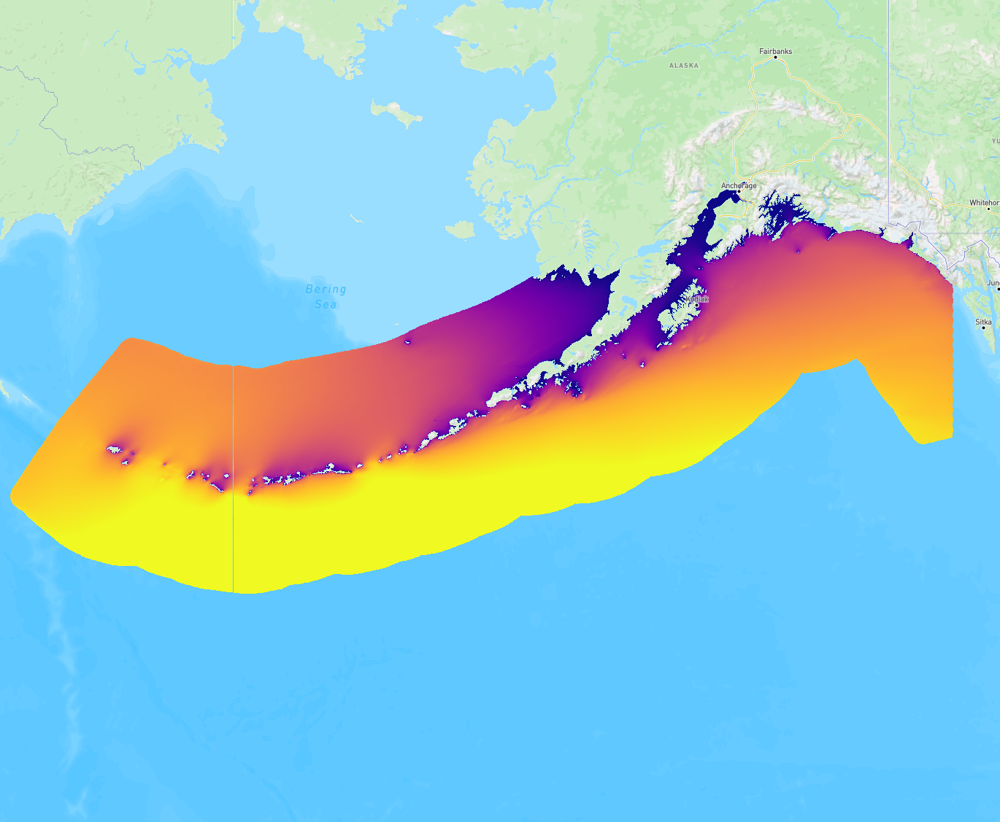{.region-card__img}][atlas-wave-alaska]{target=_blank}
<div class="region-card__header" markdown="1">

### Alaska

[chicago@garcia_medina2021_us_alaska]

</div>
</div>
<div class="region-card__body" markdown="1">

--8<-- "docs/includes/wave/region-stats-alaska.md"

[View Alaska on the Marine Energy Atlas][atlas-wave-alaska]{.md-button .md-button--inline}

</div>
</div>

<div class="region-card" markdown="1">
<div class="region-card__top" markdown="1">
[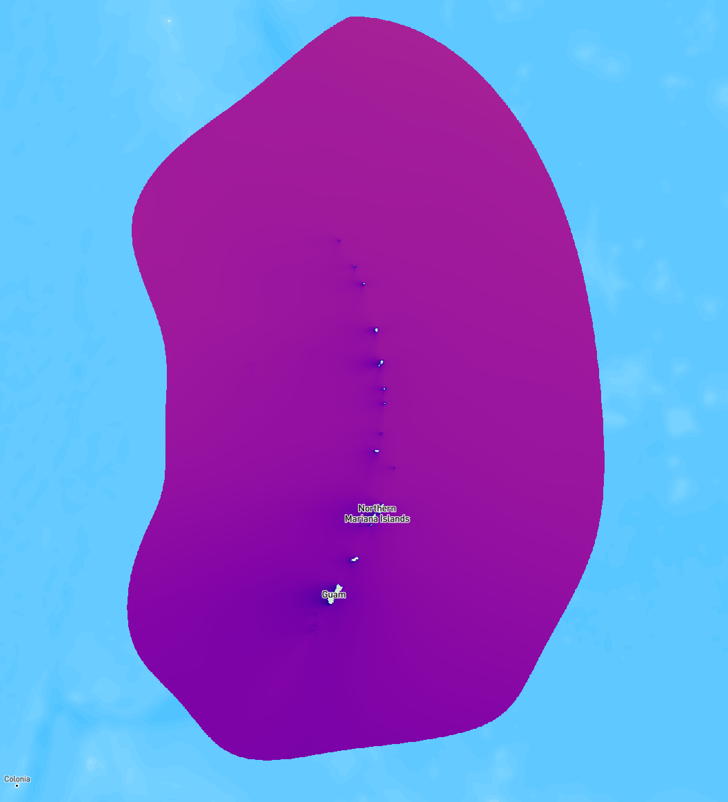{.region-card__img}][atlas-wave-cnmi-guam]{target=_blank}
<div class="region-card__header" markdown="1">

### Guam and Northern Mariana Islands

[chicago@garcia_medina2023_us_guam_and_cnmi]

</div>
</div>
<div class="region-card__body" markdown="1">

--8<-- "docs/includes/wave/region-stats-cnmi-guam.md"

[View CNMI and Guam on the Marine Energy Atlas][atlas-wave-cnmi-guam]{.md-button .md-button--inline}

</div>
</div>

<div class="region-card" markdown="1">
<div class="region-card__top" markdown="1">
[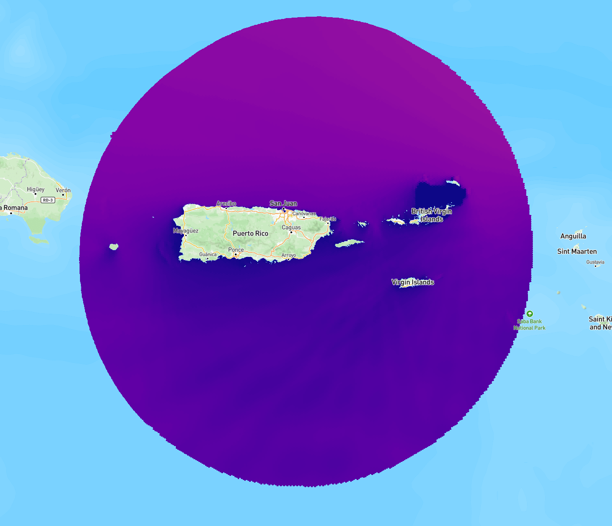{.region-card__img}][atlas-wave-puerto-rico]{target=_blank}
<div class="region-card__header" markdown="1">

### Puerto Rico

[chicago@ahn2021_us_gulf_of_mexico]

</div>
</div>
<div class="region-card__body" markdown="1">

Part of the Gulf of America dataset — same grid, variables, and archive period.

[View Puerto Rico on the Marine Energy Atlas][atlas-wave-puerto-rico]{.md-button .md-button--inline}

</div>
</div>

<div class="region-card" markdown="1">
<div class="region-card__top" markdown="1">
[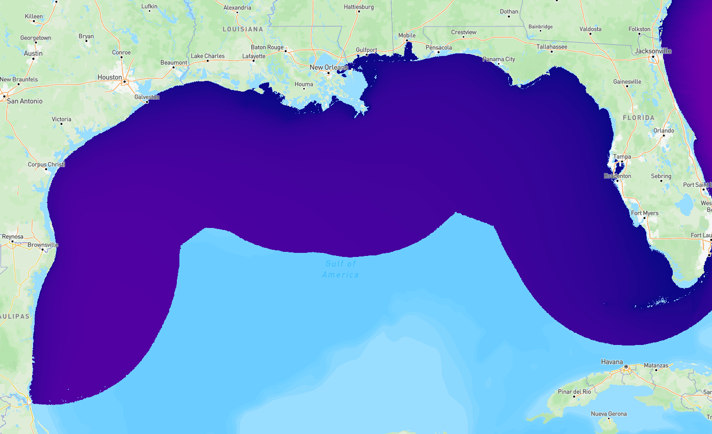{.region-card__img}][atlas-wave-gulf-of-america]{target=_blank}
<div class="region-card__header" markdown="1">

### Gulf of America

[chicago@ahn2021_us_gulf_of_mexico]

</div>
</div>
<div class="region-card__body" markdown="1">

--8<-- "docs/includes/wave/region-stats-gulf-of-america-and-puerto-rico.md"

[View Gulf of America on the Marine Energy Atlas][atlas-wave-gulf-of-america]{.md-button .md-button--inline}

</div>
</div>

## Limitations

!!! warning "Important Limitations"
    - **Hindcast, not measurements.** Model output does not replace in-situ buoy observations.
    - **Not design-grade by itself.** Class 3 assessments require site-specific measurements and validated local modeling.
    - **Skill varies by region.** Validation was performed against NOAA buoys for selected sites; accuracy is generally higher offshore and lower in complex nearshore areas, near domain boundaries, and ice-affected regions (Alaska).

## Data Access

Wave energy resource characteizion data is available in three data products that serve different needs. **Start with the Atlas** for visual exploration, then move to the API or raw files as your analysis deepens.

| I want to…                                      | Use this                                                       | Reference                                                                               |
| :---                                            | :---                                                           | :---                                                                                    |
| Explore the resource spatially, compare regions | [Marine Energy Atlas][atlas-wave-all-datasets]                 | [Atlas guide](../getting-started/marine-energy-atlas.md)                                |
| Download time series for up to ~100 sites       | `us-marine-energy-resource-python` or MHKiT `wave.io.hindcast` | [Getting Started](../getting-started/index.md)                                          |
| Download or slice the full archive              | HSDS or AWS S3                                                 | [HSDS Setup](../getting-started/hsds-setup.md) · [AWS S3](../getting-started/aws-s3.md) |
| Look up variable definitions and units          | Variable reference                                             | [Wave Variables](hindcast/variables.md)                                                 |

!!! tip "Start at the marine energy atlas"
    - **Marine Energy Atlas**: zero setup, browser-only. Best for stakeholders, initial site screening, and non-programmers.
    - **MHKiT**: 5-line Python queries for point or multi-site time series. Best for feasibility studies and comparing candidate sites.
    - **HSDS / S3 raw files**: direct HDF5 access. Best for bulk extraction, many sites, large regional studies, and reproducible pipelines. Annual files range from ~87 GB (West Coast) to ~600 GB (Gulf of America and Puerto Rico); the full archive is TB-scale.

---

## Site Analysis Example: PacWave South

The visualizations below walk through a Class 2 feasibility workflow at a single grid point near the [PacWave](https://pacwaveenergy.org) wave energy test site off Newport, Oregon (44.62°N, 124.28°W) — a U.S. DOE-funded open-water test facility on the West Coast.

**What this example covers:**

- Pulling a multi-year site time series with MHKiT
- Seasonal and inter-annual variability of key resource parameters
- Monthly wave climate summaries
- A wave scatter diagram ($H_{m0}$ × $T_e$ joint probability)
- Environmental contours for extreme sea-state design inputs (25, 50, and 100-year return periods)

<div id="site-context-map" style="height: 300px; width: 100%; border-radius: 6px; border: 1px solid #e0e0e0; margin: 1em 0;"></div>

<link rel="stylesheet" href="https://unpkg.com/leaflet@1.9.4/dist/leaflet.css" />
<script src="https://unpkg.com/leaflet@1.9.4/dist/leaflet.js"></script>
<script>
(function () {
  var map = L.map("site-context-map", { zoomControl: true, scrollWheelZoom: false, center: [44.62, -124.28], zoom: 7 });

  L.tileLayer("https://{s}.basemaps.cartocdn.com/light_all/{z}/{x}/{y}{r}.png", {
    attribution: '&copy; <a href="https://www.openstreetmap.org/copyright">OpenStreetMap</a> &copy; <a href="https://carto.com/attributions">CARTO</a>',
    subdomains: "abcd",
    maxZoom: 19
  }).addTo(map);

  L.circleMarker([44.624076, -124.280097], {
    radius: 7,
    fillColor: "#C44E52",
    color: "#fff",
    weight: 2,
    opacity: 1,
    fillOpacity: 0.95
  })
    .bindTooltip("PacWave, Newport OR (example site)", { permanent: true, direction: "right", offset: [10, 0] })
    .addTo(map);

  setTimeout(function () { map.invalidateSize(); }, 100);
})();
</script>

### Wave Conditions Time Series

The three plots below show 3-hour hindcast time series at PacWave for 2016 to 2020. Each year is drawn as a grey trace and the 5-year mean is shown in color. Variables are plotted separately so seasonal patterns are easy to read.

<figure markdown="span">
  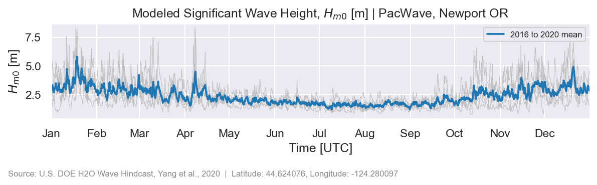{ width="100%" }
  <figcaption>Significant wave height ($H_{m0}$) at PacWave, Newport OR, 2016 to 2020. The seasonal signal is strong, with the highest and most variable heights occurring November to February.</figcaption>
</figure>

<figure markdown="span">
  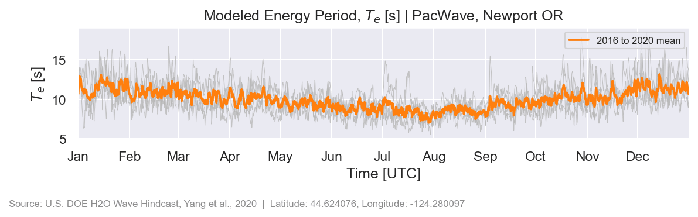{ width="100%" }
  <figcaption>Energy period ($T_e$) at PacWave, 2016 to 2020. Long-period swell dominates the winter months; shorter, locally-generated wind seas are more common in summer.</figcaption>
</figure>

<figure markdown="span">
  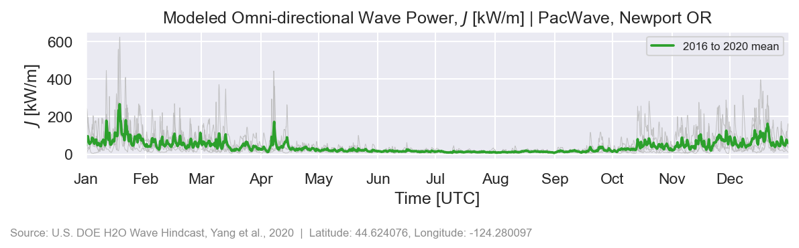{ width="100%" }
  <figcaption>Omni-directional wave power ($J$) at PacWave, Newport OR, 2016 to 2020. Winter storms drive peak power well above 100 kW/m; summer conditions typically stay below 20 kW/m.</figcaption>
</figure>

??? example "Show Python code"

    ```python
    --8<-- "scripts/generate_wave_example_figures.py:ts_helpers"

    --8<-- "scripts/generate_wave_example_figures.py:wave_height_ts"

    --8<-- "scripts/generate_wave_example_figures.py:energy_period_ts"

    --8<-- "scripts/generate_wave_example_figures.py:wave_power_ts"
    ```

### Monthly Wave Climate

The bar charts below show the monthly mean and inter-annual spread (error bars = ±1 std across years) for each wave parameter at PacWave, capturing the strong Pacific Northwest seasonal signal.

<figure markdown="span">
  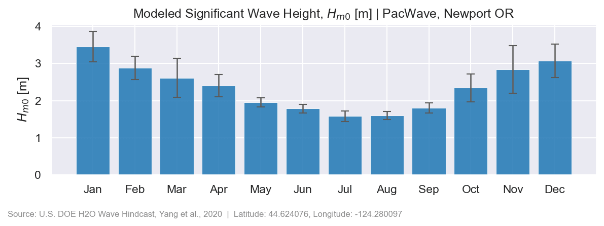{ width="100%" }
  <figcaption>Monthly mean significant wave height ($H_{m0}$) at PacWave, Newport OR, 2016 to 2020. Winter months (Nov to Feb) average 2 to 3 m; summer months (Jun to Aug) are consistently calmer at 1 to 1.5 m.</figcaption>
</figure>

<figure markdown="span">
  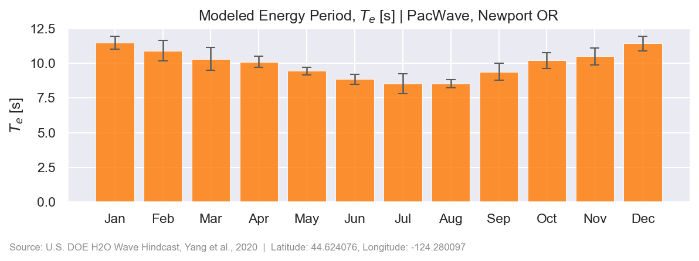{ width="100%" }
  <figcaption>Monthly mean energy period ($T_e$) at PacWave, 2016 to 2020. Long-period swell extends the energy period in winter; short-period wind seas suppress it in summer.</figcaption>
</figure>

<figure markdown="span">
  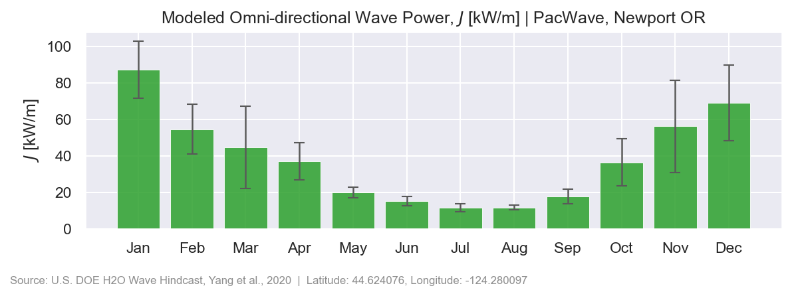{ width="100%" }
  <figcaption>Monthly mean omni-directional wave power ($J$) at PacWave, 2016 to 2020. The seasonal contrast is pronounced, with winter power often exceeding summer levels by 5 to 10x.</figcaption>
</figure>

??? example "Show Python code"

    ```python
    --8<-- "scripts/generate_wave_example_figures.py:monthly_barchart"
    ```

### Resource Matrix and Environmental Contours

The joint probability distribution (JPD) maps how often each $H_{m0}$ and $T_e$ combination occurs, binned at $0.5\,\text{m} \times 1\,\text{s}$. The environmental contours (PCA method) define the extreme sea state envelope at 25, 50, and 100-year return periods, providing design load inputs per IEC 62600-101 [@iec_62600_101].

<div class="plot-pair" markdown="1">

<figure markdown="span">
  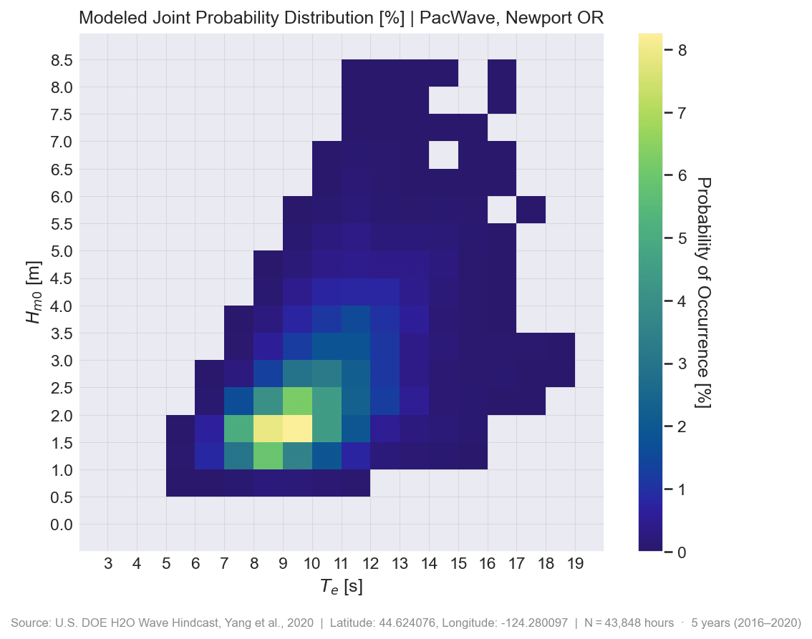{ width="100%" }
  <figcaption>Joint probability distribution ($H_{m0}$ × $T_e$) at PacWave, Newport OR, 1995 hindcast year. Cells are colored by occurrence (hours/year). The dominant sea states cluster around $H_{m0}$ = 1.5 to 3.5 m and $T_e$ = 8 to 14 s.</figcaption>
</figure>

<figure markdown="span">
  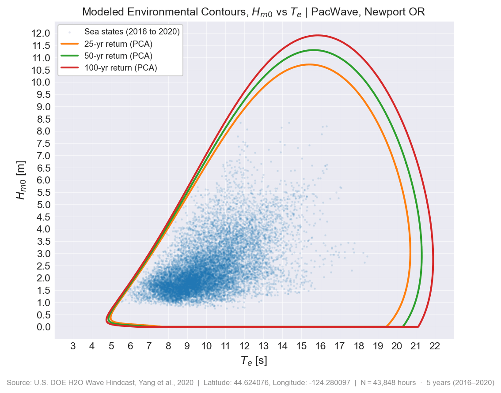{ width="100%" }
  <figcaption>Environmental contours at PacWave, Newport OR (PCA method, 1995 hindcast). Steel-blue points are the observed sea states; curves show the 25, 50, and 100-year return period envelopes. Sea states on or outside a contour exceed that return period.</figcaption>
</figure>

</div>

??? example "Show Python code"

    ```python
    --8<-- "scripts/generate_wave_example_figures.py:scatter_diagram"

    --8<-- "scripts/generate_wave_example_figures.py:environmental_contour"
    ```

---

## Resource Characterization (IEC/TS 62600-101)

IEC/TS 62600-101 [@iec_62600_101] defines three levels of wave resource assessment — think of them as progressively deeper stages of a development project:

| IEC class | What you are doing | Hindcast supports? | Best access path |
|:---|:---|:---|:---|
| **Class 1: Reconnaissance** | Screening regions, comparing broad areas, identifying candidate sites | Yes | [Marine Energy Atlas][atlas-wave-all-datasets] |
| **Class 2: Feasibility** | Site time series, seasonal profiles, scatter diagrams, early extreme-value inputs | With caveats | MHKiT or raw H5 |
| **Class 3: Design** | Device engineering, array layout, certification-grade assessment | Not alone | Site measurements and validated local modeling |

### Class 1: Reconnaissance

The [Marine Energy Atlas][atlas-wave-all-datasets] displays time-averaged wave energy resource parameters (significant wave height, wave power, energy period) across all hindcast domains. Grid cells are color-coded by magnitude and a point-query tool returns summary statistics for any selected location.

### Class 2: Feasibility

A Class 2 assessment derives site-specific statistics from the full time series. The hindcast provides all six IEC/TS 62600-101 primary resource parameters:

- **Significant wave height** ($H_{m0}$): mean height of the largest one-third of waves
- **Energy period** ($T_e$): spectral period weighted toward low-frequency components; preferred for wave power calculations
- **Peak period** ($T_p$): period at the dominant spectral peak
- **Mean zero-crossing period** ($T_z$): average zero-crossing period derived from spectral moments
- **Omni-directional wave power** ($J$): total wave energy flux from all directions [W/m]
- **Directionality coefficient** ($d$): fraction of wave power arriving from the dominant direction

Point queries can be made using [MHKiT](https://mhkit-software.github.io/MHKiT/):

```python
from mhkit.wave.io.hindcast.hindcast import request_wpto_point_data

# PacWave site near Newport, OR
lat_lon = (44.624076, -124.280097)

# Fetch one year of significant wave height and energy period
Hm0, meta = request_wpto_point_data("3-hour", "significant_wave_height", lat_lon, [2005])
Te,  meta = request_wpto_point_data("3-hour", "energy_period",            lat_lon, [2005])
```

MHKiT is ideal for up to ~100 sites. For larger studies, switch to HSDS or S3 bulk access:

```python
from rex import ResourceX

wave_file = '/nrel/US_wave/West_Coast/West_Coast_wave_2005.h5'
with ResourceX(wave_file, hsds=True) as f:
    meta       = f.meta
    time_index = f.time_index
    Hm0        = f['significant_wave_height']
    J          = f['omni-directional_wave_power']
```

!!! tip "Prerequisites"
    See [Getting Started](../getting-started/index.md) for HSDS/S3 setup.

---

## Next Steps

- **Access the data**: see [Getting Started](../getting-started/index.md) for HSDS/S3 setup and code examples using [us-marine-energy-resource-python](https://github.com/US-Marine-Energy-Resource/us-marine-energy-resource-python), [MHKiT](https://mhkit-software.github.io/MHKiT/), and [rex](https://github.com/NatLabRockies/rex).
- **Explore variables**: see [Wave Variables](hindcast/variables.md) for full IEC and SWAN definitions of each output parameter.
- **Read the references**: see [References](hindcast/references.md) for the publications behind each regional dataset.


--8<-- "docs/wave/_cite-widget.md"
--8<-- "docs/includes/links.md"

