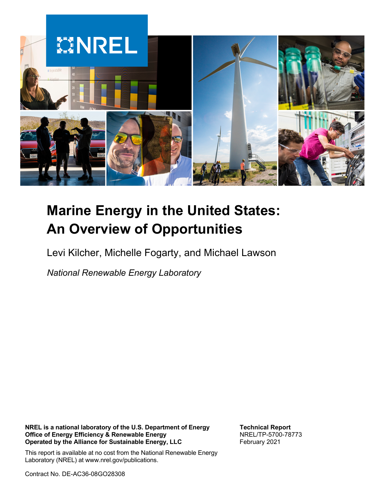
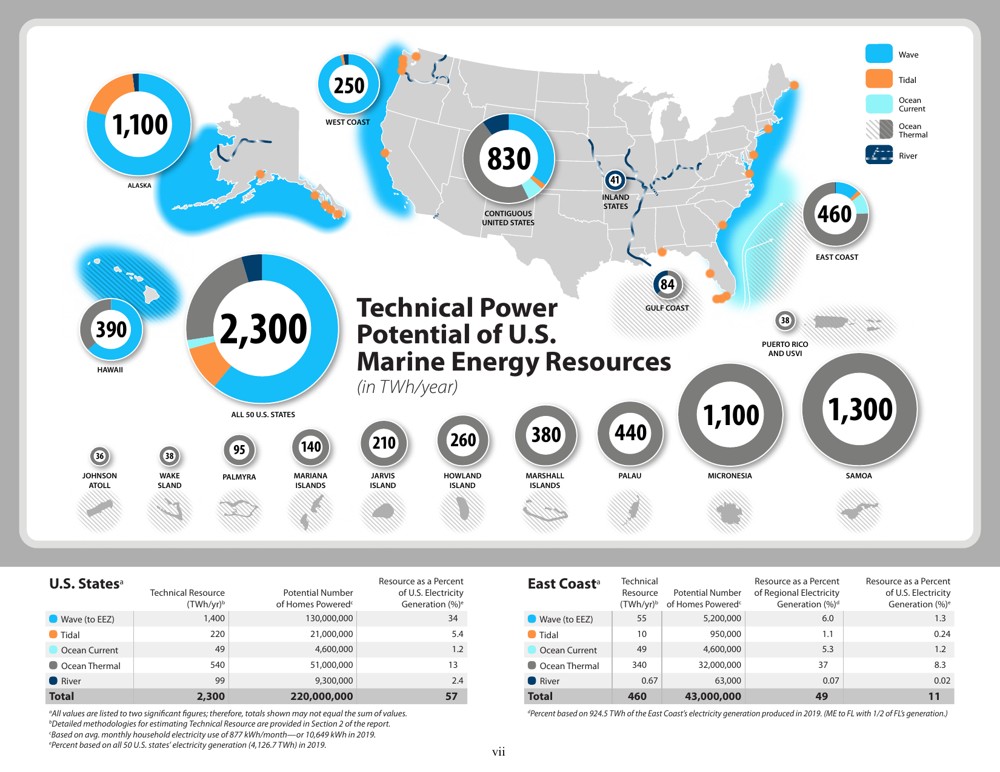
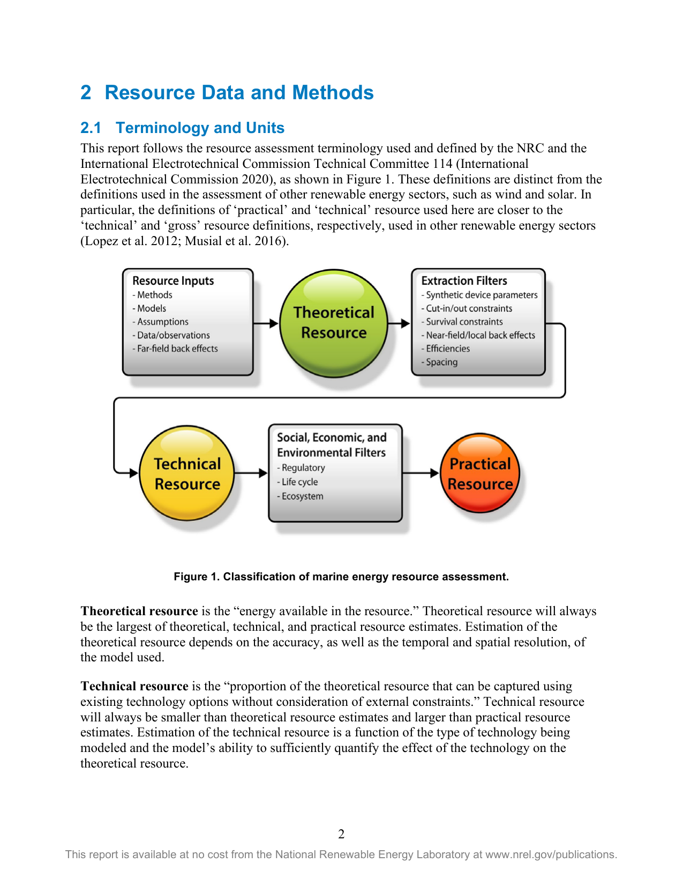

# Marine Energy in the United States: An Overview of Opportunities

**Authors:** Levi Kilcher, Michelle Fogarty, and Michael Lawson  
**Institution:** National Renewable Energy Laboratory (NREL)  
**Report:** NREL/TP-5700-78773  
**Date:** February 2021  
**Source:** [NREL](https://www.nrel.gov/docs/fy21osti/78773.pdf)

## Acknowledgments

This report is primarily a summary of work completed by leading marine energy scientists. It
would not have been possible without the work they put into the original marine energy resource
assessments. It was authored by the National Renewable Energy Laboratory, operated by
Alliance for Sustainable Energy, LLC, for the U.S. Department of Energy (DOE) under Contract
No. DE-AC36-08GO28308. Funding provided by U.S. Department of Energy, Office of Energy
Efficiency and Renewable Energy, Water Power Technologies Office.
The authors thank the DOE’s Water Power Technologies Office team for its timely, thorough,
and insightful review of this work. Hoyt Battey, in particular, provided considerable
encouragement and valuable perspective.
We also thank the National Research Council’s review of the assessments; many of their
recommendations were implemented here and helped frame this report. We are also grateful to
our colleagues, Zhaoqing Yang and Vince Neary, for their careful review and input. We thank
Terri Marshburn for her steadfast review and support in keeping this publication moving forward
efficiently. We also thank John Frenzl for his creative and detailed presentation of the results in
Figure ES-1, which provides a compact and lustrous overview of the results contained herein.
Finally, we thank the numerous anonymous reviewers who took the time to provide detailed and
thoughtful comments that provided many important, detailed, and nuanced contributions.

## List of Acronyms

CONUS contiguous U.S. states
DOE U.S. Department of Energy
EEZ exclusive economic zone
IEC International Electrotechnical Commission
kWh kilowatt hour
GW gigawatt
MHK marine and hydrokinetic
MW megawatt
nmi nautical mile
NREL National Renewable Energy Laboratory
NRC National Research Council
OTEC ocean thermal energy conversion
PNNL Pacific Northwest National Laboratory
QTR 2015 Quadrennial Technology Review
Sandia Sandia National Laboratories
TWh terawatt hour

## Executive Summary

This report provides a concise and consolidated overview of the Unites States’ marine energy
resources.1 The results reported herein are primarily based on U.S. Department of Energy
(DOE)-funded marine energy resource assessments in the following technology areas: wave,
tidal currents, ocean currents, ocean thermal gradients, and river currents (Jacobson, Hagerman,
and Scott 2011; Haas et al. 2011; Haas 2013; Ascari et al. 2012). This report also incorporates
recent updates and refinements to the U.S. wave and tidal resource assessments performed by
several national laboratories (Kilcher, Garcia-Medina, and Yang 2021; Kilcher, Haas, and
Muscalus 2021). Many of these refinements were undertaken to address feedback from the
National Research Council’s evaluation of the original resource assessments (National Research
Council 2013). Further, this report refines the analysis published to date by identifying the
marine energy resources available in each state or region to the extent practical. In short, this
report summarizes the best available data on U.S. marine energy resources at the state, regional,
and national scales.
While marine energy technologies are still at the relatively early stages of development, the
resource potential is immense and distributed widely across the nation’s coastlines and rivers.
We use the following definitions to frame the conversation about marine energy resource
potentials (International Electrotechnical Commission 2020):
• Theoretical resource—the energy available in the resource
• Technical resource—the proportion of the theoretical resource that can be captured using
existing technology options
• Practical resource—the proportion of the technical resource that is available after
consideration of external constraints. Where ‘external constraints’ are the socio-
economic, environmental, regulatory, and other competing-use constraints that determine
whether a project is viable at a specific site.
In this work, we focus on the technical resource within the nation’s exclusive economic zone
(EEZ)2 that can be harnessed for large-scale (megawatt- to gigawatt-scale) energy generation. It
does not include marine energy resources that may be valuable to many blue economy
applications,3 which often have lower power requirements and can use low-energy marine
energy resources that are not sufficiently energetic for large-scale energy generation.
Accordingly, some locations where this report indicates there is little or no technical resource
1 Marine energy is defined in the Energy Act of 2020 as energy from waves, tides, ocean currents, free-flowing
rivers and man-made channels, as well as from differentials in salinity, temperature, and pressure (116th U.S.
Congress 2020). Before this bill was enacted, marine energy had often been known as marine and hydrokinetic
energy (MHK).
2 In this report, we use the National Oceanic and Atmospheric Administration definition of the U.S. EEZ (National
Oceanic and Atmospheric Administration 2019).
3 Blue economy applications for marine energy include providing power at sea to support offshore industries,
science, and security activities and also meeting the energy and water needs of coastal and rural island communities
(LiVecchi et al. 2019).

may still have marine energy resources that are sufficient to provide power for blue economy
applications.
The total marine energy technical resource in the 50 states is 2,300 TWh/yr, equivalent to 57% of
the electricity generated by those states in 2019. The nation’s Pacific and Caribbean territories
and freely associated states add an additional 4,100 TWh/yr of ocean thermal energy resource.
While we do not attempt to forecast the future deployment of marine energy technologies, it is
important to note that even if only a small portion of the technical resource potential is captured,
marine energy technologies would make significant contributions to our nation’s energy needs.
For example, utilizing just one-tenth of the technically available marine energy resources in the
50 states would equate to 5.7% of our nation’s current electricity generation—enough energy to
power 22-million homes (U.S. Energy Information Administration 2020) (Figure ES-1).
Assuming this energy could be generated at capacity factors between 30% and 70%, this would
translate to between 40 GW and 90 GW of marine energy projects.
Marine energy resources are distributed throughout the United States and provide unique
opportunities to different states and regions. Massive quantities of wave energy arrive at our
coastlines every year, and this resource is particularly energetic along the nation’s Pacific
shorelines (California, Oregon, Washington, Alaska, and Hawaii). Tidal energy, perhaps the
most predictable renewable energy resource, could play a major role in Alaska’s electricity
generation and could realistically contribute sizable quantities of power in Washington state and
several Atlantic states. Ocean current energy, which is primarily contained in the Gulf Stream,
has the potential to provide steady, reliable power to homes in North Carolina, South Carolina,
Georgia, and Florida. Ocean thermal energy is another significant opportunity for parts of the
Atlantic coast as well as the Gulf Coast states, Hawaii, and U.S. Pacific territories and freely
associated states. Finally, the nation’s riverine resource can be harnessed without the need for
dams or river diversion to provide reliable power throughout the country.

*Figure ES-1. Technical potential of U.S. marine energy resources by region (TWh/year). Total technical resource for all 50 U.S. states is 2,300 TWh/yr.*

| ve (to EEZ) 1,40 | 0 130,000,000 | 34 |
| --- | --- | --- |
| l 22 | 0 21,000,000 |  |
| an Current 4 | 9 4,600,000 | 1.2 |
| an Thermal 54 | 0 51,000,000 |  |
| er 9 | 9 9,300,000 | 2.4 |
| 2,30 | 0 220,000,000 | 57 |

| 63,000 0.07 0.02 |
| --- |
| 00,000 49 11 |

| Wave (to EEZ) | 890 | 83,000,000 | 15,000 | 21 |
| --- | --- | --- | --- | --- |
|  | 210 | 20,000,000 | 3,400 |  |
| Ocean Current | 0 | 0 | 0 | 0 |
|  | 0 | 0 | 0 |  |
| River | 21 | 1,900,000 | 340 | 0.50 |
| Total | 1,100 | 100,000,000 | 18,000 | 27 |

| Wave (to EEZ) |  |  |  |  |
| --- | --- | --- | --- | --- |
|  |  |  |  |  |
| Ocean Current |  |  |  |  |
|  |  |  |  |  |
| River | 41 | 3,800,000 | 2.2 | 0.99 |
| Total | 41 | 3,800,000 | 2.2 | 0.99 |

| Wave (to EEZ) | 240 | 22,000,000 | 64 | 5.7 |
| --- | --- | --- | --- | --- |
|  | 4.1 | 380,000 | 1.1 |  |
| Ocean Current | 0 | 0 | 0 | 0 |
|  | 0 | 0 | 0 |  |
| River | 6.7 | 630,000 | 1.8 | 0.16 |
| Total | 250 | 23,000,000 | 67 | 6.0 |

| Wave (to EEZ) | 0 | 0 | 0 | 0 |
| --- | --- | --- | --- | --- |
|  | 0.37 | 35,000 | 0.04 |  |
| Ocean Current | 0 | 0 | 0 | 0 |
|  | 53 | 5,000,000 | 5.8 |  |
| River | 31 | 2,900,000 | 3.3 | 0.74 |
| Total | 84 | 7,900,000 | 9.2 | 2.0 |

| Wave (to EEZ) | 250 | 23,000,000 | 2,500 | 6.0 |
| --- | --- | --- | --- | --- |
|  | not assessed |  |  |  |
| Ocean Current | 0 | 0 | 0 | 0 |
|  | 140 | 13,000,000 | 1,500 |  |
| River | not assessed |  |  |  |
| Total | 390 | 37,000,000 | 4,000 | 9.4 |

| Wave (to EEZ) | 0 | 0 | 0 | 0 |
| --- | --- | --- | --- | --- |
|  | not assessed |  |  |  |
| Ocean Current | not assessed |  |  |  |
|  | 38 | 3,600,000 | 210 |  |
| River | not assessed |  |  |  |
| Total | 38 | 3,600,000 | 210 | 0.92 |

| Johnson Atoll | 36 | 3,400,000 | 0.87 |
| --- | --- | --- | --- |
|  | 38 | 3,600,000 |  |
| Palmyra | 95 | 8,900,000 | 2.3 |
|  | 140 | 13,000,000 |  |
| Jarvis Island | 210 | 20,000,000 | 5.2 |
|  | 260 | 25,000,000 |  |
| Marshall Islands | 380 | 35,000,000 | 9.2 |
|  | 440 | 41,000,000 |  |
| Micronesia | 1,100 | 110,000,000 | 27 |
|  | 1,300 | 120,000,000 |  |
| Total | 4,100 | 380,000,000 | 98 |

| Wave (to EEZ) | not assessed |  |  |
| --- | --- | --- | --- |
|  | not assessed |  |  |
| Ocean Current | not assessed |  |  |
|  | 4,100 | 380,000,000 |  |
| River | not assessed |  |  |
| Total | 4,100 | 380,000,000 | 98 |

Alaskaa Technical Potential Resource as a Percent Resource as a Percent Inland Technical Potential Resource as a Percent Resource as a Percent
Resource Number of of Regional Electricity of U.S. Electricity Resource Number of of Regional Electricity of U.S. Electricity
U.S. Statesa
(TWh/yr)b Homes Poweredc Generation (%)d Generation (%)e (TWh/yr)b Homes Poweredc Generation (%)d Generation (%)e
Wave (to EEZ) 890 83,000,000 15,000 21 Wave (to EEZ)
Tidal 210 20,000,000 3,400 5.0 Tidal
Ocean Current 0 0 0 0 Ocean Current
Ocean Thermal 0 0 0 0 Ocean Thermal
River 21 1,900,000 340 0.50 River 41 3,800,000 2.2 0.99
Total 1,100 100,000,000 18,000 27 Total 41 3,800,000 2.2 0.99
dPercent based on 6.1 TWh of Alaska’s electricity generation produced in 2019. dPercent based on 1,901.0 TWh of the inland U.S. states’ electricity generation produced in 2019.
West Coasta Technical Potential Resource as a Percent Resource as a Percent Gulf Coasta Technical Potential Resource as a Percent Resource as a Percent
Resource Number of of Regional Electricity of U.S. Electricity Resource Number of of Regional Electricity of U.S. Electricity
(TWh/yr)b Homes Poweredc Generation (%)d Generation (%)e (TWh/yr)b Homes Poweredc Generation (%)d Generation (%)e
Wave (to EEZ) 240 22,000,000 64 5.7 Wave (to EEZ) 0 0 0 0
Tidal 4.1 380,000 1.1 0.10 Tidal 0.37 35,000 0.04 0.01
Ocean Current 0 0 0 0 Ocean Current 0 0 0 0
Ocean Thermal 0 0 0 0 Ocean Thermal 53 5,000,000 5.8 1.3
River 6.7 630,000 1.8 0.16 River 31 2,900,000 3.3 0.74
Total 250 23,000,000 67 6.0 Total 84 7,900,000 9.2 2.0
dPercent based on 370.5 TWh of the West Coast’s electricity generation produced in 2019. dPercent based on 914.8 TWh of the Gulf Coast’s electricity generation produced in 2019.
(AL, LA, MS, TX, and with 1/2 of FL’s generation.)
Hawaiia Technical Potential Resource as a Percent Resource as a Percent PR & USVIa Technical Potential Resource as a Percent Resource as a Percent
Resource Number of of Regional Electricity of U.S. Electricity Resource Number of of Regional Electricity of U.S. Electricity
(TWh/yr)b Homes Poweredc Generation (%)d Generation (%)e (TWh/yr)b Homes Poweredc Generation (%)d Generation (%)e
Wave (to EEZ) 250 23,000,000 2,500 6.0 Wave (to EEZ) 0 0 0 0
Tidal not assessed Tidal not assessed
Ocean Current 0 0 0 0 Ocean Current not assessed
Ocean Thermal 140 13,000,000 1,500 3.5 Ocean Thermal 38 3,600,000 210 0.92
River not assessed River not assessed
Total 390 37,000,000 4,000 9.4 Total 38 3,600,000 210 0.92
dPercent based on 9.7 TWh of Hawaii’s electricity generation produced in 2019. dPercent based on 18 TWh of Puerto Rico and the U.S. Virgin Islands’ electricity generation produced in 2017.
Ocean Thermal in Pacific
Pacific Territories
and Freely Technical Resource as a Percent Territories and Freely Technical Resource as a Percent
Resource Potential Number of U.S. Electricity
Associated Statesa
(
R
T
e
W
so
h
u
/y
rc
r)
e
b of
P
H
o
o
te
m
n
e
ti
s
a
P
l N
ow
um
er
b
e
e
d
r
c
o
G
f
e
U
n
.S
e
.
r
E
a
l
t
e
io
c
n
tr i
(
c
%
it
)
y
e
Associated Statesa
(TWh/yr)b of Homes Poweredc Generation (%)e
Johnson Atoll 36 3,400,000 0.87
Wave (to EEZ) not assessed
Wake Island 38 3,600,000 0.92
Tidal not assessed
Palmyra 95 8,900,000 2.3
Ocean Current not assessed
Mariana Islands 140 13,000,000 3.3
Ocean Thermal 4,100 380,000,000 98
Jarvis Island 210 20,000,000 5.2
River not assessed
Howland Island 260 25,000,000 6.3
Total 4,100 380,000,000 98
Marshall Islands 380 35,000,000 9.2
aAll values are listed to two significant figures; therefore, totals shown may not equal the sum of values. Palau 440 41,000,000 11
bDetailed methodologies for estimating Technical Resource are provided in Section 2 of the report.
Micronesia 1,100 110,000,000 27
cBased on avg. monthly household electricity use of 877 kWh/month—or 10,649 kWh in 2019.
ePercent based on all 50 U.S. states’ electricity generation (4,126.7 TWh) in 2019. Samoa 1,300 120,000,000 32
Total 4,100 380,000,000 98
Figure ES-1. Technical power potential of U.S. marine energy resources (in TWh/yr) for the United States, U.S. territories, and freely associated states.

## 1 Introduction

This report was written at the request of the U.S. Department of Energy’s (DOE’s) Water Power
Technologies Office to provide a concise and consolidated summary of the location and quantity
of utility-scale wave, tidal current, ocean current, ocean thermal, and river hydrokinetic
resources. The information presented herein is intended to help improve understanding of the
locations and characteristics of the resources and how they might contribute to the future energy
portfolio of the United States. This work is based on several DOE-funded resource assessment
studies (Haas et al. 2011; Haas 2013; Jacobson, Hagerman, and Scott 2011; Jacobson et al. 2012;
Ascari et al. 2012), a review of these studies performed by the National Research Council
(National Research Council (NRC) 2013), and work to update and improve resource assessment
studies currently underway at the National Renewable Energy Laboratory (NREL), Pacific
Northwest National Laboratory (PNNL), and Sandia National Laboratories (Sandia).
Accordingly, this report presents the most up-to-date marine energy technically recoverable
utility-scale resource data for the United States.
This report focuses on the technically recoverable marine energy resource that can be captured
using utility-scale technologies that, when deployed in arrays, can provide megawatts to
gigawatts of power and does not independently consider marine energy resources for Powering
the Blue Economy applications and markets (LiVecchi et al. 2019). Many blue economy uses of
marine energy have lower power requirements and can often harness low-energy marine energy
resources that are not sufficiently energetic for large-scale energy generation. Accordingly,
some locations where this report identifies little or no technical resource may still have
sufficient resource potential to power blue economy marine energy technologies. While
quantifying marine energy resources for blue economy applications is beyond the scope of this
report, including them would increase the overall resource available withing the U.S. exclusive
economic zone (EEZ). Further, although Powering the Blue Economy power requirements are
often small, the value of energy in these markets is typically high, and there is the potential for
significant market opportunities and economic benefit in harnessing marine energy for blue
economy applications.
Section 2 of this document provides a high-level overview of terminology and methods used to
describe and define each marine energy resource type. It also includes a short description of
challenges and next steps for each resource type, based primarily on the NRC 2013 report.
Sections 3 and 4 provide a description of marine energy resources at the national, state, and
regional scales, respectively. Section 5 provides conclusions and a discussion of how to prioritize
future research in marine energy resource assessment to support the growth of the industry.

## 2 Resource Data and Methods

### 2.1 Terminology and Units

This report follows the resource assessment terminology used and defined by the NRC and the
International Electrotechnical Commission Technical Committee 114 (International
Electrotechnical Commission 2020), as shown in Figure 1. These definitions are distinct from the
definitions used in the assessment of other renewable energy sectors, such as wind and solar. In
particular, the definitions of ‘practical’ and ‘technical’ resource used here are closer to the
‘technical’ and ‘gross’ resource definitions, respectively, used in other renewable energy sectors
(Lopez et al. 2012; Musial et al. 2016).

*Figure 1. Classification of marine energy resource assessment.*

Theoretical resource is the “energy available in the resource.” Theoretical resource will always
be the largest of theoretical, technical, and practical resource estimates. Estimation of the
theoretical resource depends on the accuracy, as well as the temporal and spatial resolution, of
the model used.
Technical resource is the “proportion of the theoretical resource that can be captured using
existing technology options without consideration of external constraints.” Technical resource
will always be smaller than theoretical resource estimates and larger than practical resource
estimates. Estimation of the technical resource is a function of the type of technology being
modeled and the model’s ability to sufficiently quantify the effect of the technology on the
theoretical resource.

Practical resource is the “proportion of the technical resource that is available after
consideration of external constraints.” External constraints include, but are not limited to,
economic, environmental, and regulatory considerations. Practical resource will always be the
smallest of theoretical, technical, and practical resource estimates.
The practical resource for marine energy technologies depends heavily on regulatory constraints,
social acceptance, competing uses, and other factors that are highly uncertain and difficult to
accurately quantify. As such, consideration of the practical resource is beyond the scope of this
report—only estimates of the theoretical and technical resources are presented, with a focus on
the technical resource. Throughout this work, wherever the term ‘resource’ is used without a
‘practical’ or ‘theoretical’ qualifier, it refers to the technical resource.
In this report, the marine energy resource is reported in terms of four metrics:
• Terawatt hours per year (TWh/yr) is the amount of energy the marine energy
resource could generate per year. This metric is valuable because it indicates the
average amount of energy the resource can provide per year. 1e12 watts = 1 trillion watts
= 1 terawatt.
• Number of average homes the marine energy resource could power per year. This
metric is a more readily conceptualized indication of how much electricity the resource
could produce. In 2019, the average U.S. residential electricity customer consumed
10,649 kilowatt hours (kWh) of energy per year (U.S. Energy Information Administration
2020). One TWh/yr can provide electricity for approximately 94,000 U.S. homes given
2019 consumption rates.
• Percentage of the region’s electricity generation the marine energy resource could
provide. This metric allows regions to consider the marine energy resource relative to
present-day electricity generation (as of 2019). This allows state and regional planners to
better consider opportunities to develop marine energy resources, including opportunities
for energy export.
• Percentage of electricity generation by all 50 states that the marine energy resource
could provide. This metric allows regional resources to be compared to the nation’s total
generation. This provides a common reference (4,127 TWh/yr in 2019), rather than the
metric in the previous bullet, which varies by region (U.S. Energy Information
Administration 2020).

### 2.1.1 Capacity Estimates

In addition to the metrics defined above, it can also be useful to discuss the amount of electrical
generation capacity (i.e., the nameplate capacity of devices installed in megawatts (MW)) that
would need to be installed to capture the resource, because this is another metric that is more
familiar to utility operators, policymakers, and the general public. Where we do estimate
capacity in this work (i.e., in Section 5), we do so according to the following equation:

|  | Resource |  |  | Capacity |  |
| --- | --- | --- | --- | --- | --- |
|  | Type |  |  | Factor |  |
|  | Wave |  |  | 30% |  |
| Tidal |  |  | 30% |  |  |
|  | Ocean-Current |  |  | 70% |  |
| Ocean thermal energy conversion (OTEC) |  |  | 4 100% |  |  |
|  | River |  |  | 30% |  |

TWh
𝐸𝐸𝐸𝐸𝐸𝐸𝐸𝐸𝐸𝐸𝐶𝐶 𝐶𝐶𝐶𝐶𝐶𝐶𝐶𝐶𝐶𝐶𝐸𝐸𝐸𝐸 � �
yr 1000 [GW/TW]
𝐶𝐶𝐶𝐶𝐶𝐶𝐶𝐶𝐶𝐶𝐶𝐶𝐶𝐶𝐶𝐶 [GW] = ∗
We use the capacity factor estimates from𝐶𝐶𝐶𝐶 (𝐶𝐶Je𝐶𝐶n𝐶𝐶n𝐶𝐶𝐶𝐶e𝐶𝐶, Y𝐹𝐹u𝐶𝐶,𝐶𝐶 a𝐶𝐶n𝐹𝐹d𝐸𝐸 Neary 2807156)0, s[hho/wyrn] in Table 1. This
approach certainly neglects many details of device performance and resource variability.
However, a simple analysis of existing marine energy technologies in realistic U.S. resource
conditions indicates that these values are at least technically achievable. Therefore, for a
technology that is precommercial, we believe this approach is at least reasonable for estimating
the potential scale of future projects in terms of the resource available. However, the reader
should not interpret any statements of capacity as anything more than a first-order estimate of
marine energy opportunities in terms of installed capacity and a starting point for more detailed
investigation.
Table 1. Capacity Factors for Each Resource Type
Resource Capacity
Type Factor
Wave 30%
Tidal 30%
Ocean-Current 70%
Ocean thermal energy
100%
conversion (OTEC)
River 30%

### 2.2 Ocean Wave Energy

There have been several notable wave resource assessments over the last two decades that have
gradually improved the accuracy and spatial coverage of our understanding of the U.S. wave
energy opportunity (Jacobson, Hagerman, and Scott 2011; García-Medina, Özkan-Haller, and
Ruggiero 2014; Bedard and Hagerman 2004). In this report, the theoretical resource results and
data are from a forthcoming manuscript authored by researchers at NREL and PNNL (Kilcher,
Garcia-Medina, and Yang 2021). This data set is distinct from the new high-resolution wave
hindcasts because the methodology required a more detailed breakdown of the wave field (i.e.,
directional spectra and wave energy source terms) than is contained in the new high-resolution
wave data set generated by PNNL and Sandia (Yang and Neary 2020; Wu et al. 2020; Allahdadi
et al. 2019). The forthcoming manuscript builds on the previous DOE-funded resource
assessment and resolves several limitations of that work that were identified in an NRC review
(Jacobson, Hagerman, and Scott 2011; National Research Council 2013). The forthcoming
manuscript improves upon the 2011 methodology in three important ways:
1. It extends the resource area to cover the entire U.S. EEZ
4 An OTEC capacity factor was not estimated in Jenne, Yu, and Neary (2015), but the technology is expected to be
very consistent, so we utilize a value of 100%.

2. It expands the definition of wave resource to include waves generated by local winds
within the EEZ
3. It accounts for wave directionality using a vector line-integral to compute the total wave
energy that arrives at the edge of the EEZ.
The wave energy technical resource is calculated from this same data set using the methodology
described in Chapter 4.N of DOE’s 2015 Quadrennial Technology Review (QTR) (U.S.
Department of Energy 2015). The basis for this methodology is summarized by:
If an array consists of an arbitrarily large number of rows, it is theoretically possible to
extract almost all incoming wave energy. In practice, however, there will be a point of
diminishing returns, where installing additional rows of devices will provide only
marginal increases in absorbed energy. Accordingly, there will be a point where
deploying additional rows of [wave energy converters] is not economically beneficial. To
evaluate the technical wave resource, it is assumed that once the resource has been
depleted to 8 kW/m as it passes through an array, it is not economical to deploy
additional rows. In addition, the analysis assumed that the array has an overall
mechanical to electrical conversion efficiency of 90%.
The equation that defines this method of estimating the technical resource is:
𝑤𝑤𝐶𝐶𝑤𝑤𝐸𝐸 𝐶𝐶𝐸𝐸𝐸𝐸𝐶𝐶𝐶𝐶 𝐹𝐹𝐶𝐶𝐶𝐶𝐶𝐶𝐶𝐶𝐶𝐶 𝐶𝐶𝐸𝐸𝑖𝑖𝑖𝑖𝐹𝐹𝑤𝑤 𝐸𝐸𝐸𝐸𝐸𝐸𝐸𝐸𝐸𝐸𝐶𝐶 𝐹𝐹𝐶𝐶𝐶𝐶𝑖𝑖𝑖𝑖𝐹𝐹𝑤𝑤 𝐸𝐸𝐸𝐸𝐸𝐸𝐸𝐸𝐸𝐸𝐶𝐶
= � − �∗𝐶𝐶𝐹𝐹𝐸𝐸𝑤𝑤𝐸𝐸𝐸𝐸𝑐𝑐𝐶𝐶𝐹𝐹𝐸𝐸 𝐸𝐸𝑖𝑖𝑖𝑖𝐶𝐶𝐶𝐶𝐶𝐶𝐸𝐸𝐸𝐸𝐶𝐶𝐶𝐶
While our𝑚𝑚 w𝐸𝐸o𝐶𝐶r𝐸𝐸k𝐸𝐸 uses the same ou𝑚𝑚tfl𝐸𝐸o𝐶𝐶w𝐸𝐸𝐸𝐸 energy value as𝑚𝑚 in𝐸𝐸 𝐶𝐶t𝐸𝐸h𝐸𝐸e QTR (8 kW/m), we make two
different assumptions that effect the magnitude of the wave energy technical resource. First, we
account for wave directionality by using a “bidirectional dot-product” to quantify energy that is
propagating both onshore and offshore. In contrast, the QTR did not account for directionality.
Second, we change the conversion efficiency from 90% to 70%. We made this adjustment
because we currently have no operational knowledge of wave array efficiencies, which we
believe require a more conservative approach.
We apply this equation to the data sets developed for estimating the theoretical resource at both
10 nautical miles (nmi) from shore (the “inner shelf resource”) and at 200 nmi from shore (the
resource at the EEZ boundary) to compute the technical resource. These two values provide
upper and lower bounds (respectively) on estimates of the United States’ technical wave
resource, depending on how far from shore it is technically and economically viable to generate
wave energy.
The theoretical and technical resources for states along the U.S. West Coast were calculated by
breaking the EEZ (i.e., out to 200 nmi from shore) into three sections, separated by extending the
borders between the states offshore directly westward (i.e., along lines of constant latitude). On
the East Coast, the southeast subregion was separated from the mid-Atlantic subregion by
extending the border between North Carolina and Virginia directly eastward. The border
between New England and the mid-Atlantic subregions was separated by a line that extends the

state-water boundary between New York and Rhode Island to the southeast (i.e., the line
connecting 41.419 N, 72.021 W to 36.667 N, 67.670 W separates the two subregions).

### 2.2.1 Ocean Wave Energy: Challenges and Future Work

The new high-resolution wave hindcast data sets are being made publicly available via cloud-
hosting services (Yang and Neary 2020). That data will also be accessible via the MHK Atlas by
the end of 2021. The improved resolution of this data set is expected to help project developers
identify specific sites that are suitable for specific wave technologies.
More work is needed to delineate the wave resource, which is currently quantified in terms of the
entire EEZ by state along the Atlantic and Gulf coasts. This is especially challenging because
state boundaries are typically only defined out to 3 nmi from shore (9 nmi in the Gulf), which
makes other definitions arbitrary. It was relatively simple to accomplish this on the West Coast,
where state coastlines are long and straight, but it is significantly more challenging to do so for
East Coast states. Additionally, more work is needed to build consensus around a methodology
for estimating the technical resource because divergent approaches exist (Jacobson, Hagerman,
and Scott 2011; U.S. Department of Energy 2015).

### 2.3 Tidal Current Energy

The tidal data reported here comes primarily from the 2011 DOE-funded wave resource
assessment (Haas et al. 2011). That work modeled the tides along the entire U.S. coastline, then
calculated the power potential at each channel where the tidal flows exceeded 0.5 m/s over an
area greater than 0.5 km2 and with a depth greater than 5 m. The power available at these ‘hot
spots’ was estimated in terms of a theoretical limit based on tidal hydraulics (Garrett and
Cummins 2005). This approach provides the maximum power that can be extracted from a
function of drag added to it. Below this ‘maximum power’ point, more energy can be extracted
by adding more turbines. However, above this ‘maximum power’ point, adding more turbines
will actually constrict the flow to the point that the array as a whole extracts less energy (i.e., it
restricts and slows the flow).
The 2011 assessment included a fairly detailed model validation effort based on publicly existing
data at the time, but an exhaustive model validation effort for each hot spot is a big challenge. As
time has passed, the energy at several locations has been identified to have been underestimated,
which has motivated refined modeling efforts (Gunawan, Neary, and Colby 2014). This work
utilizes new model data for four locations: Long Island Sound coupled to the New York/New
Jersey bight via the East River, a refined model of Portsmouth Harbor (Lower Piscataqua River)
on the New Hampshire/Maine border, Cape Cod Canal that connects Buzzards Bay to Cape Cod
Bay, and a new model of Delaware Bay (Kilcher, Haas, and Muscalus 2021). All other data
presented are from the original 2011 report. In the QTR, the tidal energy technical resource was
estimated to be 50%–75% of the theoretical resource. For simplicity and to be conservative, we
take the technical resource to be 50% of the theoretical resource estimates provided in Haas et al.
(2011).

### 2.3.1 Tidal Current Energy: Challenges and Future Work

A definitive estimate of the technical potential of tidal energy requires a detailed understanding
of the energy dissipated to turbulence in the wake of tidal energy devices. This is because the

wake turbulence also contributes to the effective drag in the channel and, thereby, reduces the
total amount of energy that can be extracted. Furthermore, the support structures of the turbines
also contribute directly to increased channel drag as well as generate wake turbulence. Finally, it
seems likely that most tidal arrays will be restricted to operate at a depth where there is zero
probability that they pose a risk to vessel traffic. As such, the energy in the surface layer may be
more technically challenging to harness.
A more detailed understanding of energy dissipation in turbine wakes, and the associated
increase in drag, is required to improve our understanding of the tidal energy technical resource.
With an improved understanding of these ‘wake losses,’ it will be possible to model arrays of
turbines to identify optimal energy extraction scenarios. By iterating this process across all of the
nation’s tidal energy hot spots, it will be possible to obtain a more rigorous estimate of the
technical resource potential. This type of iterative approach, where realistic models of turbines
are simulated to extract energy and increase drag in tidal circulation models, is also needed to
identify whether complex channel geometries (e.g., those in Puget Sound) might be capable of
yielding more energy than simple hydraulic models currently indicate (Wang and Yang 2017).
Furthermore, the assumptions in the underlying theory for tidal energy resource assessment are
not always relevant to the sites where it was applied (Garrett and Cummins 2005). Many tidally
forced regions are far more complicated than ‘a single channel connecting two basins.’ Instead,
these regions are often an interconnected web of channels connecting many basins (e.g., Puget
Sound and the San Juan Islands in Washington state). In these geometries, the interactions and
phase-lags between channels complicate the application of, and violate several assumptions of,
the theoretical approach of Garrett and Cummins. High-resolution models with accurate
bathymetry and the ability to simulate turbines in the tidal flow are being used to address these
challenges.
The data used here still rely primarily on the filters identified in the original assessment (>0.5
m/s, >0.5 km2, >5-m depth). However, as new tidal energy technologies emerge—for example,
designed to meet the objectives of DOE’s Powering the Blue Economy initiative—to harness
energy at lower flow speeds, or at smaller sites, the tidal energy resource could grow
considerably. For example, the existing surface area filter alone omits 66% of sites that were
otherwise identified to have strong tidal currents. If this happens, a more detailed assessment of
the ‘low speed’ or ‘small site’ tidal resource may be worthwhile. Furthermore, new tidal energy
technologies that minimize wake losses would also increase the technical resource.
More work is needed to collect measurements that can be used to validate models at potentially
promising tidal energy sites—and also to improve the resolution of existing models. The national
laboratories have already started this work: New measurements and new models have been made
for the Western Passage of Maine and several sites in Puget Sound; measurements are planned in
Cook Inlet, Alaska. As these data sets improve our understanding of the tidal energy resource,
the data will be made available via the MHK Atlas and will be used to improve national resource
estimate totals.

### 2.4 Ocean Current Energy

The ocean current data used here comes exclusively from the 2013 DOE-funded resource
assessment of ocean current energy (Haas 2013). While that work assessed the ocean current

resource across the majority of the U.S. coastline, the report focused primarily on the Gulf
Stream, because this contains the vast majority of the United States’ ocean current resource.
Other wind-driven currents (i.e., nontidal currents) in U.S. waters are relatively small (i.e.,
velocities of ~0.2 m/s or less).
The 2013 report used a simplified ocean circulation model to assess the theoretical potential of
the Gulf Stream. This was based on similar principles as the tidal assessment, where power was
maximized as a function of drag applied to the current (Gulf Stream). As the drag (number of
turbines) increased, a maximum power was identified beyond which the currents slowed such
that the total power was reduced. The technical resource was estimated for the Gulf Stream (from
Florida to North Carolina within the U.S. EEZ; i.e., including the Florida Current), by assuming
a device efficiency of 30%.

### 2.4.1 Ocean Current Energy: Challenges and Future Work

There already exists a wide range in the theoretical resource estimates for the Gulf Stream (from
1 GW to >200 GW). This wide range is related to the challenges of accurately modeling the
dynamics of the Gulf Stream under the influence of large-scale energy extraction. At some point,
experts agree that the Gulf Stream would likely shift its course around arrays of turbines that
extracted large amounts of energy, though the levels of energy extraction necessary to cause any
of these shifts are unknown.
The details of predicting this ‘inflection point’ are complex. Understanding where, when, and
under what conditions the current will divert around an array is critical to estimating a project’s
economic viability. This problem spans nearly all oceanic spatial scales: the north Atlantic Ocean
itself (i.e., the wind-driven gyre circulation) to the turbulence and stratification along the
southeastern United States that controls the drag in the Gulf Stream. Furthermore, though the
Gulf Stream is known to play an important role in the global heat budget, the climatic and
geologic implications of extracting energy from the Gulf Stream are not yet clearly understood
(Minobe et al. 2008; Palter 2015; Nunn et al. 2007).
Several recent works have begun to investigate and explore the processes and challenges to
energy extraction in the Gulf Stream. This includes modeling studies that account for energy
extraction by arrays of turbines in the Florida Current (Haas et al. 2017) as well as detailed
modeling and measurement efforts offshore of North Carolina (Lowcher et al. 2017; Muglia,
Seim, and Taylor 2020; Bane et al. 2017). We believe the next step would be to take a more
coordinated and comprehensive approach to answering these questions. That is, though the
challenge of doing so is great, it would be wise to take a more detailed look at the Gulf Stream
system before pursuing large- or even medium-scale energy extraction opportunities.
Fortunately, thanks largely to the growing trove of high-quality measurements of the Gulf
Stream, the improvement in unstructured grid circulation models, and the expanding power of
computational resources, there is a real opportunity to improve our understanding of ocean-
current energy extraction.

### 2.5 Ocean Thermal Energy Conversion (OTEC)

The ocean thermal data used here comes exclusively from the 2012 DOE-funded resource
assessment of ocean thermal energy (Ascari et al. 2012). That work provides a global assessment
of OTEC (electricity generation) via a detailed analysis based on a specific OTEC technology

and a two-year HYbrid Coordinate Ocean Model (HYCOM) simulation of ocean temperature
and currents. This work takes the technical resource estimates directly from Ascari et al. (2012).
The Ascari report also discussed the opportunity to use seawater for cooling and provided a map
that shows locations where 8°C water is less than 300 meters from the surface, but the potential
electricity savings that can be attributed to this resource was not quantified. This opportunity
may be worth more investigation in locations such as the U.S. West Coast and Hawaii, where
summer cooling loads are sizable and cold water is available near the surface.

### 2.5.1 Ocean Thermal Energy: Challenges and Future Work

As pointed out by the NRC 2013 review, the OTEC resource assessment could be significantly
improved by a longer-duration simulation (at least a decade) and by accounting for seasonality of
the resource. Future assessments should also explore the opportunity in terms of a broader mix of
available technology options (rather than just one). Furthermore, a more detailed investigation of
the influence of OTEC water discharge on circulation patterns in the vicinity of the plant is
needed to quantify the resource magnitude and to understand other impacts of OTEC on the
ocean (e.g., ocean chemistry and biological changes caused by bringing deep—potentially
nutrient-rich—waters to the surface).

### 2.6 River Current Energy

The river data reported here comes exclusively from the 2012 DOE-funded river resource
assessment (Jacobson et al. 2012). This data is a collection of more than 71,000 river segments
throughout the United States and is available on the MHK Atlas. The theoretically available
power for each segment was calculated according to the standard hydrologic engineering
equation based on the river volume flow, , and the head, :
𝑄𝑄 𝐻𝐻
Where is the specific weight of water. 𝑃𝑃Vo=lu𝛾𝛾m∙e𝑄𝑄 fl∙u𝐻𝐻x ( . and elevation drop ( of each river
segment were used to calculate the theoretically available power. The data for this analysis, for
the con𝛾𝛾tiguous United States (CONUS), was calculated𝑄𝑄 f)rom the NHDPlus GIS𝐻𝐻 d)atabase
containing discharge rates and channel slope information for discrete river segments. The data
for Alaska was calculated using a combination of resources, including the Idaho National
Laboratory’s Virtual Hydropower Prospector, Google Earth, and U.S. Geological Survey stream
gages. Segments with flow rates less than 1,000 cubic feet per second were omitted from the
analysis, as were stream segments with existing hydroelectric plants or nonpowered dams.
The technical resource was calculated based on a recovery factor for each segment that depended
on water velocity and depth during low flow conditions, maximum device packing density,
device efficiency, flow statistics, channel slope, and feedback effects between turbine presence
and hydraulic head. There were 31% of segments that had a non-zero recovery factor 0. This
work takes the technical resource estimates directly from Jacobson et al. (2012).
NREL took the data from this resource assessment, which was not previously organized by state,
and grouped it by state. This was done using a simple geographic analysis to identify the state in
which each segment was contained. Where a segment was on or near a border between states, the
power in that segment was divided equally between those states. We utilized the Natural Earth

database, “first order admin” data layer for state boundaries.5 Because state borders are known to
follow rivers—but, often, there was not a perfect match between the river segment data and the
borders data—we utilized a 5-km buffer to identify overlap between rivers and borders; that is,
any river segment that was within 5 km of the border was identified to be on the border and,
therefore, the power in that segment was shared between those states.
It is also important to note that the riverine resource quantified here overlaps with the theoretical
potential of conventional hydropower. In other words, this energy could be extracted via
conventional hydropower (dams) or marine energy turbines that do not require dams or other
flow confinement structures—but not with both technologies simultaneously.

### 2.6.1 River Current Energy: Challenges and Future Work

The assessment of river hydrokinetic resources in terms of the standard hydrologic power
equation was an important first step and was probably the only defensible methodology that
could be applied nationwide with data that was available at the time. However, the method of
quantifying the technical resource is not consistent with the methodology proposed for
quantifying river resource by the International Electrotechnical Commission (IEC) resource
assessment technical specification (International Electrotechnical Commission 2019). In
particular, while the theoretically extractable energy is certainly limited by the hydrologic
equation (Section 2.6), and the technical resource methodology was a good first attempt based on
the data available, the uncertainty in the technical resource assessment is large.
The IEC technical specification provides a methodology that yields much more accuracy, but it
is based on detailed knowledge of the river bathymetry and requires significant computational
resources. However, applying this methodology nationally is a very big challenge because the
bathymetry needed does not exist uniformly at the resolution necessary. Therefore, it seems more
reasonable that project developers use local knowledge and/or the existing resource assessment
data (on the MHK Atlas) to identify potential sites of interest and proceed with site-specific
assessments. As we gain a clearer understanding of the important considerations for these
projects through the iterative experience of siting and installing them (e.g., sedimentation and
river meandering, turbine wakes, competing uses of rivers, etc.), an improved methodology for
estimating the technical resource may become apparent. Until then, it seems prudent to simply
acknowledge the large uncertainty in the nation’s river resource and focus instead on conducting
rigorous and thorough site assessments and developing technologies that can operate at those
sites.
3 U.S. Marine Energy Resources
The total technical marine energy resource for the CONUS, extending to the EEZ, is calculated
to be 830 TWh/yr, equivalent to the power needs of 78-million homes6—or 20% of the total
electricity generation by U.S. states in 20197 (Table 2a). The two largest marine energy resources
for the CONUS are ocean thermal and wave resources, with 400 and 290 TWh/yr, respectively.
5 www.naturalearthdata.com
6 In 2019, the average annual electricity consumption for a U.S. residential utility customer was 10,649 kWh, an
average of about 877 kWh per month: https://www.eia.gov/tools/faqs/faq.php?id=97&t=3
7 Net Generation by state by type of producer by energy source: https://www.eia.gov/electricity/data/state/

The river current resource in the CONUS is 79 TWh/yr, the ocean current resource is 49 TWh/yr,
and the tidal current resource is 15 TWh/yr (all with the various uncertainties noted in the section
above). The top five tidal sites in the CONUS include one location each in Washington,
Delaware/New Jersey, Maine, New York, and California.
When Alaska and Hawaii are included, the total technical marine energy resource increases to
2,300 TWh/yr, equivalent to the power needs of 220-million homes, or 57% of the total
electricity generation by U.S. states in 2019 (Table 2b). This increase is largely attributable to the
substantial wave and tidal resources in Alaska.
Finally, when the U.S territories and freely associated states in the Pacific and Caribbean are
included, the total technical marine energy resource is 6,400 TWh/yr—equivalent to the power
needs of 600-million homes, or 160% of the total electricity generation by U.S. states in 2019
(Table 2c).
Because resource assessments for the five marine energy resource types (wave, tidal currents,
ocean currents, OTEC, and river currents) have not been completed for all U.S. states, territories,
and freely associated states, the technical resources here underestimate the full marine energy
resources contained within all U.S. land and EEZ extents.

|  | Theoretical Resource (TWh/yr) | Technical Resourceb (TWh/yr) | Technical Resource as Potential Number of Homes Powered | Technical Resource as Percent of US Electricity Generation (4126.7 TWh) (%) |
| --- | --- | --- | --- | --- |
| CONUS Marine Energy Resources |  |  |  |  |
| Wave (EEZ) | 860 | 290 | 27,000,000 | 7.1 |
| Wave (to 10 nmi) | 540 | 190 | 18,000,000 | 4.7 |
| Tidal | 29 | 15 | 1,400,000 | 0.35 |
| Top 5 Tidal Sites Ranked by Power |  |  |  |  |
| Admiralty Inlet Entrance, WA | 4.0 | 2.0 | 190,000 | 0.05 |
| Delaware Bay, DE/NJ | 2.8 | 1.4 | 130,000 | 0.03 |
| E of Cross Island, ME | 2.4 | 1.2 | 110,000 | 0.03 |
| Fishers Island Sound Central Entrance, NY | 2.1 | 1.1 | 100,000 | 0.03 |
| San Francisco Bay Entrance, CA | 1.6 | 0.78 | 73,000 | 0.02 |
| Ocean Current | 160 | 49 | 4,600,000 | 1.2 |
| Ocean Thermal | not reported | 400 | 37,000,000 | 9.6 |
| River | 1,100 | 79 | 7,400,000 | 1.9 |
| Total (Wave to EEZ + Tidal + Ocean Current + Ocean Thermal + River) | 2,100 | 830 | 78,000,000 | 20 |
| Total (Wave to 10 nmi + Tidal + Ocean Current + Ocean Thermal + River) | 1,800 | 730 | 69,000,000 | 18 |

Table 2a. Theoretical and Technical Marine Energy Resources for the CONUSa
Technical
Resource as
Technical Percent of US
Resource as Electricity
Theoretical Technical Potential Number Generation
Resource Resourceb of Homes (4126.7 TWh)
(TWh/yr) (TWh/yr) Powered (%)
CONUS
Marine Energy Resources
Wave (EEZ) 860 290 27,000,000 7.1
Wave (to 10 nmi) 540 190 18,000,000 4.7
Tidal 29 15 1,400,000 0.35
Top 5 Tidal Sites Ranked by
Power
Admiralty Inlet Entrance, WA 4.0 2.0 190,000 0.05
Delaware Bay, DE/NJ 2.8 1.4 130,000 0.03
E of Cross Island, ME 2.4 1.2 110,000 0.03
Fishers Island Sound Central
Entrance, NY 2.1 1.1 100,000 0.03
San Francisco Bay Entrance, CA 1.6 0.78 73,000 0.02
Ocean Current 160 49 4,600,000 1.2
Ocean Thermal not reported 400 37,000,000 9.6
River 1,100 79 7,400,000 1.9
Total (Wave to EEZ + Tidal +
Ocean Current + Ocean
Thermal + River) 2,100 830 78,000,000 20
Total (Wave to 10 nmi + Tidal +
Ocean Current + Ocean
Thermal + River) 1,800 730 69,000,000 18
aAll values are listed to two significant figures; therefore, totals shown may not equal the sum of values.
bDetailed methodologies for estimating Technical Resource are provided in Section 2.

|  | Theoretical Resource (TWh/yr) | Technical Resourceb (TWh/yr) | Technical Resource as Potential Number of Homes Powered | Technical Resource as Percent of US Electricity Generation (4126.7 TWh) (%) |
| --- | --- | --- | --- | --- |
| US States Marine Energy Resources |  |  |  |  |
| Wave (EEZ) | 3,300 | 1,400 | 130,000,000 | 34 |
| Wave (to 10 nmi) | 1,800 | 770 | 72,000,000 | 19 |
| Tidal | 440 | 220 | 21,000,000 | 5.4 |
| Top 5 Tidal Sites Ranked by Power |  |  |  |  |
| Cook Inlet, AK | 160 | 80 | 7,500,000 | 1.9 |
| Chatham Strait, AK | 110 | 53 | 5,000,000 | 1.3 |
| Clarence Strait, AK | 36 | 18 | 1,700,000 | 0.44 |
| Summer Strait, AK | 23 | 12 | 1,100,000 | 0.28 |
| N of Inian Islands, AK | 22 | 11 | 1,100,000 | 0.27 |
| Ocean Current | 160 | 49 | 4,600,000 | 1.2 |
| Ocean Thermal | not reported | 540 | 51,000,000 | 13 |
| River | 1,300 | 99 | 9,300,000 | 2.4 |
| Total (Wave to EEZ + Tidal + Ocean Current + Ocean Thermal + River) | 5,200 | 2,300 | 220,000,000 | 57 |
| Total (Wave to 10 nmi + Tidal + Ocean Current + Ocean Thermal + River) | 3,800 | 1,700 | 160,000,000 | 41 |

Table 2b. Theoretical and Technical Marine Energy Resources for All U.S. Statesa
Technical
Resource as
Technical Percent of US
Resource as Electricity
Theoretical Technical Potential Number Generation
Resource Resourceb of Homes (4126.7 TWh)
(TWh/yr) (TWh/yr) Powered (%)
US States
Marine Energy Resources
Wave (EEZ) 3,300 1,400 130,000,000 34
Wave (to 10 nmi) 1,800 770 72,000,000 19
Tidal 440 220 21,000,000 5.4
Top 5 Tidal Sites Ranked by
Power
Cook Inlet, AK 160 80 7,500,000 1.9
Chatham Strait, AK 110 53 5,000,000 1.3
Clarence Strait, AK 36 18 1,700,000 0.44
Summer Strait, AK 23 12 1,100,000 0.28
N of Inian Islands, AK 22 11 1,100,000 0.27
Ocean Current 160 49 4,600,000 1.2
Ocean Thermal not reported 540 51,000,000 13
River 1,300 99 9,300,000 2.4
Total (Wave to EEZ + Tidal +
Ocean Current + Ocean
Thermal + River) 5,200 2,300 220,000,000 57
Total (Wave to 10 nmi + Tidal +
Ocean Current + Ocean
Thermal + River) 3,800 1,700 160,000,000 41
aAll values are listed to two significant figures; therefore, totals shown may not equal the sum of values.
bDetailed methodologies for estimating Technical Resource are provided in Section 2.

|  | Theoretical Resource (TWh/yr) | Technical Resourceb (TWh/yr) | Technical Resource as Potential Number of Homes Powered | Technical Resource as Percent of US Electricity Generation (4126.7 TWh) (%) |
| --- | --- | --- | --- | --- |
| US States, Territories, and Freely Associated States Marine Energy Resources |  |  |  |  |
| Wave (EEZ) | 3,300 | 1,400 | 130,000,000 | 34 |
| Wave (to 10 nmi) | 1,900 | 770 | 72,000,000 | 19 |
| Tidal | 440 | 220 | 21,000,000 | 5.4 |
| Top 5 Tidal Sites Ranked by Power |  |  |  |  |
| Cook Inlet, AK | 160 | 80 | 7,500,000 | 1.9 |
| Chatham Strait, AK | 110 | 53 | 5,000,000 | 1.3 |
| Clarence Strait, AK | 36 | 18 | 1,700,000 | 0.44 |
| Summer Strait, AK | 23 | 12 | 1,100,000 | 0.28 |
| N of Inian Islands, AK | 22 | 11 | 1,100,000 | 0.27 |
| Ocean Current | 160 | 49 | 4,600,000 | 1.2 |
| Ocean Thermal | not reported | 4,600 | 440,000,000 | 110 |
| River | 1,300 | 99 | 9,300,000 | 2.4 |
| Total (Wave to EEZ + Tidal + Ocean Current + Ocean Thermal + River) | 5,200 | 6,400 | 600,000,000 | 160 |
| Total (Wave to 10 nmi + Tidal + Ocean Current + Ocean Thermal + River) | 3,800 | 5,800 | 540,000,000 | 140 |

Table 2c. Theoretical and Technical Marine Energy Resources for
All U.S. States, Territories, and Freely Associated Statesa
Technical
Resource as
Technical Percent of US
Resource as Electricity
Theoretical Technical Potential Number Generation
Resource Resourceb of Homes (4126.7 TWh)
(TWh/yr) (TWh/yr) Powered (%)
US States, Territories, and
Freely Associated States
Marine Energy Resources
Wave (EEZ) 3,300 1,400 130,000,000 34
Wave (to 10 nmi) 1,900 770 72,000,000 19
Tidal 440 220 21,000,000 5.4
Top 5 Tidal Sites Ranked by
Power
Cook Inlet, AK 160 80 7,500,000 1.9
Chatham Strait, AK 110 53 5,000,000 1.3
Clarence Strait, AK 36 18 1,700,000 0.44
Summer Strait, AK 23 12 1,100,000 0.28
N of Inian Islands, AK 22 11 1,100,000 0.27
Ocean Current 160 49 4,600,000 1.2
Ocean Thermal not reported 4,600 440,000,000 110
River 1,300 99 9,300,000 2.4
Total (Wave to EEZ + Tidal +
Ocean Current + Ocean
Thermal + River) 5,200 6,400 600,000,000 160
Total (Wave to 10 nmi + Tidal +
Ocean Current + Ocean
Thermal + River) 3,800 5,800 540,000,000 140
aAll values are listed to two significant figures; therefore, totals shown may not equal the sum of values.
bDetailed methodologies for estimating Technical Resource are provided in Section 2.

## 4 Marine Energy Resources by State/Region

Marine energy theoretical and technical resources are reported by region in Table 3–Table 10.

### 4.1 West Coast

West Coast marine energy resources are reported by state and by regional totals (Tables 3a–3d).
In California, the marine energy technical resource total extending to the EEZ is 140 TWh/yr,
equivalent to the power needs of 13-million homes, 69% of California’s 2019 net electricity
generation, or 3.4% of the total electricity generation by U.S. states in 2019 (Table 3a). The
wave resource accounts for nearly all of the state’s marine energy resource (140 TWh/yr total).
The tidal resource in the San Francisco Bay entrance has the potential to power an additional
73,000 homes and is the fifth-largest tidal resource in the CONUS.
In Oregon, the marine energy technical resource total extending to the EEZ is 95 TWh/yr,
equivalent to the power needs of 8.9-million homes, which is 1.5 times Oregon’s 2019 net
electricity generation, or 2.3% of the total electricity generation by U.S. states in 2019 (Table
3b). The wave resource accounts for 93 TWh/yr of the 95 TWh/yr total and could allow Oregon
to be a net exporter of wave-powered electricity.
In Washington, the marine energy technical resource total that extends to the EEZ is 12 TWh/yr,
which is small due to the method used to calculate the wave resource, because wave energy that
propagates southward from the Canadian EEZ does not count toward the U.S. total. However, if
we assume that Canada does not extract this energy before it propagates into U.S. waters, then
there is significantly more wave energy available in Washington. For example, if the wave
resource to 10 nmi is used instead of the wave resource to the EEZ limit, Washington’s marine
energy technical resource total is 43 TWh/yr, equivalent to the power needs of 4-million homes,
40% of Washington’s 2019 net electricity generation, or 1.0% of the total electricity generation
by U.S. states in 2019 (Table 3c). Admiralty Inlet is a particularly energetic site.
Overall, the West Coast Region’s marine energy technical resource total extending to the EEZ is
250 TWh/yr, equivalent to the power needs of 23-million homes, 67% of the West Coast’s 2019
net electricity generation, or 6.0% of the total electricity generation by U.S. states in 2019 (Table
3d). The wave resource accounts for 240 TWh/yr of the 250 TWh/yr total. The tidal sites and
river hydrokinetics of the West Coast have the potential to power 1-million homes. There are no
ocean current or OTEC resources along the West Coast.

|  | Theoretical Resource (TWh/yr) | Technical Resourceb (TWh/yr) | Technical Resource as Potential Number of Homes Powered | Technical Resource as Percent of 2019 Regional Electricity Generation in CA (201.8 TWh) (%) | Technical Resource as Percent of US Electricity Generation (4126.7 TWh) (%) |
| --- | --- | --- | --- | --- | --- |
| California Marine Energy Resources |  |  |  |  |  |
| Wave (EEZ) | 320 | 140 | 13,000,000 | 69 | 3.4 |
| Wave (to 10 nmi) | 220 | 91 | 8,500,000 | 45 | 2.2 |
| Tidal | 1.8 | 0.89 | 84,000 | 0.44 | 0.02 |
| Top 5 Tidal Sites Ranked by Power |  |  |  |  |  |
| San Francisco Bay Entrance, CA | 1.6 | 0.78 | 73,000 | 0.39 | 0.02 |
| Humboldt Bay, CA | 0.12 | 0.06 | 5,800 | 0.03 | 0.00 |
| Heckman Island, CA | 0.05 | 0.03 | 2,500 | 0.01 | 0.00 |
| San Diego Bay, CA | 0.03 | 0.01 | 1,200 | 0.01 | 0.00 |
| Tomales Bay, CA | 0.03 | 0.01 | 1,200 | 0.01 | 0.00 |
| Ocean Current | 0 | 0 | 0 | 0 | 0 |
| Ocean Thermal | not reported | 0 | 0 | 0 | 0 |
| River | 51 | 0.55 | 52,000 | 0.27 | 0.01 |
| Total (Wave to EEZ + Tidal + Ocean Current + Ocean Thermal + River) | 370 | 140 | 13,000,000 | 69 | 3.4 |
| Total (Wave to 10 nmi + Tidal + Ocean Current + Ocean Thermal + River) | 270 | 92 | 8,700,000 | 46 | 2.2 |

Table 3a. Theoretical and Technical West Coast Marine Energy Resources for Californiaa
Technical
Resource as
Percent of 2019 Technical
Technical Regional Resource as
Resource as Electricity Percent of US
Potential Generation in Electricity
Theoretical Technical Number of CA Generation
Resource Resourceb Homes (201.8 TWh) (4126.7 TWh)
(TWh/yr) (TWh/yr) Powered (%) (%)
California
Marine Energy Resources
Wave (EEZ) 320 140 13,000,000 69 3.4
Wave (to 10 nmi) 220 91 8,500,000 45 2.2
Tidal 1.8 0.89 84,000 0.44 0.02
Top 5 Tidal Sites
Ranked by Power
San Francisco Bay Entrance, CA 1.6 0.78 73,000 0.39 0.02
Humboldt Bay, CA 0.12 0.06 5,800 0.03 0.00
Heckman Island, CA 0.05 0.03 2,500 0.01 0.00
San Diego Bay, CA 0.03 0.01 1,200 0.01 0.00
Tomales Bay, CA 0.03 0.01 1,200 0.01 0.00
Ocean Current 0 0 0 0 0
Ocean Thermal not reported 0 0 0 0
River 51 0.55 52,000 0.27 0.01
Total (Wave to EEZ + Tidal + Ocean
Current + Ocean Thermal + River) 370 140 13,000,000 69 3.4
Total (Wave to 10 nmi + Tidal +
Ocean Current + Ocean Thermal +
River) 270 92 8,700,000 46 2.2
aAll values are listed to two significant figures; therefore, totals shown may not equal the sum of values.
bDetailed methodologies for estimating Technical Resource are provided in Section 2.

|  | Theoretical Resource (TWh/yr) | Technical Resourceb (TWh/yr) | Technical Resource as Potential Number of Homes Powered | Technical Resource as Percent of 2019 Regional Electricity Generation in OR (62.3 TWh) (%) | Technical Resource as Percent of US Electricity Generation (4126.7 TWh) (%) |
| --- | --- | --- | --- | --- | --- |
| Oregon Marine Energy Resources |  |  |  |  |  |
| Wave (EEZ) | 170 | 93 | 8,700,000 | 150 | 2.2 |
| Wave (to 10 nmi) | 130 | 68 | 6,400,000 | 110 | 1.6 |
| Tidal | 0.42 | 0.21 | 20,000 | 0.34 | 0.01 |
| Top 5 Tidal Sites Ranked by Power |  |  |  |  |  |
| Coos Bay Entrance, OR | 0.18 | 0.09 | 8,200 | 0.14 | 0.00 |
| Tillamook Bay Entrance, OR | 0.06 | 0.03 | 2,900 | 0.05 | 0.00 |
| Bandon, OR | 0.04 | 0.02 | 2,100 | 0.04 | 0.00 |
| Yaquina Bay Entrance, OR | 0.04 | 0.02 | 2,100 | 0.04 | 0.00 |
| Winchester Bay Entrance, OR | 0.04 | 0.02 | 1,600 | 0.03 | 0.00 |
| Ocean Current | 0 | 0 | 0 | 0 | 0 |
| Ocean Thermal | not reported | 0 | 0 | 0 | 0 |
| River | 76 | 2.2 | 200,000 | 3.5 | 0.05 |
| Total (Wave to EEZ + Tidal + Ocean Current + Ocean Thermal + River) | 250 | 95 | 8,900,000 | 150 | 2.3 |
| Total (Wave to 10 nmi + Tidal + Ocean Current + Ocean Thermal + River) | 210 | 70 | 6,600,000 | 110 | 1.7 |

Table 3b. Theoretical and Technical West Coast Marine Energy Resources for Oregona
Technical
Resource as
Percent of 2019 Technical
Technical Regional Resource as
Resource as Electricity Percent of US
Potential Generation in Electricity
Theoretical Technical Number of OR Generation
Resource Resourceb Homes (62.3 TWh) (4126.7 TWh)
(TWh/yr) (TWh/yr) Powered (%) (%)
Oregon
Marine Energy Resources
Wave (EEZ) 170 93 8,700,000 150 2.2
Wave (to 10 nmi) 130 68 6,400,000 110 1.6
Tidal 0.42 0.21 20,000 0.34 0.01
Top 5 Tidal Sites
Ranked by Power
Coos Bay Entrance, OR 0.18 0.09 8,200 0.14 0.00
Tillamook Bay Entrance, OR 0.06 0.03 2,900 0.05 0.00
Bandon, OR 0.04 0.02 2,100 0.04 0.00
Yaquina Bay Entrance, OR 0.04 0.02 2,100 0.04 0.00
Winchester Bay Entrance, OR 0.04 0.02 1,600 0.03 0.00
Ocean Current 0 0 0 0 0
Ocean Thermal not reported 0 0 0 0
River 76 2.2 200,000 3.5 0.05
Total (Wave to EEZ + Tidal + Ocean
Current + Ocean Thermal + River) 250 95 8,900,000 150 2.3
Total (Wave to 10 nmi + Tidal +
Ocean Current + Ocean Thermal +
River) 210 70 6,600,000 110 1.7
aAll values are listed to two significant figures; therefore, totals shown may not equal the sum of values.
bDetailed methodologies for estimating Technical Resource are provided in Section 2

|  | Theoretical Resource (TWh/yr) | Technical Resourceb (TWh/yr) | Technical Resource as Potential Number of Homes Powered | Technical Resource as Percent of 2019 Regional Electricity Generation in WA (106.5 TWh) (%) | Technical Resource as Percent of US Electricity Generation (4126.7 TWh) (%) |
| --- | --- | --- | --- | --- | --- |
| Washington Marine Energy Resources |  |  |  |  |  |
| Wave (EEZ) | 13 | 5.4 | 510,000 | 5.1 | 0.13 |
| Wave (to 10 nmi) | 69 | 36 | 3,400,000 | 34 | 0.87 |
| Tidal | 6.0 | 3.0 | 280,000 | 2.8 | 0.07 |
| Top 5 Tidal Sites Ranked by Power |  |  |  |  |  |
| Admiralty Inlet Entrance, WA | 4.0 | 2.0 | 190,000 | 1.9 | 0.05 |
| Willapa Bay, WA | 0.80 | 0.40 | 37,000 | 0.37 | 0.01 |
| Columbia River, WA | 0.61 | 0.31 | 29,000 | 0.29 | 0.01 |
| Grays Harbor, WA | 0.53 | 0.27 | 25,000 | 0.25 | 0.01 |
| n/a | 0 |  |  |  |  |
| Ocean Current | 0 | 0 | 0 | 0 | 0 |
| Ocean Thermal | not reported | 0 | 0 | 0 | 0 |
| River | 66 | 4.0 | 370,000 | 3.7 | 0.10 |
| Total (Wave to EEZ + Tidal + Ocean Current + Ocean Thermal + River) | 85 | 12 | 1,200,000 | 12 | 0.30 |
| Total (Wave to 10 nmi + Tidal + Ocean Current + Ocean Thermal + River) | 140 | 43 | 4,000,000 | 40 | 1.0 |

Table 3c. Theoretical and Technical West Coast Marine Energy Resources for Washingtona
Technical
Resource as
Percent of 2019 Technical
Technical Regional Resource as
Resource as Electricity Percent of US
Potential Generation in Electricity
Theoretical Technical Number of WA Generation
Resource Resourceb Homes (106.5 TWh) (4126.7 TWh)
(TWh/yr) (TWh/yr) Powered (%) (%)
Washington
Marine Energy Resources
Wave (EEZ) 13 5.4 510,000 5.1 0.13
Wave (to 10 nmi) 69 36 3,400,000 34 0.87
Tidal 6.0 3.0 280,000 2.8 0.07
Top 5 Tidal Sites
Ranked by Power
Admiralty Inlet Entrance, WA 4.0 2.0 190,000 1.9 0.05
Willapa Bay, WA 0.80 0.40 37,000 0.37 0.01
Columbia River, WA 0.61 0.31 29,000 0.29 0.01
Grays Harbor, WA 0.53 0.27 25,000 0.25 0.01
n/a 0
Ocean Current 0 0 0 0 0
Ocean Thermal not reported 0 0 0 0
River 66 4.0 370,000 3.7 0.10
Total (Wave to EEZ + Tidal + Ocean
Current + Ocean Thermal + River) 85 12 1,200,000 12 0.30
Total (Wave to 10 nmi + Tidal +
Ocean Current + Ocean Thermal +
River) 140 43 4,000,000 40 1.0
aAll values are listed to two significant figures; therefore, totals shown may not equal the sum of values.
bDetailed methodologies for estimating Technical Resource are provided in Section 2.

|  | Theoretical Resource (TWh/yr) | Technical Resourceb (TWh/yr) | Technical Resource as Potential Number of Homes Powered | Technical Resource as Percent of 2019 Regional Electricity Generation in CA, OR, WA (370.5 TWh) (%) | Technical Resource as Percent of US Electricity Generation (4126.7 TWh) (%) |
| --- | --- | --- | --- | --- | --- |
| West Coast (CA, OR, WA) Marine Energy Resources |  |  |  |  |  |
| Wave (EEZ) | 500 | 240 | 22,000,000 | 64 | 5.7 |
| Wave (to 10 nmi) | 420 | 190 | 18,000,000 | 52 | 4.7 |
| Tidal | 8.2 | 4.1 | 380,000 | 1.1 | 0.10 |
| Top 5 Tidal Sites Ranked by Power |  |  |  |  |  |
| Admiralty Inlet Entrance, WA | 4.0 | 2.0 | 190,000 | 0.54 | 0.05 |
| San Francisco Bay Entrance, CA | 1.6 | 0.78 | 73,000 | 0.21 | 0.02 |
| Willapa Bay, WA | 0.80 | 0.40 | 37,000 | 0.11 | 0.01 |
| Columbia River, WA | 0.61 | 0.31 | 29,000 | 0.08 | 0.01 |
| Grays Harbor, WA | 0.53 | 0.27 | 25,000 | 0.07 | 0.01 |
| Ocean Current | 0 | 0 | 0 | 0 | 0 |
| Ocean Thermal | not reported | 0 | 0 | 0 | 0 |
| River | 190 | 6.7 | 630,000 | 1.8 | 0.16 |
| Total (Wave to EEZ + Tidal + Ocean Current + Ocean Thermal + River) | 710 | 250 | 23,000,000 | 67 | 6.0 |
| Total (Wave to 10 nmi + Tidal + Ocean Current + Ocean Thermal + River) | 620 | 200 | 19,000,000 | 55 | 5.0 |

Table 3d. Theoretical and Technical West Coast Marine Energy Resources for
the U.S. West Coast (CA, OR, WA) a
Technical
Resource as
Percent of 2019 Technical
Technical Regional Resource as
Resource as Electricity Percent of US
Potential Generation in Electricity
Theoretical Technical Number of CA, OR, WA Generation
Resource Resourceb Homes (370.5 TWh) (4126.7 TWh)
(TWh/yr) (TWh/yr) Powered (%) (%)
West Coast (CA, OR, WA)
Marine Energy Resources
Wave (EEZ) 500 240 22,000,000 64 5.7
Wave (to 10 nmi) 420 190 18,000,000 52 4.7
Tidal 8.2 4.1 380,000 1.1 0.10
Top 5 Tidal Sites
Ranked by Power
Admiralty Inlet Entrance, WA 4.0 2.0 190,000 0.54 0.05
San Francisco Bay Entrance, CA 1.6 0.78 73,000 0.21 0.02
Willapa Bay, WA 0.80 0.40 37,000 0.11 0.01
Columbia River, WA 0.61 0.31 29,000 0.08 0.01
Grays Harbor, WA 0.53 0.27 25,000 0.07 0.01
Ocean Current 0 0 0 0 0
Ocean Thermal not reported 0 0 0 0
River 190 6.7 630,000 1.8 0.16
Total (Wave to EEZ + Tidal + Ocean
Current + Ocean Thermal + River) 710 250 23,000,000 67 6.0
Total (Wave to 10 nmi + Tidal +
Ocean Current + Ocean Thermal +
River) 620 200 19,000,000 55 5.0
aAll values are listed to two significant figures; therefore, totals shown may not equal the sum of values.
bDetailed methodologies for estimating Technical Resource are provided in Section 2.

### 4.2 East Coast

The East Coast marine energy resources are reported by subregional (New England, Mid-
Atlantic, Southeast) and regional totals (Tables 4a–4d).
The New England Coast subregion includes states from Maine to Connecticut. In New England,
the marine energy technical resource total extending to the EEZ is 24 TWh/yr, equivalent to the
power needs of 2.3-million homes, 25% of the subregion’s 2019 net electricity generation, or
0.59% of the total electricity generation by U.S. states in 2019 (Table 4a). The wave resource
accounts for 21 TWh/yr of the 24 TWh/yr total. The five largest tidal resources in the subregion
are located in Maine, including the area east of Cross Island, which is the third-largest tidal site
by power in the CONUS. The total technical resource of all tidal sites in this subregion is 3.3
TWh/yr, providing the potential to power 310,000 homes.
The Mid-Atlantic subregion includes states from New York to Virginia. In the Mid-Atlantic
Coast, the marine energy technical resource total extending to the EEZ is 16 TWh/yr, equivalent

to the power needs of 1.5-million homes, 4.8% of the subregion’s 2019 net electricity generation,
or 0.40% of the total electricity generation by U.S. states in 2019 (Table 4b). The wave resource
accounts for 12 TWh/yr of the 16 TWh/yr total. The top five tidal sites by power in the Mid-
Atlantic include two locations between Long Island and Fishers Island, New York; Delaware
Bay, Delaware/New Jersey; Chesapeake Bay, Virginia; and Toms Cove, Maryland—and have
the potential to power 309,000 homes. All of the tidal sites in this subregion have a total
technical resource of 3.8 TWh/yr, which could power 360,000 homes.
The Southeastern Coast subregion includes states from North Carolina to Florida. In the
Southeastern Coast subregion, the marine energy technical resource total extending to the EEZ is
74 TWh/yr, equivalent to the power needs of 7-million homes, 15% of the subregion’s 2019 net
electricity generation, or 1.8% of the total electricity generation by U.S. states in 2019 (Table
4c). The largest marine energy resource is the ocean current resource with 49 TWh/yr of
technical resource, followed by 22 TWh/yr in wave resource. The top five tidal sites by power in
the Southeastern Coast subregion include two locations in South Carolina and three in Georgia.
The technical resource of all of the tidal sites in this subregion is 3.0 TWh/yr, enough to power
280,000 homes. To date, the Southeastern Coast subregion is the only area with resources in all
five marine energy resource types. While the OTEC report by Ascari et al. (2012) only reports
the total OTEC resource within the EEZ for the East Coast, the report states, “ … mean net
power of 80 MW is achievable as far north as 36 degrees, offshore from North Carolina where
the Gulf Stream breaks from the U.S. coast into the Atlantic Ocean.”
Overall, the East Coast Region’s marine energy technical resource total extending to the EEZ is
460 TWh/yr, equivalent to the power needs of 43-million homes, 49% of the East Coast’s 2019
net electricity generation, or 11% of the total electricity generation by U.S. states in 2019 (Table
4d). The ocean thermal resource accounts for 340 TWh/yr of the total marine energy resource.
The wave resource at the edge of the EEZ is 55 TWh/yr. Much of this energy is in waves that are
generated within the EEZ by westerly winds and are propagating offshore. On the inner-shelf (10
nmi from shore) the theoretical resource does not exceed the 8 kW/m threshold (in the annual
average) described in Section 2.2 and, therefore, the technical wave resource is zero. Alternate
methodologies for estimating the technical resource, especially a method focused on small-scale
wave energy for blue economy applications, could certainly identify viable wave resources here.
For example, if the ‘outflow energy’ in Section 2.2 was lowered from 8 kW/m to 5 kW/m, the
East Coast’s 10-nmi technical resource would be 3.8 TWh/yr.
The ocean current resource of 49 TWh/yr in the Gulf Stream is the only such resource in the
United States and is the equivalent to powering 4.6-million homes. The top five tidal sites by
power include Delaware Bay, Delaware/New Jersey; east of Cross Island, Maine; Fishers Island
Sound Central entrance, New York (‘The Race’); Chesapeake Bay entrance, Virginia; and Port
Royal Sound, South Carolina. All of the tidal sites along the East Coast have a technical resource
of 10 TWh/yr.

|  | Theoretical Resource (TWh/yr) | Technical Resourceb (TWh/yr) | Technical Resource as Potential Number of Homes Powered | Technical Resource as Percent of 2019 Regional Electricity Generation in ME, NH, MA, RI, CT (97.7 TWh) (%) | Technical Resource as Percent of US Electricity Generation (4126.7 TWh) (%) |
| --- | --- | --- | --- | --- | --- |
| New England (Maine–Connecticut) Marine Energy Resources |  |  |  |  |  |
| Wave (EEZ) | 80 | 21 | 2,000,000 | 21 | 0.51 |
| Wave (to 10 nmi) | 34 | 0 | 0 | 0 | 0 |
| Tidal | 6.6 | 3.3 | 310,000 | 3.4 | 0.08 |
| Top 5 New England (ME–CT) Tidal Sites Ranked by Power |  |  |  |  |  |
| E of Cross Island, ME | 2.4 | 1.2 | 110,000 | 1.2 | 0.03 |
| S of Eastport, ME | 0.93 | 0.46 | 44,000 | 0.48 | 0.01 |
| Btwn Southwest Breaker & Green Islands, ME | 0.60 | 0.30 | 28,000 | 0.30 | 0.01 |
| Btwn East Sister & Crow Islands, ME | 0.53 | 0.27 | 25,000 | 0.27 | 0.01 |
| NE of Roque Island, ME | 0.28 | 0.14 | 13,000 | 0.14 | 0.00 |
| Ocean Current | 0 | 0 | 0 | 0 | 0 |
| Ocean Thermal | not reported |  |  |  |  |
| River | 13 | 0.12 | 11,000 | 0.12 | 0.00 |
| River Resource by State |  |  |  |  |  |
| Connecticut | 0.93 | 0.04 | 3,500 | 0.04 | 0.00 |
| Maine | 9.4 | 0.05 | 4,400 | 0.05 | 0.00 |
| Massachusetts | 1.3 | 0.03 | 2,600 | 0.03 | 0.00 |
| New Hampshire | 1.8 | 0.01 | 690 | 0.01 | 0.00 |
| Rhode Island | 0.00 | 0 | 0 | 0 | 0 |
| Total (Wave to EEZ + Tidal + Ocean Current + Ocean Thermal + River) | 100 | 24 | 2,300,000 | 25 | 0.59 |
| Total (Wave to 10 nmi + Tidal + Ocean Current + Ocean Thermal + River) | 54 | 3.4 | 320,000 | 3.5 | 0.08 |

Table 4a. Theoretical and Technical East Coast Marine Energy Resources
for the New England Coast Subregiona
Technical
Resource as
Percent of 2019
Regional Technical
Technical Electricity Resource as
Resource as Generation in Percent of US
Potential ME, NH, MA, RI, Electricity
Theoretical Technical Number of CT Generation
Resource Resourceb Homes (97.7 TWh) (4126.7 TWh)
(TWh/yr) (TWh/yr) Powered (%) (%)
New England
(Maine–Connecticut)
Marine Energy Resources
Wave (EEZ) 80 21 2,000,000 21 0.51
Wave (to 10 nmi) 34 0 0 0 0
Tidal 6.6 3.3 310,000 3.4 0.08
Top 5 New England (ME–CT) Tidal
Sites Ranked by Power
E of Cross Island, ME 2.4 1.2 110,000 1.2 0.03
S of Eastport, ME 0.93 0.46 44,000 0.48 0.01
Btwn Southwest Breaker & Green
Islands, ME 0.60 0.30 28,000 0.30 0.01
Btwn East Sister &
Crow Islands, ME 0.53 0.27 25,000 0.27 0.01
NE of Roque Island, ME 0.28 0.14 13,000 0.14 0.00
Ocean Current 0 0 0 0 0
Ocean Thermal not reported
River 13 0.12 11,000 0.12 0.00
River Resource by State
Connecticut 0.93 0.04 3,500 0.04 0.00
Maine 9.4 0.05 4,400 0.05 0.00
Massachusetts 1.3 0.03 2,600 0.03 0.00
New Hampshire 1.8 0.01 690 0.01 0.00
Rhode Island 0.00 0 0 0 0
Total (Wave to EEZ + Tidal +
Ocean Current + Ocean
Thermal + River) 100 24 2,300,000 25 0.59
Total (Wave to 10 nmi + Tidal +
Ocean Current + Ocean
Thermal + River) 54 3.4 320,000 3.5 0.08
aAll values are listed to two significant figures; therefore, totals shown may not equal the sum of values.
bDetailed methodologies for estimating Technical Resource are provided in Section 2.

|  | Theoretical Resource (TWh/yr) | Technical Resourceb (TWh/yr) | Technical Resource as Potential Number of Homes Powered | Technical Resource as Percent of 2019 Regional Electricity Generation in NY, NJ, DE, MD, VA (344.0 TWh) (%) | Technical Resource as Percent of US Electricity Generation (4126.7 TWh) (%) |
| --- | --- | --- | --- | --- | --- |
| Mid-Atlantic (New York–Virginia) Marine Energy Resources |  |  |  |  |  |
| Wave (EEZ) | 67 | 12 | 1,200,000 | 3.6 | 0.30 |
| Wave (to 10 nmi) | 23 | 0 | 0 | 0 | 0 |
| Tidal | 7.6 | 3.8 | 360,000 | 1.1 | 0.09 |
| Top 5 Mid-Atlantic (NY–VA) Tidal Sites Ranked by Power |  |  |  |  |  |
| Fishers Island Sound Central Entrance, NY | 2.1 | 1.1 | 100,000 | 0.31 | 0.03 |
| Delaware Bay, DE/NJ | 2.8 | 1.4 | 130,000 | 0.40 | 0.03 |
| Chesapeake Bay Entrance, VA | 1.1 | 0.57 | 53,000 | 0.17 | 0.01 |
| Toms Cove, MD | 0.29 | 0.14 | 14,000 | 0.04 | 0.00 |
| Fishers Island Sound Southern Entrance, NY | 0.25 | 0.12 | 12,000 | 0.04 | 0.00 |
| Ocean Current | 0 | 0 | 0 | 0 | 0 |
| Ocean Thermal | not reported |  |  |  |  |
| River | 20 | 0.17 | 16,000 | 0.05 | 0.00 |
| River Resource by State |  |  |  |  |  |
| Delaware | 0.09 | 0.01 | 610 | 0.00 | 0.00 |
| Maryland | 2.0 | 0.04 | 4,100 | 0.01 | 0.00 |
| New Jersey | 1.7 | 0.03 | 2,900 | 0.01 | 0.00 |
| New York | 8.7 | 0.06 | 5,100 | 0.02 | 0.00 |
| Virginia | 7.5 | 0.03 | 3,200 | 0.01 | 0.00 |
| Total (Wave to EEZ + Tidal + Ocean Current + Ocean Thermal + River) | 95 | 16 | 1,500,000 | 4.8 | 0.40 |
| Total (Wave to 10 nmi + Tidal + Ocean Current + Ocean Thermal + River) | 51 | 4.0 | 370,000 | 1.2 | 0.10 |

Table 4b. Theoretical and Technical East Coast Marine Energy Resources for
the Mid-Atlantic Subregiona
Technical
Resource as
Percent of 2019
Regional Technical
Technical Electricity Resource as
Resource as Generation in Percent of US
Potential NY, NJ, DE, MD, Electricity
Theoretical Technical Number of VA Generation
Resource Resourceb Homes (344.0 TWh) (4126.7 TWh)
(TWh/yr) (TWh/yr) Powered (%) (%)
Mid-Atlantic
(New York–Virginia)
Marine Energy Resources
Wave (EEZ) 67 12 1,200,000 3.6 0.30
Wave (to 10 nmi) 23 0 0 0 0
Tidal 7.6 3.8 360,000 1.1 0.09
Top 5 Mid-Atlantic (NY–VA) Tidal
Sites Ranked by Power
Fishers Island Sound
Central Entrance, NY 2.1 1.1 100,000 0.31 0.03
Delaware Bay, DE/NJ 2.8 1.4 130,000 0.40 0.03
Chesapeake Bay
Entrance, VA 1.1 0.57 53,000 0.17 0.01
Toms Cove, MD 0.29 0.14 14,000 0.04 0.00
Fishers Island Sound
Southern Entrance, NY 0.25 0.12 12,000 0.04 0.00
Ocean Current 0 0 0 0 0
Ocean Thermal not reported
River 20 0.17 16,000 0.05 0.00
River Resource by State
Delaware 0.09 0.01 610 0.00 0.00
Maryland 2.0 0.04 4,100 0.01 0.00
New Jersey 1.7 0.03 2,900 0.01 0.00
New York 8.7 0.06 5,100 0.02 0.00
Virginia 7.5 0.03 3,200 0.01 0.00
Total (Wave to EEZ + Tidal +
Ocean Current + Ocean
Thermal + River) 95 16 1,500,000 4.8 0.40
Total (Wave to 10 nmi + Tidal +
Ocean Current + Ocean
Thermal + River) 51 4.0 370,000 1.2 0.10
aAll values are listed to two significant figures; therefore, totals shown may not equal the sum of values.
bDetailed methodologies for estimating Technical Resource are provided in Section 2.

|  | Theoretical Resource (TWh/yr) | Technical Resourceb (TWh/yr) | Technical Resource as Potential Number of Homes Powered | Technical Resource as Percent of 2019 Regional Electricity Generation in NC, SC, GA, 1/2 FL (482.8 TWh) (%) | Technical Resource as Percent of US Electricity Generation (4126.7 TWh) (%) |
| --- | --- | --- | --- | --- | --- |
| Southeast (North Carolina–Florida) Marine Energy Resources |  |  |  |  |  |
| Wave (EEZ) | 140 | 22 | 2,000,000 | 4.5 | 0.53 |
| Wave (to 10 nmi) | 40 | 0 | 0 | 0 | 0 |
| Tidal | 6.0 | 3.0 | 280,000 | 0.62 | 0.07 |
| Top 5 Southeast Coast (NC–FL) Tidal Sites Ranked by Power |  |  |  |  |  |
| Port Royal Sound, SC | 0.95 | 0.48 | 45,000 | 0.10 | 0.01 |
| Saint Helena Sound, SC | 0.89 | 0.45 | 42,000 | 0.09 | 0.01 |
| Sapelo Sound, GA | 0.41 | 0.21 | 19,000 | 0.04 | 0.00 |
| St Catherines Sound, GA | 0.39 | 0.19 | 18,000 | 0.04 | 0.00 |
| Cumberland Sound Entrance, GA | 0.27 | 0.14 | 13,000 | 0.03 | 0.00 |
| Ocean Current | 160 | 49 | 4,600,000 | 10 | 1.2 |
| Ocean Thermal | not reported |  |  |  |  |
| River | 24 | 0.38 | 36,000 | 0.08 | 0.01 |
| River Resource by State |  |  |  |  |  |
| Florida | 3.1 | 0.10 | 9,500 | 0.02 | 0.00 |
| Georgia | 8.5 | 0.11 | 10,000 | 0.02 | 0.00 |
| North Carolina | 5.9 | 0.02 | 2,000 | 0.00 | 0.00 |
| South Carolina | 6.6 | 0.15 | 14,000 | 0.03 | 0.00 |
| Total (Wave to EEZ + Tidal + Ocean Current + Ocean Thermal + River) | 330 | 74 | 7,000,000 | 15 | 1.8 |
| Total (Wave to 10 nmi + Tidal + Ocean Current + Ocean Thermal + River) | 230 | 52 | 4,900,000 | 11 | 1.3 |

Table 4c. Theoretical and Technical East Coast Marine Energy Resources for
the Southeastern Coast Subregiona
Technical
Resource as
Percent of 2019
Regional Technical
Technical Electricity Resource as
Resource as Generation in Percent of US
Potential NC, SC, GA, Electricity
Theoretical Technical Number of 1/2 FL Generation
Resource Resourceb Homes (482.8 TWh) (4126.7 TWh)
(TWh/yr) (TWh/yr) Powered (%) (%)
Southeast
(North Carolina–Florida)
Marine Energy Resources
Wave (EEZ) 140 22 2,000,000 4.5 0.53
Wave (to 10 nmi) 40 0 0 0 0
Tidal 6.0 3.0 280,000 0.62 0.07
Top 5 Southeast Coast (NC–FL)
Tidal Sites Ranked by Power
Port Royal Sound, SC 0.95 0.48 45,000 0.10 0.01
Saint Helena Sound, SC 0.89 0.45 42,000 0.09 0.01
Sapelo Sound, GA 0.41 0.21 19,000 0.04 0.00
St Catherines Sound, GA 0.39 0.19 18,000 0.04 0.00
Cumberland Sound
Entrance, GA 0.27 0.14 13,000 0.03 0.00
Ocean Current 160 49 4,600,000 10 1.2
Ocean Thermal not reported
River 24 0.38 36,000 0.08 0.01
River Resource by State
Florida 3.1 0.10 9,500 0.02 0.00
Georgia 8.5 0.11 10,000 0.02 0.00
North Carolina 5.9 0.02 2,000 0.00 0.00
South Carolina 6.6 0.15 14,000 0.03 0.00
Total (Wave to EEZ + Tidal +
Ocean Current + Ocean
Thermal + River) 330 74 7,000,000 15 1.8
Total (Wave to 10 nmi + Tidal +
Ocean Current + Ocean
Thermal + River) 230 52 4,900,000 11 1.3
aAll values are listed to two significant figures; therefore, totals shown may not equal the sum of values.
bDetailed methodologies for estimating Technical Resource are provided in Section 2.

|  | Theoretical Resource (TWh/yr) | Technical Resourceb (TWh/yr) | Technical Resource as Potential Number of Homes Powered | Technical Resource as Percent of 2019 Regional Electricity Generation in ME to FL as listed above (924.5 TWh) (%) | Technical Resource as Percent of US Electricity Generation (4126.7 TWh) (%) |
| --- | --- | --- | --- | --- | --- |
| East Coast (Maine–Florida) Marine Energy Resources |  |  |  |  |  |
| Wave (EEZ) | 280 | 55 | 5,200,000 | 6.0 | 1.3 |
| Wave (to 10 nmi) | 98 | 0 | 0 | 0 | 0 |
| Tidal | 20 | 10 | 950,000 | 1.1 | 0.24 |
| Top 5 East Coast Tidal Sites Ranked by Power |  |  |  |  |  |
| Delaware Bay, DE/NJ | 2.8 | 1.4 | 130,000 | 0.15 | 0.03 |
| E of Cross Island, ME | 2.4 | 1.2 | 110,000 | 0.13 | 0.03 |
| Fishers Island Sound Central Entrance, NY | 2.1 | 1.1 | 100,000 | 0.12 | 0.03 |
| Chesapeake Bay Entrance, VA | 1.1 | 0.57 | 53,000 | 0.06 | 0.01 |
| Port Royal Sound, SC | 0.95 | 0.48 | 45,000 | 0.05 | 0.01 |
| Ocean Current | 160 | 49 | 4,600,000 | 5.3 | 1.2 |
| Ocean Thermal | not reported | 340 | 32,000,000 | 37 | 8.3 |
| River | 57 | 0.67 | 63,000 | 0.07 | 0.02 |
| Total (Wave to EEZ + Tidal + Ocean Current + Ocean Thermal + River) | 520 | 460 | 43,000,000 | 49 | 11 |
| Total (Wave to 10 nmi + Tidal + Ocean Current + Ocean Thermal + River) | 800 | 400 | 38,000,000 | 43 | 9.7 |

Table 4d. Theoretical and Technical East Coast Marine Energy Resources
for the East Coast Regiona
Technical
Resource as
Percent of 2019
Regional Technical
Technical Electricity Resource as
Resource as Generation in Percent of US
Potential ME to FL as Electricity
Theoretical Technical Number of listed above Generation
Resource Resourceb Homes (924.5 TWh) (4126.7 TWh)
(TWh/yr) (TWh/yr) Powered (%) (%)
East Coast
(Maine–Florida)
Marine Energy Resources
Wave (EEZ) 280 55 5,200,000 6.0 1.3
Wave (to 10 nmi) 98 0 0 0 0
Tidal 20 10 950,000 1.1 0.24
Top 5 East Coast Tidal Sites
Ranked by Power
Delaware Bay, DE/NJ 2.8 1.4 130,000 0.15 0.03
E of Cross Island, ME 2.4 1.2 110,000 0.13 0.03
Fishers Island Sound
Central Entrance, NY 2.1 1.1 100,000 0.12 0.03
Chesapeake Bay
Entrance, VA 1.1 0.57 53,000 0.06 0.01
Port Royal Sound, SC 0.95 0.48 45,000 0.05 0.01
Ocean Current 160 49 4,600,000 5.3 1.2
Ocean Thermal not reported 340 32,000,000 37 8.3
River 57 0.67 63,000 0.07 0.02
Total (Wave to EEZ + Tidal +
Ocean Current + Ocean
Thermal + River) 520 460 43,000,000 49 11
Total (Wave to 10 nmi + Tidal +
Ocean Current + Ocean
Thermal + River) 800 400 38,000,000 43 9.7
aAll values are listed to two significant figures; therefore, totals shown may not equal the sum of values.
bDetailed methodologies for estimating Technical Resource are provided in Section 2.

### 4.3 Gulf Coast

The Gulf of Mexico Coast marine energy resources are reported by regional total (Table 5).
The Gulf Coast Region’s marine energy technical resource total extending to the EEZ is 84
TWh/yr, equivalent to the power needs of 7.9-million homes, 9.2% of the Gulf Coast’s 2019 net
electricity generation, or 2.0% of the total electricity generation by U.S. states in 2019. The
ocean thermal resource accounts for 53 TWh/yr of the total marine energy resource, and the river
hydrokinetic resource contributes 31 TWh/yr. The top five tidal sites by power along the Gulf
Coast include four locations in the Florida Keys and one in Pelican Bay, Alabama. Combined,
the tidal sites in this subregion have a total technical resource of 0.37 TWh/yr, equivalent to the
power needed by 35,000 homes. There are no wave or ocean current technical resources in this

|  | Theoretical Resource (TWh/yr) | Technical Resourceb (TWh/yr) | Technical Resource as Potential Number of Homes Powered | Technical Resource as Percent of 2019 Regional Electricity Generation (914.8 TWh) (%) | Technical Resource as Percent of US Electricity Generation (4126.7 TWh) (%) |
| --- | --- | --- | --- | --- | --- |
| Gulf Coast Marine Energy Resources |  |  |  |  |  |
| Wave (EEZ) | 69 | 0 | 0 | 0 | 0 |
| Wave (to 10 nmi) | 27 | 0 | 0 | 0 | 0 |
| Tidal | 0.74 | 0.37 | 35,000 | 0.04 | 0.01 |
| Top 5 Tidal Sites Ranked by Power |  |  |  |  |  |
| Btwn Boca Grande & Gull Keys, FL | 0.25 | 0.12 | 12,000 | 0.01 | 0.00 |
| W of Pigeon Key, FL | 0.14 | 0.07 | 6,600 | 0.01 | 0.00 |
| N of Egmont Key, FL | 0.11 | 0.06 | 5,300 | 0.01 | 0.00 |
| E of Key West, FL | 0.11 | 0.05 | 4,900 | 0.01 | 0.00 |
| Pelican Bay, AL | 0.06 | 0.03 | 2,900 | 0.00 | 0.00 |
| Ocean Current | 0 | 0 | 0 | 0 | 0 |
| Ocean Thermal | not reported | 53 | 5,000,000 | 5.8 | 1.3 |
| River | 170 | 31 | 2,900,000 | 3.3 | 0.74 |
| River Resource by State |  |  |  |  |  |
| Alabama | 15 | 0.81 | 76,000 | 0.09 | 0.02 |
| Louisiana | 75 | 17 | 1,600,000 | 1.9 | 0.42 |
| Mississippi | 56 | 12 | 1,200,000 | 1.4 | 0.30 |
| Texas | 29 | 0.26 | 24,000 | 0.03 | 0.01 |
| Total (Wave to EEZ + Tidal + Ocean Current + Ocean Thermal + River) | 240 | 84 | 7,900,000 | 9.2 | 2.0 |
| Total (Wave to 10 nmi + Tidal + Ocean Current + Ocean Thermal + River) | 200 | 84 | 7,900,000 | 9.2 | 2.0 |

region. There is a theoretical wave resource in the Gulf, but in the annual-average, this resource
does not exceed the 8-kW/m threshold described in Section 2.2 and, therefore, the technical
wave resource is zero. Alternate methodologies for estimating the technical resource, especially a
method focused on small-scale wave energy for blue economy applications, could certainly
identify viable wave resources.
Table 5. Theoretical and Technical Gulf of Mexico Coast Marine Energy Resourcesa
Technical
Resource as Technical
Technical Percent of 2019 Resource as
Resource as Regional Percent of US
Potential Electricity Electricity
Theoretical Technical Number of Generation Generation
Resource Resourceb Homes (914.8 TWh) (4126.7 TWh)
(TWh/yr) (TWh/yr) Powered (%) (%)
Gulf Coast
Marine Energy Resources
Wave (EEZ) 69 0 0 0 0
Wave (to 10 nmi) 27 0 0 0 0
Tidal 0.74 0.37 35,000 0.04 0.01
Top 5 Tidal Sites
Ranked by Power
Btwn Boca Grande & Gull Keys, FL 0.25 0.12 12,000 0.01 0.00
W of Pigeon Key, FL 0.14 0.07 6,600 0.01 0.00
N of Egmont Key, FL 0.11 0.06 5,300 0.01 0.00
E of Key West, FL 0.11 0.05 4,900 0.01 0.00
Pelican Bay, AL 0.06 0.03 2,900 0.00 0.00
Ocean Current 0 0 0 0 0
Ocean Thermal not reported 53 5,000,000 5.8 1.3
River 170 31 2,900,000 3.3 0.74
River Resource by State
Alabama 15 0.81 76,000 0.09 0.02
Louisiana 75 17 1,600,000 1.9 0.42
Mississippi 56 12 1,200,000 1.4 0.30
Texas 29 0.26 24,000 0.03 0.01
Total (Wave to EEZ + Tidal + Ocean
Current + Ocean Thermal + River) 240 84 7,900,000 9.2 2.0
Total (Wave to 10 nmi + Tidal +
Ocean Current + Ocean Thermal +
River) 200 84 7,900,000 9.2 2.0
aAll values are listed to two significant figures; therefore, totals shown may not equal the sum of values.
bDetailed methodologies for estimating Technical Resource are provided in Section 2.

### 4.4 Alaska

Alaska’s marine energy resources are reported by state total (Table 6).
Alaska’s marine energy technical resource total extending to the EEZ is 1,100 TWh/yr,
equivalent to the power needs of 100-million homes, which is 180 times Alaska’s 2019 net
electricity generation, or 27% of the total electricity generation by U.S. states in 2019. The wave
resource accounts for 890 TWh/yr and is 62% of the U.S. wave resource. Alaska’s tidal resource
of 210 TWh/yr represents 93% of the U.S. tidal resource. The top two tidal sites by power, Cook

|  | Theoretical Resource (TWh/yr) | Technical Resourceb (TWh/yr) | Technical Resource as Potential Number of Homes Powered | Technical Resource as Percent of 2019 Regional Electricity Generation (6.1 TWh) (%) | Technical Resource as Percent of US Electricity Generation (4126.7 TWh) (%) |
| --- | --- | --- | --- | --- | --- |
| Alaska Marine Energy Resources |  |  |  |  |  |
| Wave (EEZ) | 2,000 | 890 | 83,000,000 | 15,000 | 21 |
| Wave (to 10 nmi) | 1,200 | 540 | 50,000,000 | 8,800 | 13 |
| Tidal | 420 | 210 | 20,000,000 | 3,400 | 5.0 |
| Top 10 Tidal Sites Ranked by Power |  |  |  |  |  |
| Cook Inlet | 160 | 80 | 7,500,000 | 1,300 | 1.9 |
| Chatham Strait | 110 | 53 | 5,000,000 | 860 | 1.3 |
| Clarence Strait | 36 | 18 | 1,700,000 | 290 | 0.44 |
| Summer Strait | 23 | 12 | 1,100,000 | 190 | 0.28 |
| N of Inian Islands | 22 | 11 | 1,100,000 | 180 | 0.27 |
| Btwn Seguam and Amlia Islands | 10 | 5.1 | 480,000 | 84 | 0.12 |
| Btwn Sundstrom and Sitkinak Islands | 5.5 | 2.8 | 260,000 | 45 | 0.07 |
| NE of Warren Island | 4.7 | 2.3 | 220,000 | 38 | 0.06 |
| Btwn Unalga and Kavalga Islands | 3.8 | 1.9 | 180,000 | 31 | 0.05 |
| Btwn Kagalaska and Adak Islands | 3.7 | 1.9 | 170,000 | 30 | 0.05 |
| Ocean Current | 0 | 0 | 0 | 0 | 0 |
| Ocean Thermal | 0 | 0 | 0 | 0 | 0 |
| River | 240 | 21 | 1,900,000 | 340 | 0.50 |
| Total (Wave to EEZ + Tidal + Ocean Current + Ocean Thermal + River) | 2,700 | 1,100 | 100,000,000 | 18,000 | 27 |
| Total (Wave to 10 nmi + Tidal + Ocean Current + Ocean Thermal + River) | 1,800 | 770 | 72,000,000 | 13,000 | 19 |

Inlet and Chatham Straight, account for 64% of Alaska’s total tidal resource and are relatively
close to Anchorage and Juneau, respectively. The state’s river hydrokinetic resource of 21
TWh/yr is equivalent to the power needed by 1.9-million homes. There are no ocean current or
ocean thermal resources in this region.
Table 6. Theoretical and Technical Alaska Marine Energy Resourcesa
Technical
Resource as Technical
Technical Percent of 2019 Resource as
Resource as Regional Percent of US
Potential Electricity Electricity
Theoretical Technical Number of Generation Generation
Resource Resourceb Homes (6.1 TWh) (4126.7 TWh)
(TWh/yr) (TWh/yr) Powered (%) (%)
Alaska
Marine Energy Resources
Wave (EEZ) 2,000 890 83,000,000 15,000 21
Wave (to 10 nmi) 1,200 540 50,000,000 8,800 13
Tidal 420 210 20,000,000 3,400 5.0
Top 10 Tidal Sites
Ranked by Power
Cook Inlet 160 80 7,500,000 1,300 1.9
Chatham Strait 110 53 5,000,000 860 1.3
Clarence Strait 36 18 1,700,000 290 0.44
Summer Strait 23 12 1,100,000 190 0.28
N of Inian Islands 22 11 1,100,000 180 0.27
Btwn Seguam and Amlia Islands 10 5.1 480,000 84 0.12
Btwn Sundstrom and Sitkinak Islands 5.5 2.8 260,000 45 0.07
NE of Warren Island 4.7 2.3 220,000 38 0.06
Btwn Unalga and Kavalga Islands 3.8 1.9 180,000 31 0.05
Btwn Kagalaska and Adak Islands 3.7 1.9 170,000 30 0.05
Ocean Current 0 0 0 0 0
Ocean Thermal 0 0 0 0 0
River 240 21 1,900,000 340 0.50
Total (Wave to EEZ + Tidal + Ocean
Current + Ocean Thermal + River) 2,700 1,100 100,000,000 18,000 27
Total (Wave to 10 nmi + Tidal +
Ocean Current + Ocean Thermal +
River) 1,800 770 72,000,000 13,000 19
aAll values are listed to two significant figures; therefore, totals shown may not equal the sum of values.
bDetailed methodologies for estimating Technical Resource are provided in Section 2.

|  | Theoretical Resource (TWh/yr) | Technical Resourceb (TWh/yr) | Technical Resource as Potential Number of Homes Powered | Technical Resource as Percent of 2019 Regional Electricity Generation (9.7 TWh) (%) | Technical Resource as Percent of US Electricity Generation (4126.7 TWh) (%) |
| --- | --- | --- | --- | --- | --- |
| Hawaii Marine Energy Resources |  |  |  |  |  |
| Wave (EEZ) | 380 | 250 | 23,000,000 | 2,500 | 6.0 |
| Wave (to 10 nmi) | 120 | 36 | 3,400,000 | 370 | 0.87 |
| Tidal | not assessed |  |  |  |  |
| Ocean Current | 0 | 0 | 0 | 0 | 0 |
| Ocean Thermal | not reported | 140 | 13,000,000 | 1,500 | 3.5 |
| River | not assessed |  |  |  |  |
| Total (Wave to EEZ + Tidal + Ocean Current + Ocean Thermal + River) | 380 | 390 | 37,000,000 | 4,000 | 9.4 |
| Total (Wave to 10 nmi + Tidal + Ocean Current + Ocean Thermal + River) | 120 | 180 | 17,000,000 | 1,800 | 4.3 |

### 4.5 Hawaii

Hawaii’s marine energy resources are reported by state total (Table 7).
Hawaii’s marine energy technical resource total extending to the EEZ is 390 TWh/yr, equivalent
to the power needs of 37-million homes, 4,000% of the region’s 2019 net electricity generation,
or 9.4% of the total electricity generation by U.S. states in 2019. The wave resource accounts for
250 TWh/yr, and the ocean thermal resource accounts for the remaining 140 TWh/yr. There is no
ocean current resource in Hawaii, and tidal current and river current resources have not been
assessed.
Table 7. Theoretical and Technical Hawaii Marine Energy Resourcesa
Technical
Resource as Technical
Technical Percent of 2019 Resource as
Resource as Regional Percent of US
Potential Electricity Electricity
Theoretical Technical Number of Generation Generation
Resource Resourceb Homes (9.7 TWh) (4126.7 TWh)
(TWh/yr) (TWh/yr) Powered (%) (%)
Hawaii
Marine Energy Resources
Wave (EEZ) 380 250 23,000,000 2,500 6.0
Wave (to 10 nmi) 120 36 3,400,000 370 0.87
Tidal not assessed
Ocean Current 0 0 0 0 0
Ocean Thermal not reported 140 13,000,000 1,500 3.5
River not assessed
Total (Wave to EEZ + Tidal + Ocean
Current + Ocean Thermal + River) 380 390 37,000,000 4,000 9.4
Total (Wave to 10 nmi + Tidal +
Ocean Current + Ocean Thermal +
River) 120 180 17,000,000 1,800 4.3
aAll values are listed to two significant figures; therefore, totals shown may not equal the sum of values.
bDetailed methodologies for estimating Technical Resource are provided in Section 2.

### 4.6 Puerto Rico and the U.S. Virgin Islands

Puerto Rico and the U.S. Virgin Islands’ marine energy resources are reported by state total
(Table 8).
Puerto Rico and the U.S. Virgin Islands’ marine energy technical resource total extending to the
EEZ is 38 TWh/yr, equivalent to the power needs of 3.6-million homes, 210% of the region’s
2019 net electricity generation, or 0.92% of the total electricity generation by U.S. states in 2019.
The ocean thermal resource accounts for all of the identified marine energy resources because
there is no technical wave resource in this region; tidal current, ocean current, and river current
resources have not been assessed. There is a theoretical wave resource available for these U.S.
Territories, but in the annual-average, this resource does not exceed the 8-kW/m threshold
described in Section 2.2 and, therefore, the technical wave resource is zero. Alternate

|  | Theoretical Resource (TWh/yr) | Technical Resourceb (TWh/yr) | Technical Resource as Potential Number of Homes Powered | Technical Resource as Percent of 2017 Regional Electricity Generation (18 TWh) (%) | Technical Resource as Percent of US Electricity Generation (4126.7 TWh) (%) |
| --- | --- | --- | --- | --- | --- |
| Puerto Rico & US Virgin Islands Marine Energy Resources |  |  |  |  |  |
| Wave (EEZ) | 16 | 0 | 0 | 0 | 0 |
| Wave (to 10 nmi) | 18 | 0 | 0 | 0 | 0 |
| Tidal | not assessed |  |  |  |  |
| Ocean Current | not assessed |  |  |  |  |
| Ocean Thermal | not reported | 38 | 3,600,000 | 210 | 0.92 |
| River | not assessed |  |  |  |  |
| Total (Wave to EEZ + Tidal + Ocean Current + Ocean Thermal + River) | 16 | 38 | 3,600,000 | 210 | 0.92 |
| Total (Wave to 10 nmi + Tidal + Ocean Current + Ocean Thermal + River) | 18 | 38 | 3,600,000 | 210 | 0.92 |

methodologies for estimating the technical resource, especially a method focused on small-scale
wave energy for blue economy applications, could certainly identify viable wave resources here.
Table 8. Theoretical and Technical Puerto Rico and U.S. Virgin Islands Marine Energy Resourcesa
Technical
Resource as Technical
Technical Percent of 2017 Resource as
Resource as Regional Percent of US
Potential Electricity Electricity
Theoretical Technical Number of Generation Generation
Resource Resourceb Homes (18 TWh) (4126.7 TWh)
(TWh/yr) (TWh/yr) Powered (%) (%)
Puerto Rico &
US Virgin Islands
Marine Energy Resources
Wave (EEZ) 16 0 0 0 0
Wave (to 10 nmi) 18 0 0 0 0
Tidal not assessed
Ocean Current not assessed
Ocean Thermal not reported 38 3,600,000 210 0.92
River not assessed
Total (Wave to EEZ + Tidal +
Ocean Current + Ocean
Thermal + River) 16 38 3,600,000 210 0.92
Total (Wave to 10 nmi + Tidal +
Ocean Current + Ocean
Thermal + River) 18 38 3,600,000 210 0.92
aAll values are listed to two significant figures; therefore, totals shown may not equal the sum of values.
bDetailed methodologies for estimating Technical Resource are provided in Section 2.

### 4.7 Pacific Territories and Freely Associated States

The U.S. Pacific territories and freely associated states’ marine energy resources are reported by
regional total (Table 9).
Only ocean thermal resources have been assessed for U.S. Pacific territories and freely
associated states. The technical ocean thermal resource of this region contributes 63% of the total
marine energy resource for all U.S. states, territories, and freely associated states, with a resource
equivalent to power 380-million homes and meet 98% of the U.S. states’ 2019 net electricity
generation. Several of these territories and freely associated states are uninhabited and, those that
are inhabited, often have limited electrical infrastructure compared to other U.S. states,
territories, and freely associated states. Incorporating OTEC and/or seawater for cooling into the
U.S. Pacific territories and freely associated states could vastly improve the lives of residents and
provide strategic energy sources for trans-Pacific ship refueling needs if OTEC were used to
power hydrogen or similar fuel generation and storage.
Though the wave energy resource of the U.S. Pacific territories and freely associated states has
not been quantified in detail, there is anecdotal evidence that a significant wave resource exists at
many of these sites. For example, a wave buoy near American Samoa has measured an average

wave resource of more than 20 kW/m over the last 3 years, and buoys in Guam and the Northern
Mariana Islands have registered a wave resource of 16 kW/m to 18 kW/m.8 PNNL is in the
process of running a high-resolution wave model of this region, and an assessment of the total
wave resource available there will be conducted as soon as the model runs are complete. The
wave resource for this region will, therefore, be included in future work similar to this one.
8 Data from CDIP, Scripps Institution of Oceanography. Buoy numbers 189, 196, and 197.

|  | Theoretical Resource (TWh/yr) | Technical Resourceb (TWh/yr) | Technical Resource as Potential Number of Homes Powered | Technical Resource as Percent of 2019 Regional Electricity Generation (N/A) (%) | Technical Resource as Percent of US Electricity Generation (4126.7 TWh) (%) |
| --- | --- | --- | --- | --- | --- |
| Pacific Territories and Freely Associated States Marine Energy Resources |  |  |  |  |  |
| Wave (EEZ) | not assessed |  |  |  |  |
| Wave (to 10 nmi) | not assessed |  |  |  |  |
| Tidal | not assessed |  |  |  |  |
| Ocean Current | not assessed |  |  |  |  |
| Ocean Thermal | not reported | 4,100 | 3 80,000,000 |  | 98 |
| Resource by Locale |  |  |  |  |  |
| Johnson Atoll | not reported | 36 | 3 ,400,000 |  | 0.87 |
| Wake Island | not reported | 38 | 3 ,600,000 |  | 0.92 |
| Palmyra | not reported | 95 | 8 ,900,000 |  | 2.3 |
| Mariana Islands | not reported | 140 | 1 3,000,000 |  | 3.3 |
| Jarvis Island | not reported | 210 | 2 0,000,000 |  | 5.2 |
| Howland Island | not reported | 260 | 2 5,000,000 |  | 6.3 |
| Marshall Island | not reported | 380 | 3 5,000,000 |  | 9.2 |
| Palau | not reported | 440 | 4 1,000,000 |  | 11 |
| Micronesia | not reported | 1,100 | 1 10,000,000 |  | 27 |
| Samoa | not reported | 1,300 | 1 20,000,000 |  | 32 |
| River | not assessed |  |  |  |  |
| Total (Wave to EEZ + Tidal + Ocean Current + Ocean Thermal + River) |  | 4,100 | 3 80,000,000 |  | 98 |
| Total (Wave to 10 nmi + Tidal + Ocean Current + Ocean Thermal + River) |  | 4,100 | 3 80,000,000 |  | 98 |

Table 9. Theoretical and Technical Pacific Territories and Freely Associated States
Marine Energy Resourcesa
Technical
Resource as Technical
Technical Percent of 2019 Resource as
Resource as Regional Percent of US
Potential Electricity Electricity
Theoretical Technical Number of Generation Generation
Resource Resourceb Homes (N/A) (4126.7 TWh)
(TWh/yr) (TWh/yr) Powered (%) (%)
Pacific Territories and Freely
Associated States
Marine Energy Resources
Wave (EEZ) not assessed
Wave (to 10 nmi) not assessed
Tidal not assessed
Ocean Current not assessed
Ocean Thermal not reported 4,100 3 80,000,000 98
Resource by Locale
Johnson Atoll not reported 36 3 ,400,000 0.87
Wake Island not reported 38 3 ,600,000 0.92
Palmyra not reported 95 8 ,900,000 2.3
Mariana Islands not reported 140 1 3,000,000 3.3
Jarvis Island not reported 210 2 0,000,000 5.2
Howland Island not reported 260 2 5,000,000 6.3
Marshall Island not reported 380 3 5,000,000 9.2
Palau not reported 440 4 1,000,000 11
Micronesia not reported 1,100 1 10,000,000 27
Samoa not reported 1,300 1 20,000,000 32
River not assessed
Total (Wave to EEZ + Tidal +
Ocean Current + Ocean
Thermal + River) 4,100 3 80,000,000 98
Total (Wave to 10 nmi + Tidal +
Ocean Current + Ocean
Thermal + River) 4,100 3 80,000,000 98
aAll values are listed to two significant figures; therefore, totals shown may not equal the sum of values.
bDetailed methodologies for estimating Technical Resource are provided in Section 2.

### 4.8 Inland States

The U.S. inland states’ marine energy resources are reported by state and regional totals (Table 10).
Inland U.S. states have 41 TWh/yr of technical river hydrokinetic resource, equivalent to the
power needs of 3.8-million homes and 0.99% of the total electricity generation by U.S. states in
2019. While each inland state has some river hydrokinetic resource, most of the resource is along
the lower Mississippi and Ohio river basins.

|  | Theoretical Resource (TWh/yr) | Technical Resourceb (TWh/yr) | Technical Resource as Potential Number of Homes Powered | Technical Resource as Percent of 2019 Regional Electricity Generation (1901.0 TWh) (%) | Technical Resource as Percent of US Electricity Generation (4126.7 TWh) (%) |
| --- | --- | --- | --- | --- | --- |
| Inland States Marine Energy Resource |  |  |  |  |  |
| River |  |  |  |  |  |
| River Resource by State Ranked by Technical Resource |  |  |  |  |  |
| Arkansas | 52 | 10 | 950,000 | 0.53 | 0.25 |
| Missouri | 50 | 7.5 | 710,000 | 0.40 | 0.18 |
| Tennessee | 34 | 5.4 | 500,000 | 0.28 | 0.13 |
| Kentucky | 27 | 4.1 | 390,000 | 0.22 | 0.10 |
| Illinois | 26 | 3.4 | 320,000 | 0.18 | 0.08 |
| Arizona | 53 | 1.3 | 120,000 | 0.07 | 0.03 |
| Montana | 72 | 1.3 | 120,000 | 0.07 | 0.03 |
| Nebraska | 28 | 1.1 | 110,000 | 0.06 | 0.03 |
| Indiana | 10 | 1.0 | 97,000 | 0.05 | 0.02 |
| Idaho | 76 | 0.88 | 83,000 | 0.05 | 0.02 |
| Iowa | 10.0 | 0.75 | 70,000 | 0.04 | 0.02 |
| Ohio | 8.5 | 0.59 | 56,000 | 0.03 | 0.01 |
| South Dakota | 7.0 | 0.58 | 54,000 | 0.03 | 0.01 |
| North Dakota | 6.0 | 0.52 | 49,000 | 0.03 | 0.01 |
| Kansas | 17 | 0.51 | 48,000 | 0.03 | 0.01 |
| Pennsylvania | 24 | 0.50 | 47,000 | 0.03 | 0.01 |
| Utah | 24 | 0.40 | 37,000 | 0.02 | 0.01 |
| West Virginia | 17 | 0.32 | 30,000 | 0.02 | 0.01 |
| Oklahoma | 11 | 0.18 | 17,000 | 0.01 | 0.00 |
| Wisconsin | 5.5 | 0.14 | 13,000 | 0.01 | 0.00 |
| Minnesota | 5.4 | 0.10 | 9,500 | 0.01 | 0.00 |
| Nevada | 5.4 | 0.08 | 7,500 | 0.00 | 0.00 |
| Colorado | 32 | 0.06 | 5,200 | 0.00 | 0.00 |
| Wyoming | 27 | 0.03 | 2,800 | 0.00 | 0.00 |
| Vermont | 0.95 | 0.01 | 750 | 0.00 | 0.00 |
| New Mexico | 12 | 0.00 | 9.6 | 0.00 | 0.00 |
| Michigan | 1.3 | 0.00 | 0.24 | 0.00 | 0.00 |
| Total (River) | 640 | 41 | 3,800,000 | 2.2 | 0.99 |

Table 10. Theoretical and Technical River Hydrokinetic Energy Resources in Inland Statesa
Technical
Resource as Technical
Technical Percent of 2019 Resource as
Resource as Regional Percent of US
Potential Electricity Electricity
Theoretical Technical Number of Generation Generation
Resource Resourceb Homes (1901.0 TWh) (4126.7 TWh)
(TWh/yr) (TWh/yr) Powered (%) (%)
Inland States
Marine Energy Resource
River
River Resource by State
Ranked by Technical Resource
Arkansas 52 10 950,000 0.53 0.25
Missouri 50 7.5 710,000 0.40 0.18
Tennessee 34 5.4 500,000 0.28 0.13
Kentucky 27 4.1 390,000 0.22 0.10
Illinois 26 3.4 320,000 0.18 0.08
Arizona 53 1.3 120,000 0.07 0.03
Montana 72 1.3 120,000 0.07 0.03
Nebraska 28 1.1 110,000 0.06 0.03
Indiana 10 1.0 97,000 0.05 0.02
Idaho 76 0.88 83,000 0.05 0.02
Iowa 10.0 0.75 70,000 0.04 0.02
Ohio 8.5 0.59 56,000 0.03 0.01
South Dakota 7.0 0.58 54,000 0.03 0.01
North Dakota 6.0 0.52 49,000 0.03 0.01
Kansas 17 0.51 48,000 0.03 0.01
Pennsylvania 24 0.50 47,000 0.03 0.01
Utah 24 0.40 37,000 0.02 0.01
West Virginia 17 0.32 30,000 0.02 0.01
Oklahoma 11 0.18 17,000 0.01 0.00
Wisconsin 5.5 0.14 13,000 0.01 0.00
Minnesota 5.4 0.10 9,500 0.01 0.00
Nevada 5.4 0.08 7,500 0.00 0.00
Colorado 32 0.06 5,200 0.00 0.00
Wyoming 27 0.03 2,800 0.00 0.00
Vermont 0.95 0.01 750 0.00 0.00
New Mexico 12 0.00 9.6 0.00 0.00
Michigan 1.3 0.00 0.24 0.00 0.00
Total (River) 640 41 3,800,000 2.2 0.99
aAll values are listed to two significant figures; therefore, totals shown may not equal the sum of values.
bDetailed methodologies for estimating Technical Resource are provided in Section 2.

## 5 Conclusion

This report provides an overview of the U.S. marine energy resource magnitude and the methods
used to estimate them. The total marine energy resource in the 50 states is 2,300 TWh/yr,
equivalent to 57% of the electricity generated by those states in 2019. The nation’s Pacific and
Caribbean territories and freely associated states add an additional 4,100 TWh/yr of OTEC
resource. These numbers are based on DOE-sponsored marine energy resource assessments
published between 2011 and 2013 (Haas et al. 2011; Haas 2013; Jacobson et al. 2012; Jacobson,
Hagerman, and Scott 2011; Ascari et al. 2012) and recent updates (Kilcher, Garcia-Medina, and
Yang 2021; Kilcher, Haas, and Muscalus 2021) to the resource assessment studies from NREL,
Sandia, and PNNL.
This report shows that the nation’s marine energy resources are large and geographically diverse.
These resources are particularly attractive because early research indicates that they are more
predictable than other renewable energy resources, which may be particularly valuable to future
energy markets as variable renewables play an increasing role in the nation’s energy mix.
However, to realize this future, more work is needed to improve the accuracy of the technical
resource estimates presented here. This starts by improving the accuracy and resolution of the
underlying resource data sets. Along these lines, DOE has supported the development of a new
high-resolution wave resource data set (Yang and Neary 2020). A similar effort is needed for
tidal and ocean-current energy. These data sets must be validated with measurements to be
reliable, especially in regions where models identify promising sites. Existing public
measurements should be used for validation as much as possible but, where existing
measurement data is lacking or is of insufficient quality, targeted measurement efforts are
needed.
These DOE-sponsored marine energy resource assessments were performed with utility-scale
projects in mind. As such, the resource data reported here do not fully capture the many
distributed, smaller-scale resources available (which are a major focus of DOE’s new Powering
the Blue Economy initiative); thus, this summary may represent an underestimate of the total
marine energy resource that is potentially available (LiVecchi et al. 2019).
The U.S. wave energy resource is large (1,400 TWh/yr), and the vast majority of this energy is
delivered directly to the nation’s shorelines where it can be utilized on land. The U.S. West
Coast is a particularly attractive region for wave energy because the resource reaches the
shoreline (240 TWh/yr), where it can be readily utilized. Harnessing 10% of the West Coast
resource (24 TWh/yr) at a capacity factor of 30% would require installing approximately 9 GW9
of wave energy capacity. Hawaii is also an attractive early market for wave energy (250 TWh/yr
total and 36 TWh/yr at 10 nmi) because it has high energy prices and aggressive renewable
portfolio standards. Installing 1 GW of capacity in Hawaii, again assuming a 30% capacity
9 These discussions of capacity are meant to provide context to the resource estimates so that policymakers, utility
operators, and the general public have a better understanding of how and where marine energy might meaningfully
contribute to our nation’s energy supply. The methodology for estimating capacity is described in Section 2.1.1.

factor, could deliver 27% of the state’s energy needs while harnessing just 7% of the state’s near-
land (10 nmi) resource.
Though the nation’s tidal energy resource is smaller than the wave resource (220 TWh/yr), the
technology is, in general, closer to commercialization. It is also a highly predictable form of
renewable energy, and many sites are adjacent to markets that could utilize the power available.
Most notable among these sites is Cook Inlet, Alaska, which possesses 36% of the nation’s
resource and is adjacent to the state’s Railbelt electricity grid that provides power to more than
two-thirds of the state’s population (Energy Information Administration 2019). Installing 1 GW
of tidal energy capacity9 in Cook Inlet, at a capacity factor of 30%, would harness just 3% of the
resource and deliver approximately half of the Railbelt’s current electricity generation (43% of
the state’s 2019 generation).
Ocean current energy (49 TWh/yr) could provide clean reliable power to the Atlantic
southeastern states. Florida has a particularly attractive opportunity in the Florida Current, which
is part of the Gulf Stream. The Florida Current is attractive because the flow, which squeezes
between the coastline around Miami and the shallow shoals of the Bahamas, is both relatively
close to shore and highly energetic (depth-averaged current speeds approaching 2 m/s). Installing
1 GW of capacity in the Gulf Stream, at an assumed capacity factor of 70%, would harness 12%
of the resource and power the equivalent of more than 550,000 homes.
Although the OTEC resource is immense (4,600 TWh/yr across the United States, its territories,
and freely associated states), it is distributed across the nation’s vast EEZ. That is, only a very
small fraction of this resource (much less than 1%) is located near land where it can be utilized in
the near term. However, if energy storage technologies become sufficiently inexpensive, it does
raise the possibility that OTEC—and other marine energy resources that are distant from load
centers (e.g., wave energy along Alaska’s Aleutian Island chain)—become viable sources of
energy. Harnessing 1% of this resource, assuming a capacity factor of 100%, would mean
installing 5.3 GW of OTEC capacity9—energy sufficient to power more than 4-million homes.
The nation’s riverine hydrokinetic resource is attractive because it could provide a clean and
reliable source of power to communities or other infrastructure along the nation’s riverbanks and
waterways. This is a particularly interesting opportunity for remote Alaskan communities, many
of which are located along rivers and typically rely on expensive diesel to power their electrical
grids. The community of Igiugig is testing a river hydrokinetic device to reduce their use of
diesel power (U.S. Department of Energy 2019). Furthermore, many of the same technologies
that are developed for tidal and ocean-current energy can also be configured to generate power
from rivers.
Finally, it is important to keep in mind that—as is the case for other renewable resource types—
the technical and theoretical resource totals for marine energy are much larger than the practical
resource:
It is the practical resource that will ultimately determine the potential
contribution of an [marine energy] resource to U.S. electricity generation.
Site-specific analyses will be needed to identify the constraints and trade-offs
necessary to reach the practical resource. (National Research Council 2013)

Industry leaders and researchers at national laboratories and universities within the marine
energy sector have begun the work of site-specific analysis at many early-market sites.
The task of actually developing those plans or quantifying the practical resource in detail is
challenging without commercial technologies. This is because regulators and other stakeholders
need detailed technology and project plans to understand the risks and impacts to other ocean
uses. Having said that, and in lieu of more detailed analysis, we simply note that a practical
resource of just 10% of the estimated technical resource for the 50 states would equate to roughly
5.7% of the total 2019 U.S. electricity generation—enough to power 22-million homes.
Assuming the capacity factor of these installations is between 30% and 70%, this would mean a
total installed marine energy capacity between 40 GW and 90 GW.
Marine energy resources are predictable sources of renewable energy. They are distributed
broadly across the world’s oceans, along its coastlines, and throughout the world’s rivers. As the
demand for renewable energy technologies continues to grow, marine energy resources have the
potential to contribute meaningfully to the U.S. and world energy supply.

## References

Allahdadi, M. Nabi, Budi Gunawan, Jonathan Lai, Ruoying He, and Vincent S. Neary. 2019.
“Development and Validation of a Regional-Scale High-Resolution Unstructured Model for
Wave Energy Resource Characterization along the US East Coast.” Renewable Energy. 136.
10.1016/j.renene.2019.01.020.
Ascari, Matthew B., Howard P. Hanson, Lynn Rauchenstein, James Van Zwieten, Desikan
Bharathan, Donna Heimiller, Nicholas Langle, George N. Scott, James Potemra, N. John
Nagurny, and Eugene Jansen. 2012. “Ocean Thermal Extractable Energy Visualization—Final
Technical Report on Award DE-EE0002664. October 28, 2012.” United States.
https://doi.org/10.2172/1055457.
Bane, John M., Ruoying He, Michael Muglia, Caroline F. Lowcher, Yanlin Gong, and Sara M.
Haines. 2017. “Marine Hydrokinetic Energy from Western Boundary Currents.” Annual Review
of Marine Science 9 (1): 105–23. https://doi.org/10.1146/annurev-marine-010816-060423.
Bedard, Roger, and George Hagerman. 2004. “E2I EPRI Assessment Offshore Wave Energy
Conversion Devices.” Electrical Innovation Institute. Washington, D.C. United States.
García-Medina, Gabriel, H. Tuba Özkan-Haller, and Peter Ruggiero. 2014. “Wave Resource
Assessment in Oregon and Southwest Washington, USA.” Renewable Energy. 64: 203–14.
https://doi.org/10.1016/j.renene.2013.11.014.
Garrett, Chris, and Patrick Cummins. 2005. “The power potential of tidal currents in
channels.” Proceedings of the Royal Society A. 461: 2563–2572.
http://doi.org/10.1098/rspa.2005.1494.
Gunawan, B., V. S. Neary, and J. Colby. 2014. “Tidal Energy Site Resource Assessment in the
East River Tidal Strait, near Roosevelt Island, New York, NY (USA).” Renewable Energy 71:
509–517. https://doi.org/10.1016/j.renene.2014.06.002.
Haas, Kevin A., Hermann M. Fritz, Steven P. French, Brennan T. Smith, and Vincent
Neary. 2011. “Assessment of Energy Production Potential from Tidal Streams in the United
States”. United States. https://doi.org/10.2172/1219367.
Haas, Kevin. 2013. “Assessment of Energy Production Potential from Ocean Currents along the
United States Coastline.” United States. https://doi.org/10.2172/1093367.
Haas, Kevin, Xiufeng Yang, Vincent Neary, and Budi Gunawan. 2017. “Ocean Current Energy
Resource Assessment for the Gulf Stream System: The Florida Current.” Marine Renewable
Energy. Edited by Zhaoqing Yang and Andrea Copping, 217–36. Cham: Springer International
Publishing. https://doi.org/10.1007/978-3-319-53536-4_9.
International Electrotechnical Commission. 2019. “Part 301: Electricity Producing River Energy
Converters—River Energy Resource Assessment.” 301. Marine Energy—Wave, Tidal and Other
Water Current Converters.

———. 2020. “Part 1: Terminology Edition 2.” Technical Specification 62600–1. Marine
Energy—Wave, Tidal and Other Water Current Converters.
Jacobson, Paul, G. Hagerman, and G. Scott. 2011. “Mapping and Assessment of the United
States Ocean Wave Energy esource.” Electric Power Research Institute. 1024637.
Jacobson, Paul T., Thomas M. Ravens, Keith W. Cunningham, and George Scott. 2012.
“Assessment and Mapping of the Riverine Hydrokinetic Resource in the Continental United
States.” Electric Power Research Institute. 1026880.
Jenne, D. S., Yi-Hsiang Yu, and V. S. Neary. 2015. “Levelized Cost of Energy Analysis of
Marine and Hydrokinetic Reference Models: Preprint.” United States.
https://www.osti.gov/biblio/1215196.
Kilcher, Levi, and Robert Thresher. 2016. “Marine Hydrokinetic Energy Site Identification and
Ranking Methodology Part I: Wave Energy.” United States. https://doi.org/10.2172/1330617.
Kilcher, Levi, Robert Thresher, and Heidi Tinnesand. 2016. “Marine Hydrokinetic Energy Site
Identification and Ranking Methodology Part II: Tidal Energy.” United States.
https://doi.org/10.2172/1330619.
Kilcher, Levi, Gabriel Garcia-Medina, and Zhaoqing Yang. 2021. “A Scalable Wave Resource
Assessment Methodology: Application to U.S. Waters.” Forthcoming.
Kilcher, Levi, Kevin A. Haas, and Alexandra Muscalus. 2021. “Tidal Resource Gaps Analysis.”
National Renewable Energy Laboratory. Technical Report (forthcoming).
LiVecchi, A., A. Copping, D. Jenne, A. Gorton, R. Preus, G. Gill, R. Robichaud, R. Green, S.
Geerlofs, S. Gore, D. Hume, W. McShane, C. Schmaus, and H. Spence. 2019. “Powering the
Blue Economy: Exploring Opportunities for Marine Renewable Energy in Maritime Markets.”
U.S. Department of Energy, Office of Energy Efficiency and Renewable Energy. Washington,
D.C. DOE/GO-1020195157. April 2019.
Lopez, Anthony, Billy Roberts, Donna Heimiller, Nate Blair, and Gian Porro. 2012. “U.S.
Renewable Energy Technical Potentials: A GIS-Based Analysis.” Renewable Energy, 40.
Lowcher, Caroline F., Michael Muglia, John M. Bane, Ruoying He, Yanlin Gong, and Sara M.
Haines. 2017. “Marine Hydrokinetic Energy in the Gulf Stream Off North Carolina: An
Assessment Using Observations and Ocean Circulation Models.” Marine Renewable Energy.
Edited by Zhaoqing Yang and Andrea Copping, 237–58. Cham: Springer International
Publishing. https://doi.org/10.1007/978-3-319-53536-4_10.
Minobe, Shoshiro, Akira Kuwano-Yoshida, Nobumasa Komori, Shang-Ping Xie, and Richard
Justin Small. 2008. “Influence of the Gulf Stream on the Troposphere.” Nature 452: 206–209.
https://doi.org/10.1038/nature06690.
Muglia, Michael, Harvey Seim, and Patterson Taylor. 2020. “Gulf Stream Marine Hydrokinetic
Energy Off Cape Hatteras, North Carolina.” Marine Technology Society Journal 54 (6): 24–36.

Musial, Walt, Donna Heimiller, Philipp Beiter, George Scott, and Caroline Draxl. 2016. “2016
Offshore Wind Energy Resource Assessment for the United States.” NREL/TP-5000-66599.
https://doi.org/10.2172/1324533.
National Oceanic and Atmospheric Administration. 2019. “What Is the EEZ?” National Ocean
Service website. https://oceanservice.noaa.gov/facts/eez.html, 11/13/19.
National Research Council. 2013. “An Evaluation of the U.S. Department of Energy’s Marine
and Hydrokinetic Resource Assessments.” Washington, D.C. The National Academies Press.
https://doi.org/10.17226/18278.
Nihous, G. C. April 5, 2005. “An Order-of-Magnitude Estimate of Ocean Thermal Energy
Conversion Resources.” ASME. J. Energy Resour. Technol. December 2005; 127(4): 328–333.
https://doi.org/10.1115/1.1949624.
Nihous, G. C. July 7, 2006. “A Preliminary Assessment of Ocean Thermal Energy Conversion
Resources.” ASME. J. Energy Resour. Technol. March 2007; 129(1): 10–17.
https://doi.org/10.1115/1.2424965.
Nunn, A. D., J. P. Harvey, J. R. Britton, P. A. Frear, and I. G. Cowx. 2007. “Fish, Climate and
the Gulf Stream: The Influence of Abiotic Factors on the Recruitment Success of Cyprinid
Fishes in Lowland Rivers.” Freshwater Biology. 52 (8): 1576–1586.
Palter, Jaime B. 2015. “The Role of the Gulf Stream in European Climate.” Annual Review of
Marine Science. 7: 113–137.
U.S. Congress. 2020. Consolidated Appropriations Act, 2021. 116th Congress.
https://www.congress.gov/116/bills/hr133/BILLS-116hr133enr.pdf.
U.S. Department of Energy. September 2015. “Quadrennial Technology Review: An Assessment
of Energy Technologies and Research Opportunities.” Chapter 4N, Technology Assessments:
Marine and Hydrokinetic Power.
https://www.energy.gov/sites/prod/files/2015/12/f27/QTR2015-4N-Marine-and-Hydrokinetic-
Power.pdf.
U.S. Department of Energy. 2019. “Energy Department Funding Helps Transform Alaskan River
into Renewable Energy Source.” August 8, 2019.
https://www.energy.gov/eere/water/articles/energy-department-funding-helps-transform-alaskan-
river-renewable-energy-source
U.S. Energy Information Administration. 2019. “Alaska State Profile and Energy Estimates.”
https://www.eia.gov/state/analysis.php?sid=AK.
U.S. Energy Information Administration. 2020. www.eia.gov/tools/faqs/.
Wang, Taiping, and Zhaoqing Yang. 2017. “A Modeling Study of Tidal Energy Extraction and
the Associated Impact on Tidal Circulation in a Multi-Inlet Bay System of Puget Sound.”

Renewable Energy, Wave and Tidal Resource Characterization, 114 (December): 204–14.
https://doi.org/10.1016/j.renene.2017.03.049.
Wang, Taiping and Zhaoqing Yang. 2020. “A Tidal Hydrodynamic Model for Cook Inlet,
Alaska, to Support Tidal Energy Resource Characterization.” J. Mar. Sci. Eng. 8, no. 4: 254.
https://doi.org/10.3390/jmse8040254.
Wu, Wei-Cheng, Taiping Wang, Zhaoqing Yang, and Gabriel García-Medina. 2020.
“Development and Validation of a High-Resolution Regional Wave Hindcast Model for U.S.
West Coast Wave Resource Characterization.” Renewable Energy. 152 (June): 736–753.
https://doi.org/10.1016/j.renene.2020.01.077.
Yang, Zhaoqing. 2020. “High Resolution Ocean Surface Wave Hindcast (U.S. Wave) Data.”
Edited by Vince Neary. National Renewable Energy Laboratory. Marine and Hydrokinetic Data
Repository. https://doi.org/10.15473/1647329.
Yang, Zhaoqing, and Vincent S. Neary. 2020. “High-Resolution Hindcasts for U.S. Wave
Energy Resource Characterization.” International Marine Energy Journal 3 (2): 65–71.
https://doi.org/10.36688/imej.3.65-71.
Yang, Zhaoqing, Taiping Wang, Ziyu Xiao, Levi Kilcher, Kevin Haas, Huijie Xue, and Xi Feng.
2020. “Modeling Assessment of Tidal Energy Extraction in the Western Passage.” J. Mar. Sci.
Eng. 8, no. 6: 411. https://doi.org/10.3390/jmse8060411.
Yang, Z., T. Wang, R. Branch, Z. Xiao, and M. Deb. 2021. “Tidal Stream Energy Resource
Characterization in the Salish Sea.” Renewable Energy. (In revision.)
