# An Introduction to Tidal Numerical Modelling

## Tides and Tidal Harmonics

The tides are a regular and predictable phenomenon caused by the gravitational attraction of the moon and the sun acting on the oceans of the rotating earth. Most locations around the UK experience the familiar two high and two low waters each day (the average interval between successive high waters is approximately 12 hours 25 minutes which leads to only 3 turning points on every 7–8th day.

The relative motions of the Earth, Moon and Sun cause the tides to vary in numerous tidal cycles – the two most important ones being:

- **The spring-neap cycle** – a 14.77 day cycle resulting from the tidal influence of the sun and moon either reinforcing each other (called spring tides, although this has nothing to do with the season) or partially cancelling each other (neap tides).
- **The equinoctial cycle** – a half yearly cycle caused by the tilt of the earth, and its orbit around the Sun which leads to higher than average spring tides around the time of the equinoxes (March and September) and lower than average spring tides in June and December.

On average, the spring tidal currents are around twice as fast as the neap currents. However in terms of potential energy available from marine renewable, power generated is proportional to the cube of the current speed. This means that a spring tidal current can generate around 8 times the power of a neap tidal current.

Spring tides usually occur 1½ to 2½ days after full and new moon, with neap tides experienced just after the first and third quarter (when half the moon is visible). Information on lunar phases is easily found on the internet.

## Tidal Harmonics

The tides that we can observe in our seas and oceans are a result of the gravitational forces that exist between the Earth, the Moon and the Sun. The complex movements within the Earth-Moon-Sun system generate forces on the oceans that can vary over time. For example the distance between the moon and the earth varies over 27½ days thereby making the magnitude of the force vary over the same period.

While gravity provides the driving force, it is the Earth's rotation, the shape and size of the ocean basins and the local coastline that ultimately determines the magnitude and frequency of the tide at a particular place.

Using a process called harmonic analysis, the numerous different patterns in the tide can be broken down into a series of much simpler waves called tidal harmonics. Each harmonic (mathematically known as sine waves) has a very specific frequency (period) relating to the movements of the Earth, Moon and Sun, however the amplitude (size) of each harmonic and its phase (time lag) is unique to each location. By combining these harmonics the tide can be computed for any point forwards or backwards in time provided the local conditions, such as the shape of the coastline, has not changed.

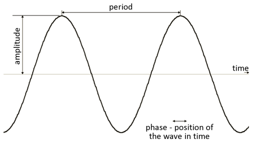

*Figure 1: the shape of a tidal harmonic (a mathematical sine wave)*

The principle tidal harmonics are listed below:

**M2**: The principle semi-diurnal lunar harmonic. For locations around the UK, this is inevitably the largest amplitude constituent and is what leads to the 2 tides per day. It has a period of around 12 hours 24 minutes.

**S2**: The principle semi-diurnal solar harmonic. This has a period of exactly 12 hours as Earth time is locked to its orbit around the sun. It is the combination of M2 and S2 that gives rise to the spring neap cycle as they move in and out of phase over a 14.8 day cycle.

**O1, K1**: The two principle diurnal constituents – the combined effect of these is to express the effect of the moons declination on the tides. They account for the diurnal inequality in the tides (the difference in height between the two high or low waters of a tidal day).

**N2, L2**: The two semi-diurnal lunar elliptic harmonics. These modulate the amplitude and frequency of M2 for the effect of variation in the moons orbital speed due to its elliptical orbit.

**M4, MS4**: These higher frequency harmonics are usually only about 5% the size of M2, however in locations where shallow water distorts the tide, they can show an amplitude of as much as 50% of M2.

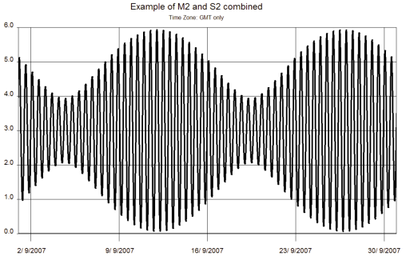

*Figure 2: the basic spring neap cycle reproduced using just M2 and S2*

For tidal levels, a single set of tidal harmonics for a location is required to compute the level at that location.

For tidal currents, two sets of tidal harmonics are required to describe the horizontal flow in two perpendicular directions: usually one set for east-west flow and one set for north-south flow. These can be combined to compute the current magnitude and direction.

NOC numerical models typically have between 10 and 50 harmonics for each grid cell in the model.

## What is "Numerical Modelling"?

The word 'model' is used widely in the physical sciences and can take many different meanings. It can, for instance, refer to a physical replica such as a scale model of a harbour or a coastline; alternatively it can describe a set of complex interactions such as those between plankton, nutrients, oxygen and bacteria in an ecosystem.

Here are a few different definitions of 'numerical modelling':

> "Numerical modelling is the process of solving a set of equations to obtain a forecast of the future state of a system, given an initial system state and any external influences that are acting on the system. The equations effectively describe the evolution of one or more variables over time." – *Colin Bell*

> "A mathematical model is the use of mathematical language to describe the behaviour of a system. Mathematical models are used particularly in the sciences such as biology, electrical engineering and physics but also in other fields such as economics, sociology and political science." – *Wikipedia.org*

> "a representation of the essential aspects of an existing system (or a system to be constructed) which presents knowledge of that system in usable form" – *Eykhoff (1974)*

To run an ocean model to predict the state of the seas and oceans requires a lot of computing power. NOC has a parallel computing cluster with 32 nodes each with 32 cores, and each core having 2GB of memory. Despite this system being capable of over a trillion calculations per second, high resolution models can often take hours or even days to run.

## Ocean Modelling

A numerical ocean model is – at its simplest – a set of equations that describe the evolution of a set of variables in a system over time. Those variables could be tidal currents, water temperature, salinity (salt content), sediment movement or indeed one of numerous chemical or biological properties.

One of the most common types of numerical model developed at NOC is a tidal model. To set up such a model, the modelling software requires detailed bathymetry (water depth data) for the model domain, a definition of the initial sea state – usually just a still water level, and some data to force the model. For a tidal model the forcing data will usually be the known tides around the edge of the model – a surge model would also include wind data and atmospheric pressure data. The modelling software will then use the equations governing fluid flow to compute the tidal level and currents for the required period of time – often 6 or 12 months.

The initial sea state (at time zero) is usually just the still model water level, and the external forcing usually comes from the open boundary of the model (see later).

At the initial time t=0, the equations are used to compute a new sea state a very small time interval later, typically just a few seconds. This process is repeated until you have the required period of data.

This data will then be analysed to derive a set of harmonic constants for every cell in the model.

## Model Grids

As with all large problems, it is correct to divide the problem up into a number of smaller ones. In numerical modelling, the sea region to be modelled (the domain) is broken up into a number of equal sized boxes, or cells. This process is called gridding. The governing equations are solved for each model cell, or grid-box. This makes the task of solving the equations computationally feasible. Each cell is identified uniquely by its position within the grid, which is usually given by a pair of indices i (the east-west position) and j (the south-north position).

In a two-dimensional model it is assumed that the horizontal velocities represent their depth-averaged values. In three-dimensional models, a similar division occurs in the vertical, slicing the water column up into a series of levels.

Figure 5 shows a 3D model divided up into a number of vertical slices. These slices can be defined at fixed levels (for example every 2 metres), although a more useful method is to define the level at specific fractions of the depth for that grid cell called sigma-coordinates. In a sigma-coordinate system, the number of vertical levels in the water column is the same everywhere in the domain irrespective of the depth of the water column. The sigma coordinate model also enables the bottom (benthic) boundary layer to be better resolved across the whole domain.

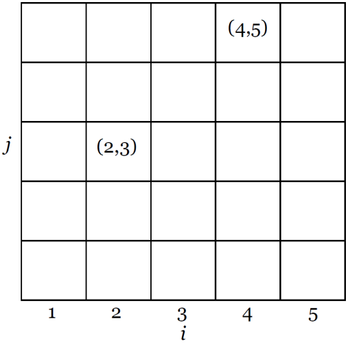

*Figure 3: a two-dimensional model grid*

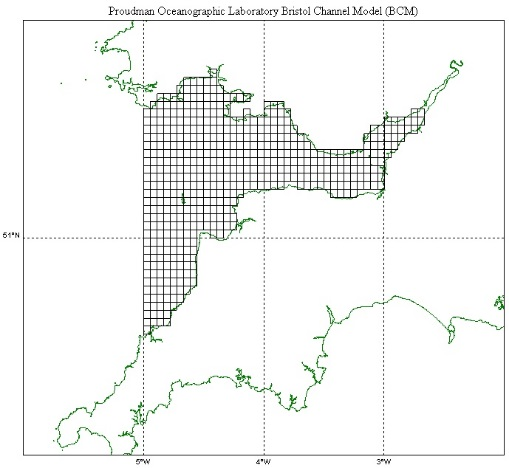

*Figure 4: The Bristol Channel Model*

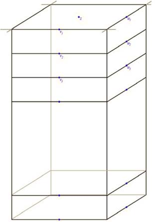

*Figure 5: vertical levels in a three-dimensional model grid*

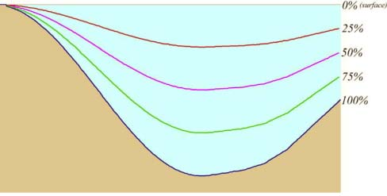

*Figure 6: Vertical discretisation in ocean models using sigma coordinates*

Each model cell contains one value for every variable of interest.

## Tidal Models

For a tidal model, the variables of interest are the tidal current U (east-west component) and V (north-south component) and the surface elevation Z.

It is convenient to stagger the variables on the model grid (i.e. the position of the current components and the elevation is different). This provides a way of computing the derivative functions that appear in the equations and is a technique called finite differences. Many of NOC's tidal models are finite difference models.

The staggering of variables also ensures numerical stability (i.e ensures small errors in the computation are not amplified).

In reality, physical variables like currents and elevations are continuous (they have some value everywhere in physical space). By dividing the model area up into a grid, and calculating the variables at only one place in each cell, we have distorted this reality. The process of converting a real flow field onto the gridded one is called discretisation.

The most popular choice of grid for stability and second-order spatial accuracy in finite difference models is the Arakawa C-grid (Arakawa and Lamb, 1977) which is shown below:

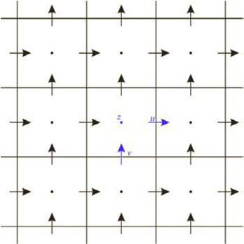

*Figure 7a: the Arakawa C-Grid*

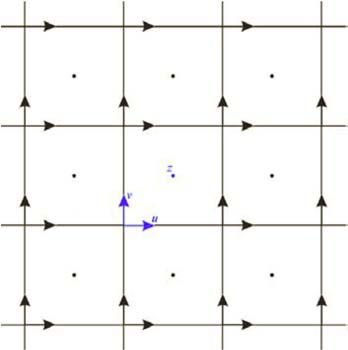

*Figure 7b: the Arakawa B-grid*

The C-Grid can be applied to rectangular coordinates as in NOC's CS3 model or curvilinear coordinates as in the Princeton Ocean Model, POM (Blumberg and Mellor, 1987). The alternative B-grid is useful if one wishes to avoid averaging four velocity points in subsequent calculations (NOC's CS20 model was developed on a B-Grid).

## Model Boundary

For the finite difference model to work, every elevation point needs to be flanked by current points and vice versa for the equations to be evaluated. In figure 8, you will see that at the edges of the model domain this does not happen. Point Z1 has no current flow to the left.

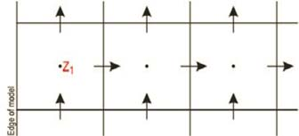

*Figure 8: C grid model boundary*

These are called boundary conditions and the missing variable must be defined at every time step. If the boundary is due to land, then it is reasonable to set this value to zero since there can be no flow through a solid boundary. However when the boundary is not land, known as an open boundary, the variable must be prescribed for every point in time. For example with a UK continental shelf model the tides at the boundary are in the North Atlantic Ocean and are derived from a larger scale model of the entire ocean. With smaller models such as harbours and small estuaries, it might be possible to provide open boundary input directly from observations of the tide.

Additional boundary conditions for a more complex model might include wind stress at the sea surface, solar heating and freshwater influence from rivers.

## Model Accuracy, Resolution and Numerical Considerations

As only one value for each variable of interest is available for each grid cell, each value computed for each grid cell can at best represent the average value for that cell. Therefore the smaller the grid cell, the more accurately the model will be able to represent reality. This is particularly important when modelling parameters which can vary greatly over fairly small distances. The only expense in having more grid cells is increased computer memory and computational time. An analogy would be the resolution of the image sensor in a digital camera – a 20 megapixel camera will capture more detail in the image than a 2 megapixel camera (it has a higher resolution) but the image files are a lot bigger and take longer to download and process.

The model resolution determines the types of motion that the model is capable of simulating. A model with a 10km resolution can distinguish between the height of the tide at Portland and Plymouth, but not Portland and Weymouth because the two places fall inside the same cell. To compute tides for Portland and Weymouth separately, a higher resolution model would be needed.

Model accuracy will depend on a number of factors – in particular the type of model. A tidal model with an accuracy of ±5% might be considered reasonable whereas a suspended sediment transport model will be doing very well to get an accuracy of ±25%.

Accuracy of a model can be increased by any of the following:

- Improved horizontal resolution (smaller grid).
- Improved vertical resolution (more layers).
- Improved resolution in the bathymetry.
- More accurate boundary conditions.
- Better temporal resolution of the boundary conditions.

## Model Validation

Numerical models require good observations that can be used to test and improve them. The process of testing a model against observations is called validation.

A good example of validation for a tidal model is to compare the predicted height of the tide with that observed at several locations. Accurate records of tidal elevations are made at standard ports around the UK. Predicted tidal elevation amplitude from a model can be compared with measured amplitudes wherever data is available. One way of visualising the comparison is to plot model vs. actual tide height on a simple scatter diagram. A regression line slope close to unity is a useful metric for gauging the predictive skill of the model.

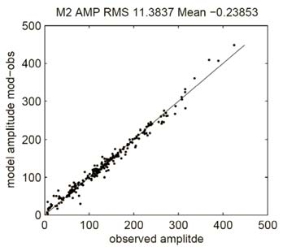

*Figure 9: Comparison of modelled elevations against tidal observations*

## Models & Computer Architecture

Running a high resolution model of the ocean requires very large amounts of computing power. A modern PC is simply incapable of running the sort of models that NOC scientists are producing.

Ocean models lend themselves to parallel computer architectures – the models are run on clusters of many processors linked by high speed communications. Efficient communications between the processors allows the scaling up of problems onto as many processors as are available. This allows models to become more complex and/or run at higher resolution with relative ease as more computer power becomes available.

NOC's Coastal Ocean Modelling System (POLCOMS) is formulated to run on parallel computers – a sophisticated pre-processor allows total scalability to suit any machine, from a single processor workstation through to massive clusters.

Scaling for multi-processors is done by splitting up the model domain into smaller regions (a process called domain decomposition). Each processor works on a specific part of the model, communicating with surrounding processors for necessary data.

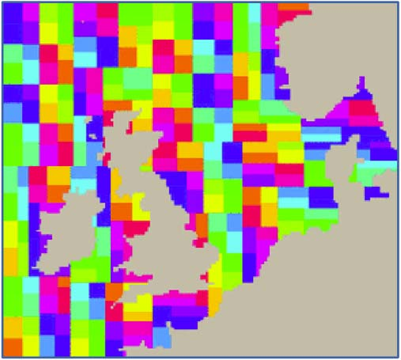

*Figure 10: model domain decomposition for 256 processors*

---

*This document is provided for information purposes only. It cannot be republished without prior permission. The National Oceanography Centre can accept no liability in relation to the use of this document. For further information please contact dataproducts@noc.ac.uk.*
